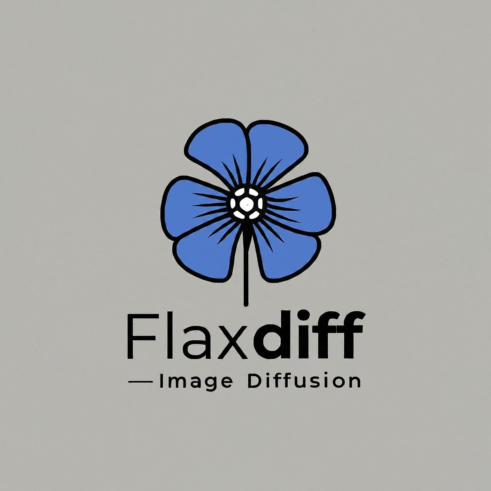
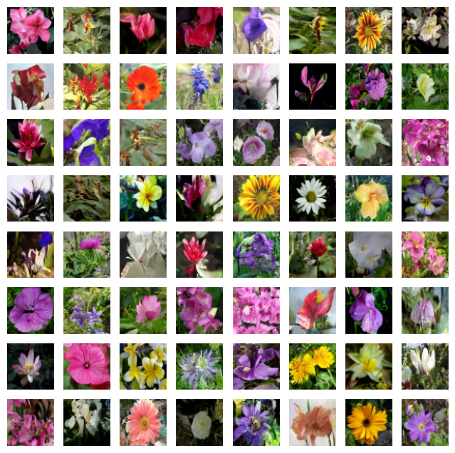
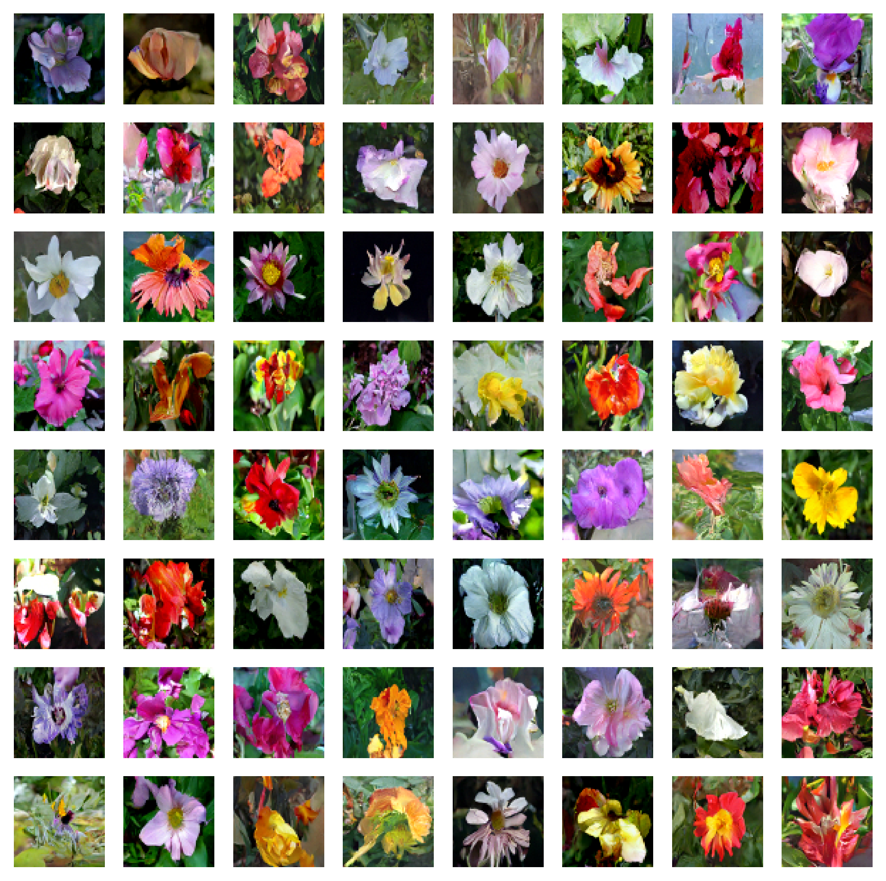

# 

**This project is partially supported by [Google TPU Research Cloud](https://sites.research.google/trc/about/). I would like to thank the Google Cloud TPU team for providing me with the resources to train the bigger text-conditional models in multi-host distributed settings.**

## A Versatile and simple Framework for Generative Models

In recent years, diffusion and score-based multi-step models have revolutionized the generative AI domain. However, the latest research in this field has become highly math-intensive, making it challenging to understand how state-of-the-art diffusion models work and generate such impressive images. Replicating this research in code can be daunting.

Dew is a library of tools (schedulers, samplers, models, etc.) designed and implemented in an easy-to-understand way. The focus is on understandability and readability over performance. I started this project as a hobby to familiarize myself with Flax and Jax and to learn about diffusion and the latest research in generative AI.

Dew is the project I published as FlaxDiff, renamed and restructured once the trainer stopped being about diffusion alone: what to optimize is now an objective you plug in, and diffusion is one of them.

I initially started this project in Keras, being familiar with TensorFlow 2.0, but transitioned to Flax, powered by Jax, for its performance and ease of use.

The library has since grown beyond images: it now also covers video diffusion, flow matching, latent diffusion with a VAE, and I-JEPA/V-JEPA self-supervised training, all running through the same trainer with data-parallel and FSDP sharding. The bigger text-conditional models in the gallery were trained on a TPU-v4-32 pod.

## Example Notebooks from scratch

In the `tutorials` folder, you will find notebooks for various diffusion techniques, written entirely from scratch and are independent of the Dew library. Each notebook includes detailed explanations of the underlying mathematics and concepts, making them invaluable resources for learning and understanding diffusion models.

### Available Notebooks and Resources

- **[Diffusion explained (nbviewer link)](https://nbviewer.org/github/AshishKumar4/Dew/blob/main/tutorials/simple%20diffusion%20flax.ipynb) [(local link)](tutorials/simple%20diffusion%20flax.ipynb)**

  - **WORK IN PROGRESS** An in-depth exploration of the concept of Diffusion based generative models, DDPM (Denoising Diffusion Probabilistic Models), DDIM (Denoising Diffusion Implicit Models), and the SDE/ODE generalizations of diffusion, with step-by-step explainations and code.

  <a target="_blank" href="https://colab.research.google.com/github/AshishKumar4/Dew/blob/main/tutorials/simple%20diffusion%20flax.ipynb">
  
</a>

- **[EDM (Elucidating the Design Space of Diffusion-based Generative Models)](tutorials/edm%20tutorial.ipynb)**
  - **TODO** A thorough guide to EDM, discussing the innovative approaches and techniques used in this advanced diffusion model.

  <a target="_blank" href="https://colab.research.google.com/github/AshishKumar4/Dew/blob/main/tutorials/edm%20tutorial.ipynb">
  
</a>

These notebooks aim to provide a very easy to understand and step-by-step guide to the various diffusion models and techniques. They are designed to be beginner-friendly, and thus although they may not adhere to the exact formulations and implementations of the original papers to make them more understandable and generalizable, I have tried my best to keep them as accurate as possible. If you find any mistakes or have any suggestions, please feel free to open an issue or a pull request.

#### Other resources

- **[Training recipes](./recipes/)**
  - The full training entry points: [`recipes/diffusion/train.py`](./recipes/diffusion/train.py) for diffusion and [`recipes/jepa/train.py`](./recipes/jepa/train.py) for I-JEPA/V-JEPA. Both run multi-host data parallel, and serve as a reference for training large models on multiple GPUs/TPUs across multiple hosts. A full-fledged tutorial notebook is in the works.

- **[TPU utilities for making life easier](./tools/tpu/)**
  - A collection of utilities and scripts to make working with TPUs easier, such as cli to create/start/stop/setup TPUs, script to setup TPU VMs (install everything you need), mounting gcs datasets etc.

## Disclaimer (and About Me)

I worked as a Machine Learning Researcher at Hyperverge from 2019-2021, focusing on computer vision, specifically facial anti-spoofing and facial detection & recognition. Since switching to my current job in 2021, I haven't engaged in as much R&D work, leading me to start this pet project to revisit and relearn the fundamentals and get familiar with the state-of-the-art. My current role involves primarily Golang system engineering with some applied ML work just sprinkled in. Therefore, the code may reflect my learning journey. Please forgive any mistakes and do open an issue to let me know.

Also, few of the text may be generated with help of github copilot, so please excuse any mistakes in the text.

## Index

- [A Versatile and simple Framework for Generative Models](#a-versatile-and-simple-framework-for-generative-models)
- [Disclaimer (and About Me)](#disclaimer-and-about-me)
- [Features](#features)
  - [Objectives](#objectives)
  - [Schedulers](#schedulers)
  - [Model Predictors](#model-predictors)
  - [Samplers](#samplers)
  - [Training](#training)
  - [Models](#models)
  - [Data](#data)
  - [Metrics](#metrics)
  - [Interop](#interop)
- [Installation](#installation)
- [Getting Started](#getting-started)
  - [Training Example](#training-example)
  - [Recipes](#recipes)
  - [Inference Example](#inference-example)
- [Testing](#testing)
- [References and Acknowledgements](#references-and-acknowledgements)
- [Pending things to do list](#pending-things-to-do-list)
- [Gallery](#gallery)
- [Contribution](#contribution)
- [License](#license)

## Features

### Objectives
Implemented in `dew.objectives`:
- **Objective** (`dew.objectives.Objective`): The seam between the trainer and the research question. It owns the parameters, the loss and the validation artifacts, while the trainer owns sharding, EMA, checkpoints and logging.
- **DiffusionObjective** (`dew.objectives.diffusion.DiffusionObjective`): Sample a noise level, corrupt the sample, predict, weight the loss. This is the default.
- **JepaObjective** (`dew.objectives.jepa.JepaObjective`): I-JEPA and V-JEPA. Predicts the representation of masked target blocks from the visible context, with the target encoder as an EMA of the context encoder and collapse telemetry on every step.

### Schedulers
Implemented in `dew.objectives.diffusion.schedules`:
- **LinearNoiseScheduler**: A beta-parameterized discrete scheduler.
- **CosineNoiseScheduler**: A beta-parameterized discrete scheduler.
- **ExpNoiseScheduler**: A beta-parameterized discrete scheduler.
- **CosineContinuousNoiseScheduler**: A continuous scheduler.
- **CosineGeneralNoiseScheduler**: A continuous sigma parameterized cosine scheduler.
- **SqrtContinuousNoiseScheduler**: A continuous scheduler using the sqrt schedule proposed for diffusion language models.
- **KarrasVENoiseScheduler**: A sigma-parameterized continuous scheduler proposed by Karras et al. 2022, best suited for inference.
- **EDMNoiseScheduler**: A sigma-parameterized continuous scheduler based on the EDM paper, best suited for training with the KarrasVENoiseScheduler.
- **FlowMatchingScheduler**: A rectified-flow scheduler with logit-normal timestep sampling and resolution-dependent shifting, as used in Stable Diffusion 3.

### Model Predictors
Implemented in `dew.objectives.diffusion.transforms`:
- **EpsilonPredictionTransform**: The model predicts the noise in the data.
- **DirectPredictionTransform**: The model predicts the original data from the noisy data.
- **VPredictionTransform**: The model predicts a linear combination of the data and noise.
- **FlowMatchPredictionTransform**: The model predicts the flow velocity.
- **KarrasPredictionTransform**: A generalized transform for the EDM, integrating various parameterizations.
- **get_diffusion_preset**: One call which pairs a training schedule, a sampling schedule and a transform for the `"edm"`, `"karras"`, `"cosine"` and `"flow"` setups.

### Samplers
Implemented in `dew.sampling`:
- **DDPMSampler** (`dew.sampling.DDPMSampler`): Implements the Denoising Diffusion Probabilistic Model (DDPM) sampling process.
- **DDIMSampler** (`dew.sampling.DDIMSampler`): Implements the Denoising Diffusion Implicit Model (DDIM) sampling process.
- **EulerSampler** (`dew.sampling.EulerSampler`): An ODE solver sampler using Euler's method.
- **EulerAncestralSampler** (`dew.sampling.EulerAncestralSampler`): Euler sampling with ancestral noise injection.
- **HeunSampler** (`dew.sampling.HeunSampler`): An ODE solver sampler using Heun's method.
- **RK4Sampler** (`dew.sampling.RK4Sampler`): An ODE solver sampler using the Runge-Kutta method.
- **MultiStepDPM** (`dew.sampling.MultiStepDPM`): Implements a multi-step sampling method inspired by the Multistep DPM solver as presented here: [tonyduan/diffusion](https://github.com/tonyduan/diffusion/blob/fcc0ed829baf29e1493b460b073e735a848c08ea/src/samplers.py#L44)

All samplers support classifier-free guidance, including interval-limited guidance.

### Training
Implemented in `dew.training`:
- **ObjectiveTrainer** (`dew.training.ObjectiveTrainer`): Manages the training loop, loss calculation, EMA, gradient accumulation, checkpointing and wandb logging, for both image and video data. It runs data-parallel and FSDP sharded training through `jax.jit` with `NamedSharding` on a `(data, fsdp)` mesh.
- **Sharding** (`dew.training.distributed`): The device mesh, the parameter specs, the batch sharding and the device prefetch iterator. `fsdp_size=1` degenerates to plain data parallelism, so one code path serves both.
- **Telemetry** (`dew.telemetry.instrumentation`): Step FLOPs straight from the compiler, model FLOPs utilization, and the persistent XLA compilation cache.
- **Config** (`dew.config`): `RunConfig` with its `ModelConfig`, `DataConfig`, `OptimConfig` and `TrainerConfig` parts, which is how the recipes describe a run.

### Models
Implemented in `dew.nn` and constructed via `dew.registry.build_model`:
- **Unet**: A classic convolutional UNet.
- **UNet3D**: A video UNet which can inflate 2D Unet checkpoints.
- **UViT / SimpleUDiT**: U-shaped transformers.
- **SimpleDiT / SimpleMMDiT / HierarchicalMMDiT**: DiT and SD3-style multi-modal DiT variants.
- **HybridSSMAttentionDiT**: Interleaves S5 state-space blocks with attention.
- **VideoDiT**: A factorized spatial-temporal DiT for video.
- **JepaEncoder / JepaVideoEncoder / JepaPredictor**: The ViT encoders and the predictor that the JEPA objective trains.
- Hilbert and zigzag patch scan orders are available via the `+hilbert` and `+zigzag` architecture suffixes.
- **Autoencoders** (`dew.nn.autoencoders`): `StableDiffusionVAE` (vendored Flax VAE, loads Hugging Face hub weights) and `SimpleAutoEncoder` for latent diffusion without any external weights.

### Data
Implemented in `dew.data`:
- **Sources** (`dew.data.sources`): TFDS datasets, ArrayRecord shards on a GCS mount, local video trees, VoxCeleb2, and a loader that streams images and videos from URLs.
- **Loaders** (`dew.data.dataloaders`): `get_dataset_grain` for images and `get_media_dataset_grain` for images or video, both grain pipelines, both with a validation split read in canonical order.
- **Registry** (`dew.data.registry`): `datasetMap` and `mediaDatasetMap`, the dataset names the loaders and the recipes accept.

### Metrics
Implemented in `dew.eval`: FID (vendored InceptionV3), CLIP score, PSNR and SSIM. The linear and kNN probes for JEPA sit with the objective, in `dew.objectives.jepa.probes`.

### Interop
Implemented in `dew.interop`: `save_params`, `load_params` and `save_hf_layout` move a Flax parameter tree to and from safetensors, naming each tensor by its '/'-joined path so other tools can read the file.

## Installation

To install Dew, you need to have Python 3.11 or higher:

```bash
pip install dew-ml
```

The package installs as `dew-ml` and imports as `dew`; the bare `dew` name on PyPI is a pending claim.

Optional extras pull in the heavier dependencies only when you need them:

- `dew-ml[av]`: video/audio sources and readers (OpenCV, decord, moviepy, PyAV)
- `dew-ml[metrics]`: FID (scipy) and Inception weight download
- `dew-ml[streaming]`: online URL-streaming loader (Hugging Face `datasets`)
- `dew-ml[tfds]`: TFDS-backed dataset sources
- `dew-ml[interop]`: safetensors conversion

Or for development, clone the repo and install in editable mode with the test dependencies:

```bash
pip install -e .[test]
```

## Getting Started

### Training Example

Here is a simplified example to get you started with training a diffusion model using Dew:

```python
from datetime import datetime
import jax, optax

from dew.data.dataloaders import get_dataset_grain
from dew.inputs import DiffusionInputConfig, ConditionalInputConfig
from dew.inputs.encoders import CLIPTextEncoder
from dew.objectives.diffusion.transforms import get_diffusion_preset
from dew.registry import build_model
from dew.sampling.euler import EulerAncestralSampler
from dew.training import ObjectiveTrainer

BATCH_SIZE, IMAGE_SIZE = 16, 128

data = get_dataset_grain("oxford_flowers102", batch_size=BATCH_SIZE, image_scale=IMAGE_SIZE)

text_encoder = CLIPTextEncoder.from_modelname("openai/clip-vit-large-patch14")
input_config = DiffusionInputConfig(
    sample_data_key="image",
    sample_data_shape=(IMAGE_SIZE, IMAGE_SIZE, 3),
    conditions=[ConditionalInputConfig(encoder=text_encoder)],
)

train_schedule, sample_schedule, transform = get_diffusion_preset("edm")

model = build_model("simple_dit", dict(
    emb_features=512, num_layers=8, num_heads=8, patch_size=8,
))

trainer = ObjectiveTrainer(
    model=model,
    optimizer=optax.adamw(2e-4),
    input_config=input_config,
    noise_schedule=train_schedule,
    model_output_transform=transform,
    rngs=jax.random.PRNGKey(4),
    name=f"flowers-edm-{datetime.now():%Y-%m-%d_%H%M}",
    distributed_training=True,
    checkpoint_base_path="./checkpoints",
)

trainer.fit(
    data,
    training_steps_per_epoch=data["train_len"] // BATCH_SIZE,
    epochs=100,
    sampler_class=EulerAncestralSampler,
    sampling_noise_schedule=sample_schedule,
)
```

### Recipes

The recipes wrap that same trainer in a config tree: a run is a `dew.config.RunConfig`, and every field of it has a command line flag.

```bash
python recipes/diffusion/train.py --data.dataset oxford_flowers102 --data.image-size 128 \
    --data.batch-size 32 --trainer.epochs 2000 --model.architecture simple_dit \
    --model.config '{"patch_size": 4, "emb_features": 512, "num_layers": 12, "num_heads": 8}'
```

```bash
python recipes/jepa/train.py --data.dataset oxford_flowers102 --probe-classes 102 \
    --model.config '{"patch_size": 16, "emb_features": 384}'
```

Architecture arguments go in one json object, straight to `build_model`, so anything the registry accepts works. `--help` on either recipe prints the whole config tree.

### Inference Example

Here is a simplified example for generating images using a trained model:

```python
from dew.sampling.pipelines import DiffusionInferencePipeline

pipeline = DiffusionInferencePipeline.from_wandb_registry(
    modelname="diffusion-model", project="my-project",
)
images = pipeline.generate_samples(
    num_samples=16, resolution=128, diffusion_steps=50,
    guidance_scale=3.0, conditioning_data=["a water lily", "a rose"],
)
```

## Testing

The suite runs in two lanes.

The mesh lane runs everything on CPU, and is what CI runs:

```bash
JAX_PLATFORMS=cpu pytest -m "not network" -q
```

`tests/conftest.py` asks XLA for 8 host devices, so the sharding tests exercise a real 4x2 data/fsdp mesh on any machine. It covers model forward passes for every architecture, scheduler and transform invariants, sampler convergence against an analytic denoiser, trainer smoke runs for images and videos, FSDP and data-parallel parity, sharded checkpoint round-trips with mid-epoch data resume, and the JEPA objectives.

The kernel lane runs the model and training files on a real GPU, with no `JAX_PLATFORMS` override so a CUDA jax picks the device:

```bash
pytest tests/test_models.py tests/test_samplers.py tests/test_schedulers.py tests/test_predictors.py \
    tests/test_flow_matching.py tests/test_metrics.py tests/test_autoencoder.py tests/test_trainer.py \
    tests/test_objectives.py tests/test_instrumentation.py tests/test_remat.py tests/test_encoders.py \
    tests/test_config.py -q -m "not network"
```

The multi-device suites stay on the CPU lane: those 8 devices are an XLA host-platform trick, and one GPU is one device.

Tests marked `network` download pretrained weights and are excluded by default.

## References and Acknowledgements

### Research papers and preprints
- The Original Denoising Diffusion Probabilistic Models (DDPM) [paper](https://arxiv.org/abs/2006.11239)
- Denoising Diffusion Implicit Models (DDIM) [paper](https://arxiv.org/abs/2010.02502)
- Improved Denoising Diffusion Probabilistic Models [paper](https://arxiv.org/abs/2102.09672)
- Diffusion Models beat GANs on image synthesis [paper](https://arxiv.org/pdf/2105.05233)
- Score-Based Generative Modeling through Stochastic Differential Equations [paper](https://arxiv.org/pdf/2011.13456)
- Elucidating the design space of Diffusion-based generative models (EDM) [paper](https://arxiv.org/abs/2206.00364)
- Perception Prioritized Training of Diffusion Models (P2 Weighting) [paper](https://arxiv.org/abs/2204.00227)
- Pseudo Numerical Methods for Diffusion Models on Manifolds (PNMDM) [paper](https://arxiv.org/abs/2202.09778)
- The DPM-Solver: A Fast ODE Solver for Diffusion Probabilistic Model Sampling in Around 10 Steps [paper](https://arxiv.org/pdf/2206.00927)
- Scalable Diffusion Models with Transformers (DiT) [paper](https://arxiv.org/abs/2212.09748)
- Scaling Rectified Flow Transformers for High-Resolution Image Synthesis (SD3) [paper](https://arxiv.org/abs/2403.03206)
- Flow Matching for Generative Modeling [paper](https://arxiv.org/abs/2210.02747)
- Self-Supervised Learning from Images with a Joint-Embedding Predictive Architecture (I-JEPA) [paper](https://arxiv.org/abs/2301.08243)
- Simplified State Space Layers for Sequence Modeling (S5) [paper](https://arxiv.org/abs/2208.04933)
- Applying Guidance in a Limited Interval Improves Sample and Distribution Quality (interval-limited CFG) [paper](https://arxiv.org/abs/2404.07724)
- Diffusion-LM Improves Controllable Text Generation (sqrt schedule) [paper](https://arxiv.org/abs/2205.14217)

### Useful blogs and codebases

- An incredible series of blogs on various diffusion related topics by [Sander Dieleman](https://sander.ai/posts/). The posts particularly on [diffusion models](https://sander.ai/2022/01/31/diffusion.html), [Typicality](https://sander.ai/2020/09/01/typicality.html), [Geometry of Diffusion Guidance](https://sander.ai/2023/08/28/geometry.html#warning) and [Noise Schedules](https://sander.ai/2024/06/14/noise-schedules.html) are a must read
- An awesome blog series by Tony Duan on [Diffusion models from scratch](https://www.tonyduan.com/diffusion/index.html). Although it trains models for MNIST and the implementations are a bit basic, the maths is explained in a very nice way. The codebase is [here](https://github.com/tonyduan/diffusion)
- The [k-diffusion](https://github.com/crowsonkb/k-diffusion/) codebase by Katherine Crowson, which hosts an exhaustive implementation of the EDM paper (Karras et al) along with the DPM-Solver, DPM-Solver++ (both 2S and 2M) in pytorch. Most other diffusion libraries borrow from this.
- The [Official EDM implementation](https://github.com/NVlabs/edm) by Tero Karras, in pytorch. Really neat code and the reference implementation for all the karras based samplers/schedules.
- The [Hugging Face Diffusers Library](https://github.com/huggingface/diffusers). The vendored Flax VAE and parts of the attention module derive from it (Apache-2.0, attribution headers preserved).
- [jax-fid](https://github.com/matthias-wright/jax-fid), the origin of the vendored InceptionV3 used for FID.
- The [Keras DDPM Tutorial](https://keras.io/examples/generative/ddpm/) by A_K Nain, and the [Keras DDIM implementation](https://keras.io/examples/generative/ddim/) by András Béres, which are great starting points for beginners to understand the basics of diffusion models. I started my journey by trying to implement the concepts introduced in these tutorials from scratch.

## Pending things to do list

- **Autoregressive LM and diffusion-LM objectives on the same trainer**
- **Multi-host validation of the revamped trainer on an actual TPU pod**
- **A proper precision policy (dtype/param_dtype are still threaded ad-hoc)**
- **Full FID-50k evaluation (the current FID metric is per-validation-batch)**
- **The `dew` name on PyPI, claimed under PEP 541 and still pending, which is why the package ships as `dew-ml`**

## Gallery

### Images generated by Euler Ancestral Sampler in 200 Steps [text2image with CFG]
Model trained on Laion-Aesthetics 12M + CC12M + MS COCO + 1M aesthetic 6+ subset of COYO-700M on TPU-v4-32:
`a beautiful landscape with a river with mountains, a beautiful landscape with a river with mountains, ...`

**Params**:
`Dataset: Laion-Aesthetics 12M + CC12M + MS COCO + 1M aesthetic 6+ subset of COYO-700M`
`Batch size: 256`
`Image Size: 128`
`Training Epochs: 5`
`Steps per epoch: 74573`
`Model Configurations: feature_depths=[128, 256, 512, 1024]`

`Training Noise Schedule: EDMNoiseScheduler`
`Inference Noise Schedule: KarrasVENoiseScheduler`


### Images generated by Euler Ancestral Sampler in 200 Steps [text2image with CFG]
Images generated by the following prompts using classifier free guidance with guidance factor = 2:
`'water tulip, a water lily, a water lily, a water lily, a photo of a marigold, a water lily, a water lily, a photo of a lotus, a photo of a lotus, a photo of a lotus, a photo of a rose, a photo of a rose, a photo of a rose, a photo of a rose, a photo of a rose'`

**Params**:
`Dataset: oxford_flowers102`
`Batch size: 16`
`Image Size: 128`
`Training Epochs: 1000`
`Steps per epoch: 511`

`Training Noise Schedule: EDMNoiseScheduler`
`Inference Noise Schedule: KarrasVENoiseScheduler`


### Images generated by DDPM Sampler in 1000 steps [Unconditional]

**Params**:
`Dataset: oxford_flowers102`
`Batch size: 16`
`Image Size: 64`
`Training Epochs: 1000`
`Steps per epoch: 511`

`Training Noise Schedule: CosineNoiseScheduler`
`Inference Noise Schedule: CosineNoiseScheduler`

`Model: UNet(emb_features=256,
            feature_depths=[64, 128, 256, 512],
            attention_configs=[{"heads":4}, {"heads":4}, {"heads":4}, {"heads":4}, {"heads":4}],
            num_res_blocks=2,
            num_middle_res_blocks=1)`



### Images generated by Heun Sampler in 10 steps (20 model inferences as Heun takes 2x inference steps) [Unconditional]

**Params**:
`Dataset: oxford_flowers102`
`Batch size: 16`
`Image Size: 64`
`Training Epochs: 1000`
`Steps per epoch: 511`

`Training Noise Schedule: EDMNoiseScheduler`
`Inference Noise Schedule: KarrasVENoiseScheduler`



## Contribution

Feel free to contribute by opening issues or submitting pull requests. Let's make Dew better together!

## License

This project is licensed under the MIT License.
