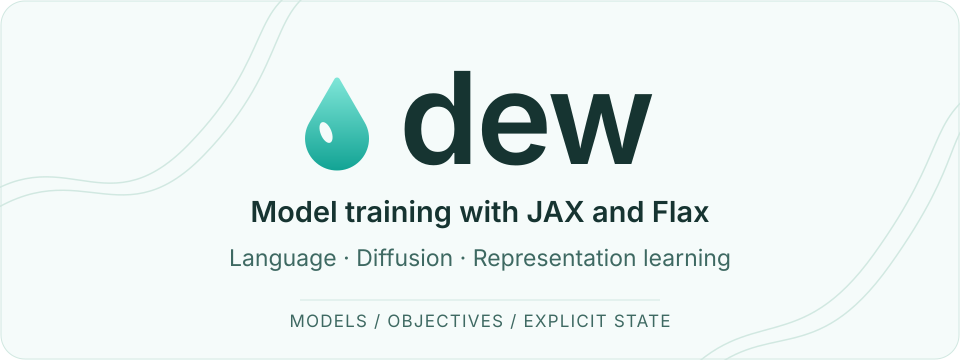
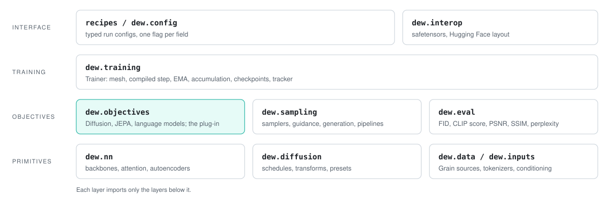
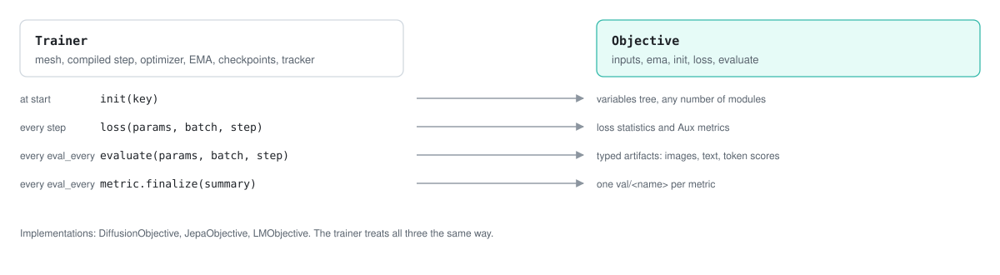
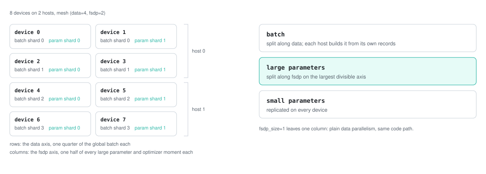
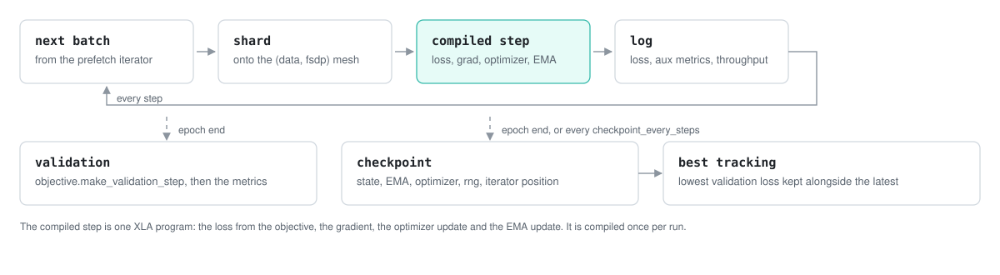

<div align="center">
<picture>
  <source media="(prefers-color-scheme: dark)" srcset="docs/assets/banner-dark.svg">
  
</picture>

<h1>Dew: building and training modern architectures at scale, in JAX and Flax</h1>

<a href="https://github.com/AshishKumar4/dew/actions/workflows/ci.yml"></a>
<a href="pyproject.toml"></a>
<a href="LICENSE"></a>

<p>
<a href="#diffusion"><b>Diffusion</b></a>
| <a href="#jepa"><b>JEPA</b></a>
| <a href="#language-models"><b>Language models</b></a>
| <a href="#objectives"><b>Objectives</b></a>
| <a href="#scaling"><b>Scaling</b></a>
| <a href="#roadmap"><b>Roadmap</b></a>
| <a href="#installation"><b>Install guide</b></a>
| <a href="docs/index.md"><b>Documentation</b></a>
</p>
</div>

## What is Dew?

Dew is a framework for building and training modern machine learning architectures in JAX and Flax, with full support for distributed training and scaling. It trains diffusion and flow matching models, JEPA encoders and autoregressive language models today, and it is built to reach parity with the large open model families: the same trainer, data pipeline and sharding serve every architecture, and a new one is a Flax module plus a class with a loss.

Dew separates what you train from how you train it. An [objective](#objectives) defines the parameters, the loss and the validation step. The [trainer](#scaling) defines the device mesh, the compiled step, gradient accumulation, EMA, checkpoints and logging, and treats every objective the same way. The same code runs on a CPU, one GPU, a TPU pod slice or many hosts: data parallel and fully sharded parameters are one code path, chosen by one number.

The [models](#models), the [diffusion maths](#schedules-and-prediction-transforms), the [samplers](#sampling) and the [metrics](#evaluation-and-export) are plain Flax and JAX, and each can be used on its own. The [data pipeline](#data) is built on Grain and gives the same batches on any number of workers and hosts. Everything that claims to be fast is [measured](#testing-and-benchmarks).

Dew is the successor to [FlaxDiff](https://github.com/AshishKumar4/FlaxDiff). It is a personal research project, not a product. Expect sharp edges, and please [report](https://github.com/AshishKumar4/dew/issues) the ones you find.

```python
import jax, optax
from dew.data.dataloaders import get_dataset_grain
from dew.diffusion.transforms import get_diffusion_preset
from dew.inputs import DiffusionInputConfig
from dew.registry import build_model
from dew.training import ObjectiveTrainer

data = get_dataset_grain("oxford_flowers102", batch_size=32, image_scale=64)
train_schedule, sample_schedule, transform = get_diffusion_preset("edm")
model = build_model("simple_dit", dict(emb_features=256, num_layers=6, num_heads=4, patch_size=4))

trainer = ObjectiveTrainer(
    model, optax.adamw(3e-4),
    input_config=DiffusionInputConfig(sample_data_key="image", sample_data_shape=(64, 64, 3), conditions=[]),
    noise_schedule=train_schedule, model_output_transform=transform,
    rngs=jax.random.PRNGKey(0), name="flowers",
)
state = trainer.fit(data, training_steps_per_epoch=data["train_len"] // 32, epochs=50)
# state.params, state.ema_params and state.opt_state, sharded over every device; checkpoints under ./checkpoints/flowers
```

<div align="center">
<picture>
  <source media="(prefers-color-scheme: dark)" srcset="docs/assets/architecture-dark.svg">
  
</picture>
</div>

### Contents
* [Diffusion](#diffusion)
* [JEPA](#jepa)
* [Language models](#language-models)
* [Objectives](#objectives)
* [Scaling](#scaling)
* [Data](#data)
* [Configuration](#configuration)
* [Checkpoints and resume](#checkpoints-and-resume)
* [Logging and profiling](#logging-and-profiling)
* [Extending Dew](#extending-dew)
* [Recipes and examples](#recipes-and-examples)
* [Evaluation and export](#evaluation-and-export)
* [Testing and benchmarks](#testing-and-benchmarks)
* [Installation](#installation)
* [Roadmap](#roadmap)
* [Citing Dew](#citing-dew)
* [Reference documentation](#reference-documentation)

## Diffusion

### Schedules and prediction transforms

A diffusion model is defined by three choices: the noise schedule for training, the noise schedule for sampling, and the prediction transform, which says what the network outputs. Use `get_diffusion_preset` to get a matched set:

```python
from dew.diffusion.transforms import get_diffusion_preset

train_schedule, sample_schedule, transform = get_diffusion_preset("edm")    # EDM training, Karras sampling
train_schedule, sample_schedule, transform = get_diffusion_preset("flow")   # rectified flow, as in Stable Diffusion 3
train_schedule, sample_schedule, transform = get_diffusion_preset("cosine", min_snr_gamma=5.0)
```

The parts are available on their own. `dew.diffusion.schedules` has the linear, cosine, exp, sqrt, Karras VE, EDM and flow matching schedules. `dew.diffusion.transforms` has the epsilon, x0, v, flow and Karras transforms. Every schedule is tested against the invariants of its paper: monotone SNR, exact forward and inverse diffusion, variance preservation. See [docs/api.md](docs/api.md#diffusion) for the list.

### Conditioning

`DiffusionInputConfig` describes the sample and its conditions. A condition pairs an encoder with the batch key it reads:

```python
from dew.inputs import DiffusionInputConfig, ConditionalInputConfig
from dew.inputs.encoders import CLIPTextEncoder

text = CLIPTextEncoder.from_modelname("openai/clip-vit-large-patch14")
inputs = DiffusionInputConfig(
    sample_data_key="image", sample_data_shape=(128, 128, 3),
    conditions=[ConditionalInputConfig(encoder=text)],
)
```

The trainer drops the conditions on 12% of each batch (`unconditional_prob`), so the model also learns the unconditional distribution that classifier-free guidance needs. `dew.inputs.encoders` ships a CLIP text encoder and a Hugging Face audio encoder; a new one implements `tokenize` and `encode_from_tokens`. The CLIP encoder is dew's own port of the text tower, in [`dew/nn/text_encoders.py`](src/dew/nn/text_encoders.py), and it reads the checkpoint's safetensors itself, since transformers 5 removed the Flax classes it used to load. Pass `autoencoder=StableDiffusionVAE()` to the trainer to train in the latent space of the Stable Diffusion VAE instead of pixels, or `SimpleAutoEncoder` to train your own.

### Sampling

A sampler takes the model, the sampling schedule, the transform and the input config. Guidance belongs to the sampler; `guidance_start` and `guidance_stop` limit it to an interval of the trajectory:

```python
from dew.sampling import EulerAncestralSampler

sampler = EulerAncestralSampler(model, sample_schedule, transform, inputs,
                                guidance_scale=4.0, guidance_start=0.1, guidance_stop=0.9)
images = sampler.generate_samples(params=state.ema_params, num_samples=4, resolution=128,
                                  diffusion_steps=50, conditioning=["a water lily", "a rose"])
# images.shape == (4, 128, 128, 3), values in [-1, 1]
```

`DDPMSampler`, `DDIMSampler`, `EulerSampler`, `EulerAncestralSampler`, `HeunSampler`, `RK4Sampler` and `MultiStepDPM` all take the same arguments. Video models pass `sequence_length` as well and get `[B, T, H, W, C]` back. Each sampler is tested to converge on an analytic denoiser.

### Models

`build_model` constructs any registered architecture from its name and a dict of keyword arguments:

```python
from dew.registry import build_model

unet = build_model("unet", dict(emb_features=256, feature_depths=[64, 128, 256, 512]))
dit = build_model("simple_dit+hilbert", dict(emb_features=512, num_layers=12, num_heads=8, patch_size=2))
mmdit = build_model("simple_mmdit", dict(emb_features=512, num_layers=12, num_heads=8, patch_size=2,
                                         dtype="bfloat16", attention_impl="auto"))
```

| Architecture | What it is |
|---|---|
| `unet`, `unet_3d` | Convolutional UNets for images and video; the 3D one inflates 2D checkpoints |
| `uvit`, `simple_udit` | U-shaped transformers |
| `simple_dit`, `simple_mmdit`, `hierarchical_mmdit` | DiT, the SD3-style dual-stream MMDiT, and a multi-resolution MMDiT, on one shared adaLN-Zero block |
| `hybrid_dit` | S5 state space blocks between attention blocks |
| `video_dit` | Factorized spatial and temporal attention |
| `jepa_encoder`, `jepa_video_encoder`, `jepa_predictor` | The ViTs the JEPA objective trains |
| `causal_transformer` | The decoder for language models, in the Hugging Face layout |

The `+hilbert` and `+zigzag` suffixes change the order in which patches enter a transformer. Every model takes `dtype` and `attention_impl`, and the parameter tree does not depend on either, so a checkpoint trained with cuDNN attention on a GPU loads on a TPU. `dew.nn` holds the pieces they are made of: attention (one module over the reference, XLA, cuDNN and TPU kernels), blocks, the DiT and ViT stacks, the S5 mixer, the scan orders, and the autoencoders. See [docs/benchmarks.md](docs/benchmarks.md) for what each architecture costs per step.

## JEPA

`JepaObjective` trains an I-JEPA or V-JEPA encoder. The predictor reads the encoder's embeddings of the visible patches and predicts the embeddings of masked target blocks; the targets come from a target encoder that is an EMA of the context encoder. The objective logs the representation standard deviation and off-diagonal covariance on every step, which is how a collapsing run shows itself.

```python
from dew.objectives.jepa import JepaObjective, multi_block_mask
from dew.objectives.jepa.probes import get_linear_probe_metric, get_knn_probe_metric

encoder = build_model("jepa_encoder", dict(patch_size=16, emb_features=384, num_layers=12, num_heads=6))
predictor = build_model("jepa_predictor", dict(grid=(14, 14), emb_features=384, predictor_features=192,
                                                num_layers=6, num_heads=6))
objective = JepaObjective(encoder, predictor, mask=multi_block_mask((14, 14)),
                          sample_data_key="image", sample_data_shape=(224, 224, 3))

trainer = ObjectiveTrainer(
    encoder, optax.adamw(1e-3), objective=objective,
    input_config=DiffusionInputConfig(sample_data_key="image", sample_data_shape=(224, 224, 3), conditions=[]),
    eval_metrics=[get_linear_probe_metric(102), get_knn_probe_metric(102)],
    rngs=jax.random.PRNGKey(0), name="ijepa-flowers",
)
# validation logs val/linear_probe_accuracy and val/knn_probe_accuracy, from classifiers fit on the frozen embeddings
```

`multi_block_mask` resolves the I-JEPA mask geometry (number of targets, scale and aspect ranges) for a patch grid. `jepa_video_encoder` and a `factorized=True` predictor do the same for video. See [docs/concepts/objectives.md](docs/concepts/objectives.md) for more.

## Language models

`CausalTransformer` is a decoder with the parts current open models use: RMSNorm, grouped-query attention, rotary positions, a gated MLP, q/k normalisation, and optional sliding-window layers, embedding scaling and logit softcapping. Its parameter tree follows the Hugging Face decoder layout. Qwen and Gemma checkpoint translators and parity tests are in progress; a checkpoint is not supported until those tests pass. `LMObjective` is next-token cross entropy in fp32; at validation it reports perplexity and generates text.

```python
from dew.data.dataloaders import get_token_dataset_grain
from dew.objectives.lm import LMObjective
from dew.sampling.text import generate

data = get_token_dataset_grain("data/shakespeare/train.bin", "data/shakespeare/val.bin",
                               batch_size=64, seq_len=256)
model = build_model("causal_transformer", dict(vocab_size=256, emb_features=384, num_layers=6, num_heads=6,
                                              max_seq_len=512, dtype="bfloat16", attention_impl="auto"))
trainer = ObjectiveTrainer(model, optax.adamw(1e-3), objective=LMObjective(model, seq_len=256, vocab_size=256),
                           input_config=None, rngs=jax.random.PRNGKey(0), name="shakespeare")
state = trainer.fit(data, training_steps_per_epoch=300, epochs=4)
# val/perplexity 391 -> 4.6 over the four epochs, on an RTX 4080

tokens = generate(model, state.ema_params, prompt, max_new_tokens=300,
                  rng=jax.random.PRNGKey(0), temperature=0.8, top_k=40)
# prompt is int32 [1, 6] for b"ROMEO:"; tokens.shape == (1, 306)
```

`generate` prefills the KV cache on the prompt and decodes in one `lax.scan`: 0.9 ms per token for a 12-layer, 512-wide model on an RTX 4080. `tools/tokenize_text.py` writes the token files with a byte-level or any Hugging Face tokenizer, and `TokenFileSource` reads them by memory map, so a corpus is never held in Python. Each decoder block has a `mixer` slot, which is where linear attention and other token mixers go. See [docs/concepts/language_models.md](docs/concepts/language_models.md) for more.

## Objectives

An objective has four methods. `init_params` builds the parameter tree, which can hold several modules. `loss` returns a scalar and a dict of metrics. `make_validation_step` returns the function that runs at the end of each epoch. `log_validation_artifacts` sends its output to Weights & Biases. `ema` says which part of the tree gets an exponential moving average, and `input_shapes` tells the trainer what a batch looks like.

<div align="center">
<picture>
  <source media="(prefers-color-scheme: dark)" srcset="docs/assets/seam-dark.svg">
  
</picture>
</div>

`LMObjective`, cut down from the class that ships, is the whole pattern:

```python
import jax.numpy as jnp, optax
from dew.objectives import Objective, EMASpec

class LMObjective(Objective):
    tag = "lm"

    def __init__(self, model, seq_len, *, vocab_size, ema_decay=0.999):
        self.model, self.seq_len, self.vocab_size = model, seq_len, vocab_size
        self.ema = EMASpec(decay=lambda step: ema_decay)

    @property
    def input_shapes(self):
        return {"tokens": ((self.seq_len,), jnp.int32)}

    def init_params(self, rng):
        return self.model.init(rng, jnp.zeros((1, self.seq_len), jnp.int32))

    def loss(self, params, ema_params, batch, rng, step):
        tokens = batch["text"]
        inputs, targets = tokens[:, :-1], tokens[:, 1:]
        logits = self.model.apply(params, inputs, train=True,
                                  rngs={"dropout": rng}).astype(jnp.float32)
        ce = optax.softmax_cross_entropy_with_integer_labels(logits, targets).mean()
        accuracy = (jnp.argmax(logits, axis=-1) == targets).mean()
        return ce, {"ce": ce, "perplexity": jnp.exp(ce), "token_accuracy": accuracy}

    def make_validation_step(self, **kwargs):
        return lambda val_state, batch: {"ce": self.loss(val_state.ema_params, None, batch, None, 0)[0]}
```

The trainer compiles `loss` into one sharded step with the optimizer and the EMA update, and checkpoints the parameters, the EMA and the optimizer state. The metrics an objective returns appear in the run as `train/<name>`, so this one logs `train/ce`, `train/perplexity` and `train/token_accuracy`. The shipped class adds a `pad_id` mask, a check that a batch row carries `seq_len + 1` ids, and the sampled text it logs at validation. `DiffusionObjective` and `JepaObjective` are written the same way, and `EMASpec(path=...)` lets an objective average one subtree only, which is how JEPA keeps its target encoder. See [docs/concepts/objectives.md](docs/concepts/objectives.md) for more.

## Scaling

The trainer places the run on a two-dimensional mesh named `(data, fsdp)`. The batch is split across all devices. With `fsdp_size=1` the parameters are replicated, which is data parallelism. With `fsdp_size=N` every parameter and optimizer moment above `fsdp_min_param_size` is split across `N` devices along its largest divisible axis. One compiled step serves both, with its shardings declared to XLA and its buffers donated, so no code changes between a laptop and a pod.

<div align="center">
<picture>
  <source media="(prefers-color-scheme: dark)" srcset="docs/assets/mesh-dark.svg">
  
</picture>
</div>

```python
trainer = ObjectiveTrainer(model, optimizer, ..., fsdp_size=4, grad_accum_steps=2)
# 8 devices: mesh (data=2, fsdp=4); every large parameter split four ways, the EMA and Adam moments with it
```

On a TPU pod every host runs the same script. The recipes join the hosts into one JAX runtime from the cluster environment before the model is built, and stop with an error if they cannot. The data pipeline shards records by process, so each host reads its own part of the dataset; `--data.dataset-path` points at the GCS mount and `--trainer.checkpoint-fs gcs` writes checkpoints to a bucket. The `dew-tpu` command creates a slice, installs dew on every worker and starts a recipe on all of them; [docs/tpu.md](docs/tpu.md) is the walkthrough.

<div align="center">
<picture>
  <source media="(prefers-color-scheme: dark)" srcset="docs/assets/training-loop-dark.svg">
  
</picture>
</div>

Models compute in bf16 with fp32 parameters by default, and attention runs on the fused kernel for the current hardware (`attention_impl="auto"`: cuDNN flash attention on a GPU for the shapes cuDNN supports, XLA for the rest). Knobs the fused kernels cannot honor raise an error instead of being ignored. On an RTX 4080 a 142M parameter DiT trains 2.3x faster this way than in fp32 with reference attention, with a third of the activation memory. The compiled step for that model keeps the device busy for the whole step, with no host synchronisation, so the remaining costs are compile time (cached across runs), sampling and checkpointing.

| | Trainer argument | Recipe flag |
|---|---|---|
| FSDP degree | `fsdp_size=4` | `--trainer.fsdp-size 4` |
| Smallest sharded parameter | `fsdp_min_param_size=2**16` | `--trainer.fsdp-min-param-size 65536` |
| Gradient accumulation | `grad_accum_steps=2` | `--optim.grad-accum-steps 2` |
| Gradient clipping | `optax.clip_by_global_norm` in the chain | `--optim.clip-grads 1.0` |
| Compute dtype | `build_model(..., dtype="bfloat16")` | `--model.dtype bfloat16` |
| Attention kernel | `build_model(..., attention_impl="auto")` | `--model.attention-impl auto` |
| fp16 loss scaling | `use_dynamic_scale=True` | `--optim.use-dynamic-scale` |
| Process pool | `prepare_process(..., multi_host=True)` | `--trainer.multi-host True` |
| Compilation cache | `compilation_cache_dir="~/.cache/dew/xla"` | on by default |

See [docs/concepts/distributed.md](docs/concepts/distributed.md) for more.

## Data

The data pipeline is built on [Grain](https://github.com/google/grain). A dataset is a random-access source and a transform. Decoding, resizing and augmentation draw their randomness from the record's own generator, so a record gets the same augmentation and the same caption on any number of workers and hosts.

<div align="center">
<picture>
  <source media="(prefers-color-scheme: dark)" srcset="docs/assets/pipeline-dark.svg">
  
</picture>
</div>

```python
from dew.config import DataConfig
from dew.data.dataloaders import load_data

data = load_data(DataConfig(dataset="oxford_flowers102", batch_size=32, image_size=128, worker_count=8))
batch = next(iter(data["train"]()))
# batch["image"].shape == (32, 128, 128, 3), uint8; batch["text"] holds the tokenized captions
```

| Source | Records | Registered in |
|---|---|---|
| TFDS datasets | images with labels or captions | `datasetMap` |
| ArrayRecord shards on a GCS mount | images with captions, at the scale of LAION and COYO | `datasetMap`, `mediaDatasetMap` |
| Local video directories, VoxCeleb2 | video clips with audio | `mediaDatasetMap` |
| Tokenized text (`train.bin`, `val.bin`) | windows of token ids | by directory, with `sequence_length` |
| URL streams (LAION-style tables) | images or videos fetched while training | `onlineDatasetMap` |

`load_data` picks the loader from the registry and holds validation records out of the training set. A failed record is dropped and counted; nothing is ever replaced with zeros. The grain loaders return the same dict: `train` and `val` iterator factories, `train_len`, `val_len`, `local_batch_size` and `global_batch_size`; the media loaders add `media_type`, and the streaming loaders return a `train` factory with no `val` beside it. `tools/benchmark_data.py` measures a loader on its own. See [docs/concepts/data.md](docs/concepts/data.md) for more.

## Configuration

A run is a `RunConfig` with four parts, and [tyro](https://github.com/brentyi/tyro) turns the tree into a command line: `--optim.learning-rate 1e-4` sets `config.optim.learning_rate`. The recipes subclass it to add their objective's knobs.

```python
from dew.config import RunConfig, ModelConfig, DataConfig, OptimConfig, TrainerConfig

config = RunConfig(
    model=ModelConfig("simple_dit", dict(patch_size=4, emb_features=512, num_layers=12, num_heads=8),
                      dtype="bfloat16", attention_impl="auto"),
    data=DataConfig(dataset="oxford_flowers102", batch_size=64, image_size=128, worker_count=16),
    optim=OptimConfig(optimizer="adamw", learning_rate=2e-4, learning_rate_schedule="cosine",
                      learning_rate_warmup_steps=2000, weight_decay=0.01, clip_grads=1.0),
    trainer=TrainerConfig(name="flowers-dit", epochs=500, fsdp_size=1, checkpoint_every_steps=2000,
                          wandb_project="dew"),
)
config.to_dict()        # the JSON the run logs; RunConfig.from_dict rebuilds it
```

| Part | Fields |
|---|---|
| `model` | `architecture`, `config` (the kwargs `build_model` receives), `dtype`, `attention_impl` |
| `data` | `dataset`, `dataset_path`, `dataset_seed`, `batch_size`, `image_size`, `val_steps_per_epoch`, `loader`, `augmentation_mode`, `worker_count`, `read_thread_count`, `read_buffer_size`, `worker_buffer_size`, `sequence_length`, `tokenizer` |
| `optim` | `optimizer` (adam, adamw, lamb, muon), `optimizer_opts`, `learning_rate`, `learning_rate_schedule`, `learning_rate_peak`, `learning_rate_end`, `learning_rate_warmup_steps`, `learning_rate_decay_epochs`, `weight_decay`, `clip_grads`, `grad_accum_steps`, `use_dynamic_scale` |
| `trainer` | `name`, `epochs`, `steps_per_epoch`, `checkpoint_dir`, `checkpoint_fs`, `checkpoint_step`, `load_from_checkpoint`, `resume_last_run`, `max_checkpoints_to_keep`, `checkpoint_every_steps`, `distributed_training`, `multi_host`, `fsdp_size`, `fsdp_min_param_size`, `ema_decay`, `best_tracker_metric`, `profile_steps`, `compilation_cache_dir`, `log_every`, `wandb_project`, `wandb_entity`, `wandb_offline` |

The diffusion recipe adds `noise_schedule`, `min_snr_gamma`, `flow_shift`, `autoencoder`, `autoencoder_opts`, `val_metrics`, `validation_prompts` and `dataset_test`; the JEPA recipe adds `predictor`, `frames_per_sample`, `num_target_blocks`, `target_scale`, `target_aspect`, `momentum`, `momentum_steps`, `probe_classes`, `probe_label_key` and `knn_k`; the language model recipe adds `sequence_length`, `tokenizer`, `sample_prompt` and `sample_tokens`. The defaults carry no machine paths and no personal accounts. `--help` on any recipe prints the whole tree with its defaults. See [docs/recipes.md](docs/recipes.md) for more.

## Checkpoints and resume

A checkpoint holds the train state (parameters, EMA parameters, optimizer state, step), the random state, the best loss so far, the epoch, and the position of the data iterator. The trainer writes one at the end of every epoch, every `checkpoint_every_steps` steps if set, and once more when `fit` returns. Writes are asynchronous with Orbax; sharded arrays go from the devices to disk without passing through one host.

Retention is Orbax's job. The latest `max_checkpoints_to_keep` checkpoints stay, and so does the one with the lowest mean training loss of its epoch, whichever step it is.

```bash
python recipes/diffusion/train.py ... --trainer.load-from-checkpoint ./checkpoints/flowers-dit          # latest step
python recipes/diffusion/train.py ... --trainer.load-from-checkpoint ./checkpoints/flowers-dit --trainer.checkpoint-step 40000
python recipes/diffusion/train.py ... --trainer.wandb-project dew --trainer.resume-last-run 3k9d2x1a  # from the run's artifact
```

A resumed run continues from the next unseen batch. A run that would write into a directory that already holds checkpoints stops before it trains and says how to resume or where to write instead; nothing is deleted or overwritten. For inference:

```python
from dew.sampling.loading import load_from_checkpoint

state = load_from_checkpoint("./checkpoints/flowers-dit", step="best")   # or "latest", or an int
```

Checkpoints from FlaxDiff load as they are, and `tools/convert_legacy_checkpoint.py` brings the ones from before the DiT consolidation up to date.

## Logging and profiling

With `--trainer.wandb-project` set, a run logs to Weights & Biases; without it, to the terminal. Every `log_every` steps: `train/loss`, `train/step_time_ms`, `train/samples_per_sec`, `train/mfu`, and every metric the objective returned as `train/<name>`. Every epoch: `train/avg_loss`, `train/best_loss`, `train/epoch_time`, each evaluation metric as `val/<name>`, and the objective's artifacts (`sample_i` and `video_sample_i` for diffusion, a `val/samples` table of generated text for language models). The config that ran is stored with the run, and when the run ranks among the project's best by `--trainer.best-tracker-metric` its newest checkpoint is pushed to the wandb model registry, which is what `DiffusionInferencePipeline.from_wandb_registry` loads.

`train/mfu` is the step's FLOPs, counted off the compiled executable's optimized HLO, divided by the step time and by one device's dense peak; the table of peaks in `dew.telemetry.instrumentation` covers TPU v4 to v6e, A100, H100, H200 and the RTX 4080, and the metric is left out on hardware it does not know. `profile_steps=N` writes a profiler trace of `N` steps after a warmup to `<checkpoint dir>/profile`, for TensorBoard or Perfetto. The XLA compilation cache is on by default under `~/.cache/dew/xla`, so a restarted run compiles in seconds instead of minutes. A sustained non-finite loss stops the run.

## Extending Dew

**A model.** Write a Flax module that takes `(x, temb, textcontext)` for diffusion or `(tokens)` for language models, and register it:

```python
from dew.registry import MODEL_REGISTRY

MODEL_REGISTRY["my_dit"] = MyDiT          # build_model("my_dit", {...}) now works, recipes included
```

**An objective.** A class with `init_params`, `loss`, `make_validation_step` and `log_validation_artifacts`, as in the [Objectives](#objectives) section. The trainer needs nothing else.

**A data source.** A `DataSource` returns a random-access source; a `DataAugmenter` returns a Grain transform; the registry pairs them:

```python
from dew.data.registry import datasetMap

datasetMap["my_dataset"] = {"source": MySource(), "augmenter": my_augmenter}
```

**A metric.** `EvaluationMetric(function, name, higher_is_better)` where `function(artifacts, batch)` returns a float; pass it in `eval_metrics`.

**A sampler.** Subclass `DiffusionSampler` and implement `take_next_step`, which receives the current samples, the reconstructed clean samples and the predicted noise at one step and returns the next samples. Guidance, conditioning, the loop and video handling are inherited.

**A conditioning encoder.** Implement `tokenize` and `encode_from_tokens` on `ConditioningEncoder`, and add it to `CONDITIONAL_ENCODERS_REGISTRY` so a logged config can rebuild it.

## Recipes and examples

`recipes/diffusion/train.py`, `recipes/jepa/train.py` and `recipes/lm/train.py` are complete training programs over the config tree above:

```bash
python recipes/diffusion/train.py --data.dataset oxford_flowers102 --data.image-size 128 \
    --model.architecture simple_dit \
    --model.config '{"patch_size": 4, "emb_features": 512, "num_layers": 12, "num_heads": 8}' \
    --trainer.epochs 2000 --trainer.wandb-project my-project

python recipes/jepa/train.py --data.dataset oxford_flowers102 --probe-classes 102 \
    --model.config '{"patch_size": 16, "emb_features": 384}'

python tools/tokenize_text.py --input shakespeare.txt --out data/shakespeare --tokenizer byte --val-fraction 0.02
python recipes/lm/train.py --data.dataset data/shakespeare --sequence-length 256 \
    --model.config '{"emb_features": 384, "num_layers": 6, "num_heads": 6}' --sample-prompt "ROMEO:"
```

The scripts in [`examples/`](examples/) go from a dataset to a trained model, samples on disk and exported weights, and each one runs in the test suite at a tiny size:

* [`train_diffusion.py`](examples/train_diffusion.py): a text-to-image DiT on Oxford Flowers, four prompts sampled to `samples.png`, the EMA weights exported as safetensors.
* [`train_jepa.py`](examples/train_jepa.py): an I-JEPA encoder with linear and kNN probes, the encoder saved on its own.
* [`train_lm.py`](examples/train_lm.py): a byte-level language model on a tokenized corpus, a sample written after training.

The notebooks in [`tutorials/`](tutorials/) build diffusion from scratch without the library. See [docs/recipes.md](docs/recipes.md) for the full config tree.

## Evaluation and export

Validation runs at the end of every epoch: the objective produces artifacts (samples, embeddings or text) and `EvaluationMetric` objects score them.

```python
from dew.eval import get_clip_metric, get_fid_metric

trainer = ObjectiveTrainer(model, optimizer, ..., eval_metrics=[get_clip_metric(), get_fid_metric()])
trainer.fit(data, ..., sampler_class=EulerAncestralSampler, sampling_noise_schedule=sample_schedule)
# logs val/clip_similarity and val/fid per epoch; per-batch FID tracks a run over time and is not FID-50k
```

`dew.eval` has FID (with a vendored InceptionV3), CLIP score, PSNR, SSIM and perplexity. A trained model exports to the `model.safetensors` and `config.json` pair a Hugging Face style loader looks for. No leaf is renamed, transposed or cast, and the config is written as given, so anything that reads safetensors reads the tensors; loading an export as a transformers, vLLM or verl model is the per-family work in the [roadmap](#roadmap):

```python
from dew.interop import save_hf_layout

save_hf_layout(state.ema_params, config=model_config, directory="export/flowers")
# export/flowers/model.safetensors and export/flowers/config.json
```

`push_to_hub(directory, repo_id)` uploads that directory to a Hub repo, creating the repo if it does not exist yet. `pull_from_hub(repo_id)` downloads a repo snapshot and returns the local directory it landed in.

See [docs/api.md](docs/api.md#evaluation-and-interop) for more.

## Testing and benchmarks

The suite has two lanes. CI runs the CPU lane on every push to `main` and every pull request into it, with XLA asked for 8 host devices, so the FSDP, data parallel, checkpoint and resume tests run anywhere. The GPU lane runs the model, sampler, trainer and data files on an RTX 4080 before each merge.

```bash
JAX_PLATFORMS=cpu pytest -m "not network" -q         # the CPU lane, about 20 minutes
pytest tests/test_models.py tests/test_trainer.py -q  # any file on the local GPU
```

`tests/test_architectures.py` trains every registered architecture through `fit` on both an 8x1 data-parallel mesh and a 2x4 data-by-FSDP mesh, and fails if an architecture is added without a case. `tools/benchmark_step.py` measures the real training step per architecture:

| architecture | sample | batch | params | ms/step | samples/s | util |
|---|---|---|---|---|---|---|
| `simple_dit` | 64x64x3 | 16 | 19.8M | 7.9 | 2036 | 38% |
| `hierarchical_mmdit` | 64x64x3 | 16 | 55.5M | 32.7 | 489 | 23% |
| `video_dit` | 8x64x64x3 | 4 | 25.2M | 17.3 | 232 | 45% |
| `causal_transformer` | 512 tokens | 16 | 67.0M | 83.0 | 193 | 42% |

RTX 4080, bf16, excerpt; the full table with FLOPs, spread, memory and compile times is in [docs/benchmarks.md](docs/benchmarks.md). `tools/benchmark_data.py` measures the data pipeline alone.

## Installation

### Supported platforms

|            | Linux x86_64 | Cloud TPU VM |
|------------|--------------|--------------|
| CPU        | yes          | yes          |
| NVIDIA GPU | yes          | n/a          |
| Google TPU | n/a          | yes          |

CI runs the test suite on CPU on every push to `main` and every pull request into it, and the GPU lane runs on an RTX 4080 before each merge. TPU pods trained the models in the [gallery](docs/gallery.md); the current trainer's multi-host path is on the [roadmap](#roadmap) for revalidation.

### Instructions

Dew needs Python 3.11 or later. There is no release on PyPI yet; install from the repository. The base install comes with a CPU-only JAX; install the [JAX build](https://docs.jax.dev/en/latest/installation.html) for your accelerator as well.

| Platform   | Instructions                                                                 |
|------------|------------------------------------------------------------------------------|
| CPU        | `pip install "dew-ml @ git+https://github.com/AshishKumar4/dew"`               |
| NVIDIA GPU | `pip install "dew-ml @ git+https://github.com/AshishKumar4/dew" "jax[cuda12]"` |
| Google TPU | `pip install "dew-ml @ git+https://github.com/AshishKumar4/dew" "jax[tpu]"`    |

Optional extras: `[tfds]` for TFDS datasets, `[av]` for video and audio, `[streaming]` for URL streaming, `[metrics]` for FID, `[interop]` for safetensors, as in `"dew-ml[tfds,metrics] @ git+https://github.com/AshishKumar4/dew"`. The package imports as `dew`. The first release will ship as `dew-ml`; the bare `dew` name on PyPI is an unused placeholder.

To work on Dew itself, read [CONTRIBUTING.md](CONTRIBUTING.md) first: it states the design rules, the reference-parity requirement for every port, and what a merge needs.


```bash
git clone https://github.com/AshishKumar4/dew.git
cd dew && pip install -e ".[test]"
JAX_PLATFORMS=cpu pytest -m "not network" -q
```

`.gitmodules` pins the `tools/tpu` submodule over SSH, so `--recurse-submodules` needs a GitHub key. Over HTTPS, point it at the public URL first:

```bash
git config submodule.tpu-tools.url https://github.com/AshishKumar4/tpu-tools.git
git submodule update --init
```

## Roadmap

The goal is to train the way the large labs train and to run what they release, on the same trainer. In progress means a branch exists; the rest is ordered by dependency.

### Architecture parity

| Family | What it needs beyond today's decoder | Status |
|---|---|---|
| Qwen3 (dense) | checkpoint loading with logit parity against the reference implementation | in progress |
| Gemma 3 | sandwich norms, attention scale, per-layer-type RoPE; checkpoint loading | in progress |
| Qwen3.5, Qwen3.6, Qwen3.8 | the GatedDeltaNet linear-attention mixer, gated attention, mixture of experts, multi-token prediction | planned |
| Gemma 4 (E2B, E4B, 26B-A4B, 31B) | per-layer input embeddings, KV sharing across layers, mixture of experts | planned |
| DeepSeek V3, V3.2, V4 | multi-head latent attention, sparse attention, mixture of experts with shared experts and bias-based load balancing, multi-token prediction, FP8 weights | planned |
| GLM 4.5 and 5.x | mixture of experts, multi-token prediction | planned |
| Kimi K2 and Kimi Linear | mixture of experts, the MuonClip optimizer, the KDA linear-attention mixer | planned |
| gpt-oss | attention sinks, MXFP4 expert weights | planned |
| MiniMax, Nemotron-H | lightning attention and Mamba hybrids | planned |
| Llama 3 and 4, Mixtral | dense and mixture-of-experts baselines | planned |
| Diffusion language models | bidirectional attention and a mask token on the decoder, masked-diffusion and continuous-embedding objectives on the sqrt schedule, a rounding sampler; parity with the open-weight diffusion language models | planned |

Every family lands with the same proof: the reference implementation and Dew agree on the logits of a real checkpoint, and the export loads back in transformers. The research notes that shape this roadmap, each citing its sources, are in [docs/research/](docs/research/README.md).

### Systems

* Mixture of experts: an expert block for the decoder, ragged matmuls, and an `expert` mesh axis with expert parallelism
* Tensor, pipeline and context parallelism as further mesh axes on the same trainer, with the rules for choosing between them stated from arithmetic intensity
* FP8 training with fine-grained scaling, and MXFP4 weight loading
* The Muon and MuonClip optimizers; weight-decay and schedule utilities that match the published recipes
* Long context: RoPE scaling, sequence packing, two-stage context extension
* Multi-host validation on a TPU pod, emergency and multi-tier checkpointing, goodput measurement
* Scan over layers for compile time at depth

### Kernels and performance

* Pallas flash attention (Triton on GPUs, splash on TPUs) as a selectable kernel, adopted for `auto` only where it measures faster than cuDNN; in progress
* Fused norms, SwiGLU and ragged expert matmuls, measured against XLA's own fusion first
* A sweep of XLA GPU flags with the winners as the default; in progress
* Evaluation of tokamax and other published kernel libraries behind the same kernel path

### Multimodal and evaluation

* Audio-conditioned video models end to end, and vision-language inputs for the decoder
* FID-50k and the standard language model evaluations as offline jobs
* Streaming as a Grain pipeline with checkpointable position

### Tooling

* The `dew` name on PyPI, and a first release on it

## Citing Dew

```
@software{dew2026github,
  author = {Ashish Kumar Singh},
  title = {Dew: building and training modern architectures at scale, in JAX and Flax},
  url = {https://github.com/AshishKumar4/dew},
  version = {0.1.0},
  year = {2026},
}
```

## Acknowledgements

**This project is partially supported by [Google TPU Research Cloud](https://sites.research.google/trc/about/). I would like to thank the Google Cloud TPU team for providing me with the resources to train the bigger text-conditional models in multi-host distributed settings.**

Dew builds on [JAX](https://github.com/jax-ml/jax), [Flax](https://github.com/google/flax), [Optax](https://github.com/google-deepmind/optax), [Orbax](https://github.com/google/orbax), [Grain](https://github.com/google/grain), [tyro](https://github.com/brentyi/tyro), [albumentations](https://github.com/albumentations-team/albumentations) and [Weights & Biases](https://github.com/wandb/wandb). The VAE and parts of the attention code come from [diffusers](https://github.com/huggingface/diffusers), the InceptionV3 from [jax-fid](https://github.com/matthias-wright/jax-fid), and the Karras samplers follow [k-diffusion](https://github.com/crowsonkb/k-diffusion) and the [EDM](https://github.com/NVlabs/edm) reference code. The papers are listed in [docs/references.md](docs/references.md).

## Reference documentation

* [Concepts](docs/concepts/): [objectives](docs/concepts/objectives.md), [distributed training](docs/concepts/distributed.md), [the data pipeline](docs/concepts/data.md), [language models](docs/concepts/language_models.md), [mixture of experts](docs/concepts/moe.md)
* [API reference](docs/api.md), [recipes](docs/recipes.md), [benchmarks](docs/benchmarks.md), [TPUs](docs/tpu.md)
* [Diffusion explained](https://nbviewer.org/github/AshishKumar4/dew/blob/main/tutorials/simple%20diffusion%20flax.ipynb), a notebook that builds diffusion from scratch without the library
* [Gallery](docs/gallery.md) and [migrating from FlaxDiff](docs/from-flaxdiff.md)

Dew is released under the [MIT license](LICENSE).
