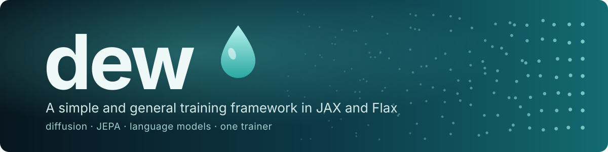
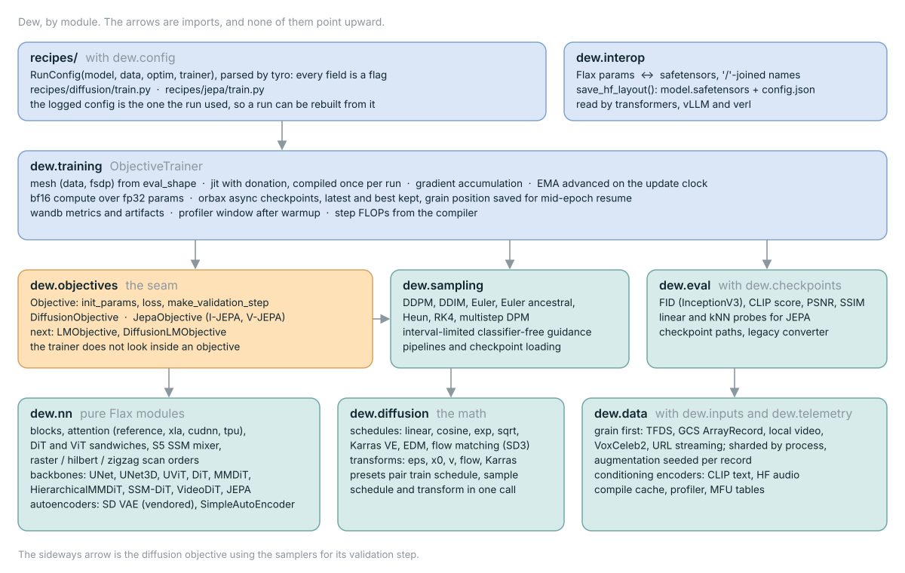
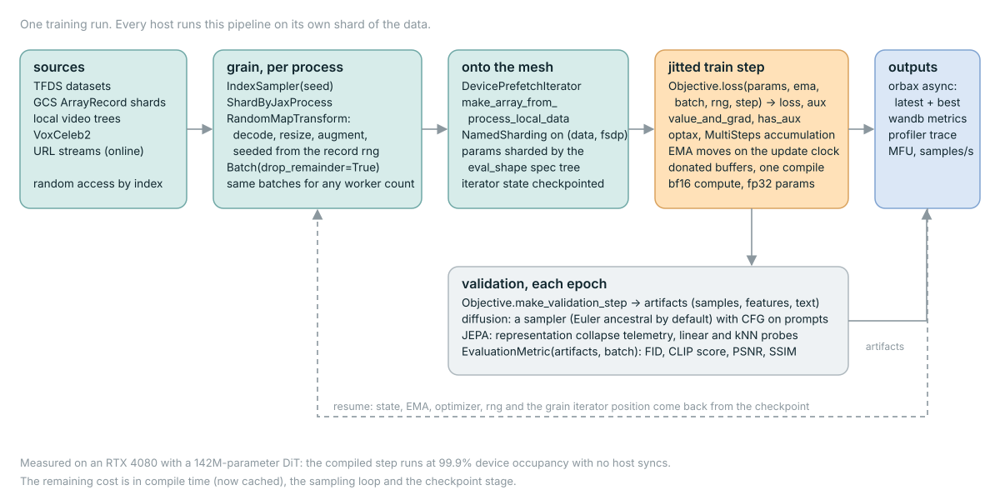

<p align="center">
  
</p>

<p align="center">
  <a href="https://github.com/AshishKumar4/dew/actions/workflows/ci.yml"></a>
  
  
  
</p>

**This project is partially supported by [Google TPU Research Cloud](https://sites.research.google/trc/about/). I would like to thank the Google Cloud TPU team for providing me with the resources to train the bigger text-conditional models in multi-host distributed settings.**

## A simple and general training framework in JAX and Flax

Dew is the framework I use to train models from scratch in JAX and Flax. It grew out of [FlaxDiff](https://github.com/AshishKumar4/FlaxDiff), a diffusion library I wrote to teach myself Flax and the maths behind diffusion models, and it still carries that project's complete git history (`git log --follow` on any file goes all the way back to the Keras notebooks). FlaxDiff was only about diffusion. Everything from it is still here, but the thing you optimize is now a plug-in called an objective, so the same trainer, data pipeline, sharding and checkpointing can train diffusion models, JEPA encoders and, soon, language models as well.

Dew is a library of tools (schedulers, samplers, models, objectives, a trainer, data pipelines, etc.) designed and implemented in an easy-to-understand way. The focus is still on understandability and readability. Performance is something I now measure though, and the recipes default to what measured fastest (bf16 compute with fp32 params, fused attention, and a persistent compilation cache). On my RTX 4080 with a 142M parameter DiT the compiled training step keeps the GPU busy 99.9% of the time, so the remaining cost is in compile time, the sampling loop and checkpointing, and that is where the recent work went. The maths is tested against the invariants of the papers it comes from (the schedules, the prediction transforms, and the samplers against an analytic denoiser).

I initially started this project in Keras, being familiar with TensorFlow 2.0, but transitioned to Flax, powered by Jax, for its performance and ease of use. I started FlaxDiff as a hobby to familiarize myself with Flax and Jax and to learn about diffusion and the latest research in generative AI, and Dew is the same hobby with a wider scope. The bigger text-conditional models in the gallery were trained on a TPU-v4-32 pod.

## Index

- [How it fits together](#how-it-fits-together)
- [Features](#features)
- [Installation](#installation)
- [Getting Started](#getting-started)
  - [Training Example](#training-example)
  - [Recipes](#recipes)
  - [Training something other than diffusion](#training-something-other-than-diffusion)
  - [Inference Example](#inference-example)
  - [Running on a TPU pod](#running-on-a-tpu-pod)
- [Example Notebooks from scratch](#example-notebooks-from-scratch)
- [Testing](#testing)
- [Coming from FlaxDiff](#coming-from-flaxdiff)
- [References and Acknowledgements](#references-and-acknowledgements)
- [Pending things to do list](#pending-things-to-do-list)
- [Gallery](#gallery)
- [Disclaimer (and About Me)](#disclaimer-and-about-me)
- [Contribution](#contribution)
- [License](#license)

## How it fits together

The trainer is built around one abstraction, the `Objective`. An objective owns the parameters, the loss, and whatever it wants to compute for validation, and the trainer owns everything else (the device mesh, the jitted step, EMA, gradient accumulation, checkpoints and logging). `DiffusionObjective` and `JepaObjective` ship today. Because the trainer never looks inside an objective, I could train a small byte-level language model through it with a fifteen line objective and no changes to the trainer at all (the sketch is [further down](#training-something-other-than-diffusion)).

<p align="center">
  
</p>

The second diagram follows one training run. Every host runs the same pipeline on its own shard of the data, and the mesh joins the hosts together.

<p align="center">
  
</p>

## Features

### Objectives
Implemented in `dew.objectives`:
- **Objective** (`dew.objectives.Objective`): The base class every objective implements. It has four methods (`init_params`, `loss`, `make_validation_step` and `log_validation_artifacts`) and an `EMASpec` which says which part of the parameter tree gets an EMA and how fast it moves.
- **DiffusionObjective** (`dew.objectives.diffusion.DiffusionObjective`): The default. Samples a noise level, corrupts the sample, runs the model and weights the loss (with optional min-SNR-gamma weighting). Works in pixel space, or in the latent space of an autoencoder if you pass one.
- **JepaObjective** (`dew.objectives.jepa.JepaObjective`): I-JEPA and V-JEPA. Predicts the representation of masked target blocks from the visible context, with the target encoder as an EMA of the context encoder, and logs collapse telemetry on every step.

### Schedulers
Implemented in `dew.diffusion.schedules`:
- **LinearNoiseScheduler**: A beta-parameterized discrete scheduler.
- **CosineNoiseScheduler**: A beta-parameterized discrete scheduler.
- **ExpNoiseScheduler**: A beta-parameterized discrete scheduler.
- **CosineContinuousNoiseScheduler**: A continuous scheduler.
- **CosineGeneralNoiseScheduler**: A continuous sigma parameterized cosine scheduler.
- **SqrtContinuousNoiseScheduler**: A continuous scheduler using the sqrt schedule proposed for diffusion language models.
- **KarrasVENoiseScheduler**: A sigma-parameterized continuous scheduler proposed by Karras et al. 2022, best suited for inference.
- **EDMNoiseScheduler**: A sigma-parameterized continuous scheduler based on the EDM paper, best suited for training with the KarrasVENoiseScheduler.
- **FlowMatchingScheduler**: A rectified-flow scheduler with logit-normal timestep sampling and resolution-dependent shifting, as used in Stable Diffusion 3.

### Model Predictors
Implemented in `dew.diffusion.transforms`:
- **EpsilonPredictionTransform**: The model predicts the noise in the data.
- **DirectPredictionTransform**: The model predicts the original data from the noisy data.
- **VPredictionTransform**: The model predicts a linear combination of the data and noise.
- **FlowMatchPredictionTransform**: The model predicts the flow velocity.
- **KarrasPredictionTransform**: A generalized transform for the EDM, integrating various parameterizations.
- **get_diffusion_preset**: One call which pairs a training schedule, a sampling schedule and a transform for the `"edm"`, `"karras"`, `"cosine"` and `"flow"` setups.

`dew.diffusion` is a leaf package. The samplers, the objectives and the trainer all import it and it imports none of them, so the maths can be used on its own.

### Samplers
Implemented in `dew.sampling`:
- **DDPMSampler**: Implements the Denoising Diffusion Probabilistic Model (DDPM) sampling process.
- **DDIMSampler**: Implements the Denoising Diffusion Implicit Model (DDIM) sampling process.
- **EulerSampler**: An ODE solver sampler using Euler's method.
- **EulerAncestralSampler**: Euler sampling with ancestral noise injection.
- **HeunSampler**: An ODE solver sampler using Heun's method.
- **RK4Sampler**: An ODE solver sampler using the Runge-Kutta method.
- **MultiStepDPM**: Implements a multi-step sampling method inspired by the Multistep DPM solver as presented here: [tonyduan/diffusion](https://github.com/tonyduan/diffusion/blob/fcc0ed829baf29e1493b460b073e735a848c08ea/src/samplers.py#L44)
- **DiffusionInferencePipeline** (`dew.sampling.pipelines`): Rebuilds a model from the config a run logged and generates from it, from a local checkpoint or from the wandb model registry.

All samplers support classifier-free guidance, including interval-limited guidance.

### Training
Implemented in `dew.training`:
- **ObjectiveTrainer** (`dew.training.ObjectiveTrainer`): Manages the training loop, EMA, gradient accumulation, checkpointing and wandb logging. It runs data-parallel and FSDP sharded training through `jax.jit` with `NamedSharding` on a `(data, fsdp)` mesh, donates the state buffers, and compiles the step once per run. `fsdp_size=1` is plain data parallelism, so there is one code path for both. The EMA only moves on real optimizer updates, which matters when you accumulate gradients.
- **Checkpointing**: Async orbax checkpoints at the end of every epoch, and every `checkpoint_every_steps` steps if you set it. Both the latest and the best checkpoint are kept, the state is stored once, and the position of the grain iterator is saved along with it, so a resumed run continues mid-epoch from the next unseen batch.
- **Precision**: The recipes default to bf16 compute over fp32 params (`--model.dtype`) and pick the fused attention kernel for the hardware they run on (`--model.attention-impl auto`, which is cuDNN flash attention on a GPU). If you ask the fused paths for something they cannot do (a higher matmul precision, or softmax in the input dtype) they raise, rather than silently doing something else.
- **Sharding** (`dew.training.distributed`): The device mesh, the parameter specs, the batch sharding and the device prefetch iterator.
- **Telemetry** (`dew.telemetry`): Step FLOPs read straight from the compiler, throughput and MFU, a profiler window which opens after a warmup so the trace is not full of compilation, and the persistent XLA compilation cache (on by default in the recipes).
- **Config** (`dew.config`): `RunConfig` with its `ModelConfig`, `DataConfig`, `OptimConfig` and `TrainerConfig` parts, which is how the recipes describe a run. [tyro](https://github.com/brentyi/tyro) turns the whole tree into a command line, and what gets logged to wandb is the config the run used, after defaults were applied.

### Models
Implemented in `dew.nn` and constructed via `dew.registry.build_model`:
- **Unet**: A classic convolutional UNet.
- **UNet3D**: A video UNet which can inflate 2D Unet checkpoints.
- **UViT / SimpleUDiT**: U-shaped transformers.
- **SimpleDiT / SimpleMMDiT / HierarchicalMMDiT**: DiT and SD3-style multi-modal DiT variants, all built on one shared adaLN-Zero block with a pluggable mixer.
- **HybridSSMAttentionDiT**: Interleaves S5 state-space blocks with attention.
- **VideoDiT**: A factorized spatial-temporal DiT for video.
- **JepaEncoder / JepaVideoEncoder / JepaPredictor**: The ViT encoders and the predictor that the JEPA objective trains.
- Hilbert and zigzag patch scan orders are available via the `+hilbert` and `+zigzag` architecture suffixes.
- **Autoencoders** (`dew.nn.autoencoders`): `StableDiffusionVAE` (vendored Flax VAE, loads Hugging Face hub weights) and `SimpleAutoEncoder` for latent diffusion without any external weights.
- **Attention** (`dew.nn.attention`): One kernel path shared by every attention module. It can run the Flax reference attention, `jax.nn.dot_product_attention` (XLA or cuDNN flash attention) or the Pallas TPU kernel, and the parameter tree is the same whichever you pick, so checkpoints move between hardware.

### Data
Implemented in `dew.data`, built on [grain](https://github.com/google/grain):
- **Sources** (`dew.data.sources`): TFDS datasets, ArrayRecord shards on a GCS mount, local video trees, VoxCeleb2 (audio and video), and a loader that streams images and videos from URLs while training.
- **Transforms**: Decoding, resizing and augmentation run as grain `RandomMapTransform`s and take their randomness from the record's own rng. Augmentation is done with [albumentations](https://albumentations.ai/). The same seed produces the same batches whatever the worker count or the number of hosts.
- **Loaders** (`dew.data.dataloaders`): `get_dataset_grain` for images and `get_media_dataset_grain` for images or video, both with a validation split that does not overlap the training records, and `load_data(config)`, which picks the right loader from the dataset registry.
- **Registry** (`dew.data.registry`): `datasetMap`, `mediaDatasetMap` and `onlineDatasetMap`, the dataset names the loaders and the recipes accept.
- **Conditioning** (`dew.inputs`): `DiffusionInputConfig` describes the sample and its conditions, and `CLIPTextEncoder` and `HFAudioEncoder` are the encoders that ship with it.

### Metrics
Implemented in `dew.eval`: FID (vendored InceptionV3), CLIP score, PSNR and SSIM, all as `EvaluationMetric`s the trainer runs on the validation artifacts. The linear and kNN probes for JEPA sit with the objective, in `dew.objectives.jepa.probes`.

### Interop
Implemented in `dew.interop`: `save_params`, `load_params` and `save_hf_layout` move a Flax parameter tree to and from [safetensors](https://github.com/huggingface/safetensors), naming each tensor by its '/'-joined path. `save_hf_layout` writes the `model.safetensors` + `config.json` directory that [transformers](https://github.com/huggingface/transformers), [vLLM](https://github.com/vllm-project/vllm) and [verl](https://github.com/verl-project/verl) all read, so a model trained here can be handed to them for post-training and serving.

### Tools
- **[TPU utilities for making life easier](./tools/tpu/)**: A collection of utilities and scripts to make working with TPUs easier, such as cli to create/start/stop/setup TPUs, script to setup TPU VMs (install everything you need), mounting gcs datasets etc. (This is the [tpu-tools](https://github.com/AshishKumar4/tpu-tools) repo, included as a submodule.)
- **[tools/benchmark_data.py](./tools/benchmark_data.py)**: Measures a data pipeline on its own, in samples per second, with no model in the way.
- **[tools/convert_legacy_checkpoint.py](./tools/convert_legacy_checkpoint.py)**: Converts FlaxDiff-era checkpoints to the current parameter tree.

## Installation

Dew needs Python 3.11 or higher:

```bash
pip install dew-ml
```

The package ships as `dew-ml` and imports as `dew`. The bare `dew` name on PyPI has been an empty placeholder since 2015 and I am asking for it, but until that goes through this is the name.

The base install comes with a CPU-only JAX, which is enough to run the tests and small experiments. For a GPU or a TPU, install the matching JAX build as well:

```bash
pip install "jax[cuda12]"   # NVIDIA GPUs
pip install "jax[tpu]"      # Cloud TPU VMs
```

Optional extras pull in the heavier dependencies only when you need them:

- `dew-ml[av]`: video/audio sources and readers (decord, moviepy, PyAV)
- `dew-ml[metrics]`: FID (scipy) and Inception weight download
- `dew-ml[streaming]`: the URL-streaming loader (Hugging Face `datasets`)
- `dew-ml[tfds]`: TFDS-backed dataset sources
- `dew-ml[interop]`: safetensors conversion

Or for development, clone the repo and install in editable mode with the test dependencies:

```bash
git clone --recurse-submodules git@github.com:AshishKumar4/dew.git
cd dew && pip install -e ".[test]"
```

## Getting Started

### Training Example

Here is a simplified example to get you started with training a text conditioned diffusion model on Oxford Flowers using Dew:

```python
from datetime import datetime
import jax, optax

from dew.data.dataloaders import get_dataset_grain
from dew.inputs import DiffusionInputConfig, ConditionalInputConfig
from dew.inputs.encoders import CLIPTextEncoder
from dew.diffusion.transforms import get_diffusion_preset
from dew.registry import build_model
from dew.sampling.euler import EulerAncestralSampler
from dew.training import ObjectiveTrainer

BATCH_SIZE, IMAGE_SIZE = 16, 128

data = get_dataset_grain("oxford_flowers102", batch_size=BATCH_SIZE, image_scale=IMAGE_SIZE)

text_encoder = CLIPTextEncoder.from_modelname("openai/clip-vit-large-patch14")
input_config = DiffusionInputConfig(
    sample_data_key="image",
    sample_data_shape=(IMAGE_SIZE, IMAGE_SIZE, 3),
    conditions=[ConditionalInputConfig(encoder=text_encoder)],
)

# A preset is a training schedule, a sampling schedule and a prediction transform that go together.
train_schedule, sample_schedule, transform = get_diffusion_preset("edm")

model = build_model("simple_dit", dict(
    emb_features=512, num_layers=8, num_heads=8, patch_size=8,
    dtype="bfloat16", attention_impl="auto",
))

trainer = ObjectiveTrainer(
    model=model,
    optimizer=optax.adamw(2e-4),
    input_config=input_config,
    noise_schedule=train_schedule,
    model_output_transform=transform,
    rngs=jax.random.PRNGKey(4),
    name=f"flowers-edm-{datetime.now():%Y-%m-%d_%H%M}",
    checkpoint_base_path="./checkpoints",
)

trainer.fit(
    data,
    training_steps_per_epoch=data["train_len"] // BATCH_SIZE,
    epochs=100,
    sampler_class=EulerAncestralSampler,
    sampling_noise_schedule=sample_schedule,
)
```

`fit` takes care of jitting the step, the EMA, checkpointing and resuming, and it logs to wandb if you give the trainer a `wandb_config`. To sample from the trained model, build the sampler you named and call it with the EMA parameters:

```python
sampler = EulerAncestralSampler(model, sample_schedule, transform, input_config, guidance_scale=3.0)
images = sampler.generate_samples(
    params=trainer.state.ema_params, num_samples=2, resolution=IMAGE_SIZE,
    diffusion_steps=50, conditioning=["a water lily", "a rose"],
)
```

### Recipes

The recipes wrap that same trainer in a config tree. A run is a `dew.config.RunConfig`, every field of it has a command line flag, and `--help` on either recipe prints the whole tree.

```bash
python recipes/diffusion/train.py --data.dataset oxford_flowers102 --data.image-size 128 \
    --data.batch-size 32 --trainer.epochs 2000 --model.architecture simple_dit \
    --model.config '{"patch_size": 4, "emb_features": 512, "num_layers": 12, "num_heads": 8}' \
    --trainer.wandb-project my-project
```

```bash
python recipes/jepa/train.py --data.dataset oxford_flowers102 --probe-classes 102 \
    --model.config '{"patch_size": 16, "emb_features": 384}'
```

Architecture arguments go in one json object, straight to `build_model`, so anything the registry accepts works. A few knobs are about the run rather than the architecture and have typed flags of their own: `--model.dtype` (`bfloat16` by default, the params stay fp32), `--model.attention-impl` (`auto` by default), `--trainer.checkpoint-every-steps`, `--trainer.compilation-cache-dir` (on by default, under `~/.cache/dew`), `--trainer.fsdp-size` and `--trainer.multi-host`. If you don't pass `--trainer.wandb-project`, the run only logs to the terminal.

### Training something other than diffusion

To check that the objective seam works for something other than diffusion, I trained a tiny byte-level language model with the objective below, using the trainer as it is. `model` is any Flax module that maps tokens to logits, and the trainer provides the mesh, the jit, the EMA and the checkpoints:

```python
import jax.numpy as jnp
import optax
from dew.objectives import Objective, EMASpec

class LMObjective(Objective):
    tag = "lm"

    def __init__(self, model, seq_len):
        self.model, self.seq_len = model, seq_len
        self.ema = EMASpec(decay=lambda step: 0.999)

    def init_params(self, rng):
        return self.model.init(rng, jnp.zeros((1, self.seq_len), jnp.int32))["params"]

    def loss(self, params, ema_params, batch, rng, step):
        tokens = batch["text"]
        logits = self.model.apply({"params": params}, tokens[:, :-1])
        ce = optax.softmax_cross_entropy_with_integer_labels(logits, tokens[:, 1:]).mean()
        return ce, {"ce": ce}

    def make_validation_step(self, **kwargs):
        return lambda val_state, batch: self.loss(val_state.params, None, batch, None, 0)[0]
```

You pass it as `ObjectiveTrainer(model, optimizer, objective=LMObjective(model, seq_len), ...)`. The cross entropy went from 5.5 to 0.05 in 512 steps and the model could recite its little corpus back. Language models are not a proper part of the library yet though. What is missing is in the [to do list](#pending-things-to-do-list) below (causal attention in `dew.nn`, a text pipeline, this objective in the library and a generation loop), plus one change to the trainer: it still asks for a diffusion style input config to learn the sample shape, which really should come from the objective.

### Inference Example

Here is a simplified example for generating images using a trained model, from a local checkpoint directory (the latest step, or the best one):

```python
from dew.sampling.loading import load_from_checkpoint, parse_config
from dew.sampling.pipelines import DiffusionInferencePipeline

state = load_from_checkpoint("./checkpoints/flowers-edm", step="best")
pipeline = DiffusionInferencePipeline.create(config=parse_config(run_config), state=state)
images = pipeline.generate_samples(
    num_samples=16, resolution=128, diffusion_steps=50,
    guidance_scale=3.0, conditioning_data=["a water lily", "a rose"],
)
```

Or from the wandb model registry, which is where the trainer pushes its best checkpoints:

```python
pipeline = DiffusionInferencePipeline.from_wandb_registry(
    modelname="diffusion-model", project="my-project",
)
```

### Running on a TPU pod

For a pod, run the same recipe on every host and pass `--trainer.multi-host`. That makes the processes join one JAX pool before anything else happens, and if they cannot, the run stops with an error instead of carrying on with one host. `--trainer.fsdp-size` shards the parameters and the optimizer state across that many devices, and `--data.dataset-path` points at the GCS mount. The scripts in [tools/tpu](./tools/tpu/) create the pod, install everything and mount the datasets.

## Example Notebooks from scratch

In the `tutorials` folder, you will find comprehensive notebooks for various diffusion techniques, written entirely from scratch and are independent of the Dew library. Each notebook includes detailed explanations of the underlying mathematics and concepts, making them invaluable resources for learning and understanding diffusion models.

- **[Diffusion explained (nbviewer link)](https://nbviewer.org/github/AshishKumar4/dew/blob/main/tutorials/simple%20diffusion%20flax.ipynb) [(local link)](tutorials/simple%20diffusion%20flax.ipynb)**

  - **WORK IN PROGRESS** An in-depth exploration of the concept of Diffusion based generative models, DDPM (Denoising Diffusion Probabilistic Models), DDIM (Denoising Diffusion Implicit Models), and the SDE/ODE generalizations of diffusion, with step-by-step explainations and code.

  <a target="_blank" href="https://colab.research.google.com/github/AshishKumar4/dew/blob/main/tutorials/simple%20diffusion%20flax.ipynb">
  
</a>

- **[EDM (Elucidating the Design Space of Diffusion-based Generative Models)](tutorials/edm%20tutorial.ipynb)**
  - **TODO** A thorough guide to EDM, discussing the innovative approaches and techniques used in this advanced diffusion model.

  <a target="_blank" href="https://colab.research.google.com/github/AshishKumar4/dew/blob/main/tutorials/edm%20tutorial.ipynb">
  
</a>

These notebooks aim to provide a very easy to understand and step-by-step guide to the various diffusion models and techniques. They are designed to be beginner-friendly, and thus although they may not adhere to the exact formulations and implementations of the original papers to make them more understandable and generalizable, I have tried my best to keep them as accurate as possible. If you find any mistakes or have any suggestions, please feel free to open an issue or a pull request.

## Testing

The suite runs in two lanes.

The mesh lane runs everything on CPU, and is what CI runs:

```bash
JAX_PLATFORMS=cpu pytest -m "not network" -q
```

`tests/conftest.py` asks XLA for 8 host devices, so the sharding tests exercise a real 4x2 data/fsdp mesh on any machine. It covers model forward passes for every architecture, scheduler and transform invariants, sampler convergence against an analytic denoiser, trainer smoke runs for images and videos, FSDP and data-parallel parity, sharded checkpoint round-trips with mid-epoch data resume, the EMA clock under gradient accumulation, the augmenters and the JEPA objectives.

The kernel lane runs the model and training files on a real GPU, with no `JAX_PLATFORMS` override so a CUDA jax picks the device:

```bash
pytest tests/test_models.py tests/test_samplers.py tests/test_schedulers.py tests/test_predictors.py \
    tests/test_flow_matching.py tests/test_metrics.py tests/test_autoencoder.py tests/test_trainer.py \
    tests/test_objectives.py tests/test_instrumentation.py tests/test_remat.py tests/test_encoders.py \
    tests/test_config.py tests/test_config_cli.py tests/test_interop.py tests/test_data.py \
    tests/test_augmenters.py -q -m "not network"
```

The multi-device suites stay on the CPU lane: those 8 devices are an XLA host-platform trick, and one GPU is one device. Tests marked `network` download pretrained weights and are excluded by default. What the suite cannot cover is a real multi-host run, which needs an actual pod (see the to do list).

## Coming from FlaxDiff

If you are coming from FlaxDiff, most of the code is the same, only moved around:

- `flaxdiff.models` became `dew.nn`, with the registry at `dew.registry`.
- `flaxdiff.schedulers` and `flaxdiff.predictors` became `dew.diffusion.schedules` and `dew.diffusion.transforms`.
- `flaxdiff.trainer.GeneralDiffusionTrainer` became `dew.training.ObjectiveTrainer`, and `flaxdiff.jepa` became `dew.objectives.jepa` plus `dew.nn.backbones.jepa`.
- `flaxdiff.samplers` and `flaxdiff.inference` became `dew.sampling`, and `flaxdiff.metrics` became `dew.eval`.
- `training.py` and `training_jepa.py` became `recipes/diffusion/train.py` and `recipes/jepa/train.py`, with typed configs instead of argparse.
- Parameter trees and checkpoint layouts did not change, so old checkpoints load. `tools/convert_legacy_checkpoint.py` handles the ones from before the DiT consolidation.

## References and Acknowledgements

### Research papers and preprints
- The Original Denoising Diffusion Probabilistic Models (DDPM) [paper](https://arxiv.org/abs/2006.11239)
- Denoising Diffusion Implicit Models (DDIM) [paper](https://arxiv.org/abs/2010.02502)
- Improved Denoising Diffusion Probabilistic Models [paper](https://arxiv.org/abs/2102.09672)
- Diffusion Models beat GANs on image synthesis [paper](https://arxiv.org/pdf/2105.05233)
- Score-Based Generative Modeling through Stochastic Differential Equations [paper](https://arxiv.org/pdf/2011.13456)
- Elucidating the design space of Diffusion-based generative models (EDM) [paper](https://arxiv.org/abs/2206.00364)
- Perception Prioritized Training of Diffusion Models (P2 Weighting) [paper](https://arxiv.org/abs/2204.00227)
- Pseudo Numerical Methods for Diffusion Models on Manifolds (PNMDM) [paper](https://arxiv.org/abs/2202.09778)
- The DPM-Solver: A Fast ODE Solver for Diffusion Probabilistic Model Sampling in Around 10 Steps [paper](https://arxiv.org/pdf/2206.00927)
- Scalable Diffusion Models with Transformers (DiT) [paper](https://arxiv.org/abs/2212.09748)
- Scaling Rectified Flow Transformers for High-Resolution Image Synthesis (SD3) [paper](https://arxiv.org/abs/2403.03206)
- Flow Matching for Generative Modeling [paper](https://arxiv.org/abs/2210.02747)
- Efficient Diffusion Training via Min-SNR Weighting Strategy [paper](https://arxiv.org/abs/2303.09556)
- Self-Supervised Learning from Images with a Joint-Embedding Predictive Architecture (I-JEPA) [paper](https://arxiv.org/abs/2301.08243)
- Revisiting Feature Prediction for Learning Visual Representations from Video (V-JEPA) [paper](https://arxiv.org/abs/2404.08471)
- Simplified State Space Layers for Sequence Modeling (S5) [paper](https://arxiv.org/abs/2208.04933)
- Applying Guidance in a Limited Interval Improves Sample and Distribution Quality (interval-limited CFG) [paper](https://arxiv.org/abs/2404.07724)
- Diffusion-LM Improves Controllable Text Generation (sqrt schedule) [paper](https://arxiv.org/abs/2205.14217)

### Libraries this is built on
- [JAX](https://github.com/jax-ml/jax) and [Flax](https://github.com/google/flax) (Linen). All of the models and the trainer are written in these.
- [Optax](https://github.com/google-deepmind/optax) for the optimizers and schedules, [Orbax](https://github.com/google/orbax) for checkpoints, and [Grain](https://github.com/google/grain) for the data pipeline.
- [tyro](https://github.com/brentyi/tyro), which turns the config dataclasses into the command line, and [Weights & Biases](https://github.com/wandb/wandb) for tracking runs.
- [albumentations](https://github.com/albumentations-team/albumentations) for augmentation, [OpenCV](https://github.com/opencv/opencv-python) for decoding, and [TensorFlow Datasets](https://github.com/tensorflow/datasets) for the public datasets.
- [transformers](https://github.com/huggingface/transformers) for the CLIP and audio encoders, and [safetensors](https://github.com/huggingface/safetensors) for interop.

### Useful blogs and codebases
- An incredible series of blogs on various diffusion related topics by [Sander Dieleman](https://sander.ai/posts/). The posts particularly on [diffusion models](https://sander.ai/2022/01/31/diffusion.html), [Typicality](https://sander.ai/2020/09/01/typicality.html), [Geometry of Diffusion Guidance](https://sander.ai/2023/08/28/geometry.html#warning) and [Noise Schedules](https://sander.ai/2024/06/14/noise-schedules.html) are a must read
- An awesome blog series by Tony Duan on [Diffusion models from scratch](https://www.tonyduan.com/diffusion/index.html). Although it trains models for MNIST and the implementations are a bit basic, the maths is explained in a very nice way. The codebase is [here](https://github.com/tonyduan/diffusion)
- The [k-diffusion](https://github.com/crowsonkb/k-diffusion/) codebase by Katherine Crowson, which hosts an exhaustive implementation of the EDM paper (Karras et al) along with the DPM-Solver, DPM-Solver++ (both 2S and 2M) in pytorch. Most other diffusion libraries borrow from this.
- The [Official EDM implementation](https://github.com/NVlabs/edm) by Tero Karras, in pytorch. Really neat code and the reference implementation for all the karras based samplers/schedules.
- The [Hugging Face Diffusers Library](https://github.com/huggingface/diffusers). The vendored Flax VAE and parts of the attention module derive from it (Apache-2.0, attribution headers preserved).
- [jax-fid](https://github.com/matthias-wright/jax-fid), the origin of the vendored InceptionV3 used for FID.
- [facebookresearch/ijepa](https://github.com/facebookresearch/ijepa) and [facebookresearch/jepa](https://github.com/facebookresearch/jepa), the reference I-JEPA and V-JEPA code which the masking and the probes follow.
- The [Keras DDPM Tutorial](https://keras.io/examples/generative/ddpm/) by A_K Nain, and the [Keras DDIM implementation](https://keras.io/examples/generative/ddim/) by András Béres, which are great starting points for beginners to understand the basics of diffusion models. I started my journey by trying to implement the concepts introduced in these tutorials from scratch.

### Related projects
- [MaxText](https://github.com/AI-Hypercomputer/maxtext) and [Levanter](https://github.com/stanford-crfm/levanter) are mature JAX trainers for language models and worth looking at if language models are all you need. Dew is a lot smaller, and also covers diffusion and JEPA.
- [verl](https://github.com/verl-project/verl) (RL post-training) and [vLLM](https://github.com/vllm-project/vllm) (serving) both read Hugging Face model directories, and `dew.interop.save_hf_layout` writes one, which is how a model trained here gets to them.

## Pending things to do list

- **Autoregressive language models as a proper objective**: causal attention in `dew.nn`, a text source and tokenizer transform in `dew.data`, `LMObjective`, perplexity, and a generation loop next to the samplers.
- **Diffusion language models**: the sqrt schedule is in, but the embedding layer, the `"sqrt"` preset and a rounding sampler are not.
- **Multimodal conditioning end to end**: the audio encoder and the audio-video source exist, but no backbone consumes the audio yet.
- **Multi-host validation of the revamped trainer on an actual TPU pod**
- **Full FID-50k evaluation (the current FID metric is per-validation-batch)**
- **Streaming as a grain pipeline**: the URL streaming loader still runs on its own threads and cannot resume. The plan is a grain `MapDataset` over the URL table with fetch and decode as grain ops.
- **The trainer should take its sample shape from the objective**: today every objective, JEPA included, has to hand it a `DiffusionInputConfig`.
- **Sampling as a `lax.scan`**: the sampling loop is still a Python loop, which costs about 1.4 ms of host time per step.
- **The `dew` name on PyPI**, which is why the package ships as `dew-ml` for now

## Gallery

### Images generated by Euler Ancestral Sampler in 200 Steps [text2image with CFG]
Model trained on Laion-Aesthetics 12M + CC12M + MS COCO + 1M aesthetic 6+ subset of COYO-700M on TPU-v4-32:
`a beautiful landscape with a river with mountains, a beautiful landscape with a river with mountains, ...`

**Params**:
`Dataset: Laion-Aesthetics 12M + CC12M + MS COCO + 1M aesthetic 6+ subset of COYO-700M`
`Batch size: 256`
`Image Size: 128`
`Training Epochs: 5`
`Steps per epoch: 74573`
`Model Configurations: feature_depths=[128, 256, 512, 1024]`

`Training Noise Schedule: EDMNoiseScheduler`
`Inference Noise Schedule: KarrasVENoiseScheduler`


### Images generated by Euler Ancestral Sampler in 200 Steps [text2image with CFG]
Images generated by the following prompts using classifier free guidance with guidance factor = 2:
`'water tulip, a water lily, a water lily, a water lily, a photo of a marigold, a water lily, a water lily, a photo of a lotus, a photo of a lotus, a photo of a lotus, a photo of a rose, a photo of a rose, a photo of a rose, a photo of a rose, a photo of a rose'`

**Params**:
`Dataset: oxford_flowers102`
`Batch size: 16`
`Image Size: 128`
`Training Epochs: 1000`
`Steps per epoch: 511`

`Training Noise Schedule: EDMNoiseScheduler`
`Inference Noise Schedule: KarrasVENoiseScheduler`


### Images generated by DDPM Sampler in 1000 steps [Unconditional]

**Params**:
`Dataset: oxford_flowers102`
`Batch size: 16`
`Image Size: 64`
`Training Epochs: 1000`
`Steps per epoch: 511`

`Training Noise Schedule: CosineNoiseScheduler`
`Inference Noise Schedule: CosineNoiseScheduler`

`Model: UNet(emb_features=256,
            feature_depths=[64, 128, 256, 512],
            attention_configs=[{"heads":4}, {"heads":4}, {"heads":4}, {"heads":4}, {"heads":4}],
            num_res_blocks=2,
            num_middle_res_blocks=1)`


### Images generated by Heun Sampler in 10 steps (20 model inferences as Heun takes 2x inference steps) [Unconditional]

**Params**:
`Dataset: oxford_flowers102`
`Batch size: 16`
`Image Size: 64`
`Training Epochs: 1000`
`Steps per epoch: 511`

`Training Noise Schedule: EDMNoiseScheduler`
`Inference Noise Schedule: KarrasVENoiseScheduler`


## Disclaimer (and About Me)

I worked as a Machine Learning Researcher at Hyperverge from 2019-2021, focusing on computer vision, specifically facial anti-spoofing and facial detection & recognition. Since switching to my current job in 2021, I haven't engaged in as much R&D work, leading me to start this pet project to revisit and relearn the fundamentals and get familiar with the state-of-the-art. My current role involves primarily Golang system engineering with some applied ML work just sprinkled in. Therefore, the code may reflect my learning journey. Please forgive any mistakes and do open an issue to let me know.

Also, few of the text may be generated with help of github copilot, so please excuse any mistakes in the text.

## Contribution

Feel free to contribute by opening issues or submitting pull requests. Let's make Dew better together!

## License

This project is licensed under the MIT License.
