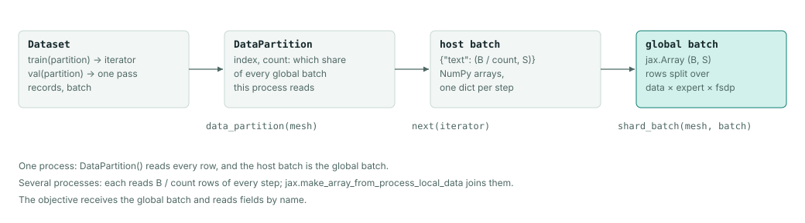
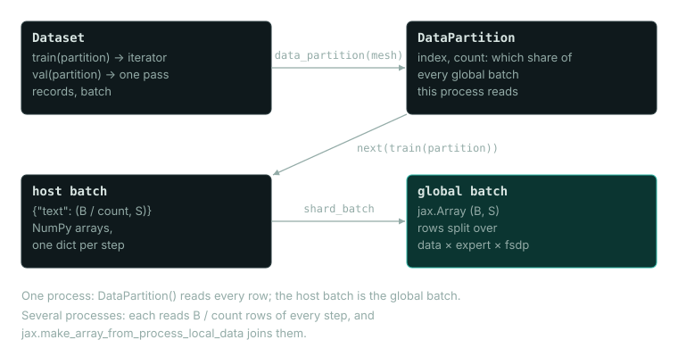

# Training data

A `Dataset` supplies the batches a run trains and validates on. A batch is a dictionary of arrays whose first dimension holds this process's rows of the global batch (all of them with one process). Most readers yield NumPy arrays, but device image augmentation yields pixels that are already JAX arrays on the device. The trainer joins the processes' rows into global arrays, and the objective reads the fields it needs by name.

This page covers the `Dataset` class, one-line datasets from Hugging Face, TFDS, Grain and PyTorch, the fields each built-in objective expects, the built-in readers, reading data that TFDS or Hugging Face already holds, and resuming the data stream from a checkpoint.




## Dataset

Records you already hold in memory become a `Dataset` through `Dataset.from_records`:

```python
import numpy as np
from dew.data import DataPartition, Dataset

x = np.arange(32, dtype=np.float32).reshape(16, 2)
y = x.sum(axis=1, keepdims=True)
data = Dataset.from_records({"features": x, "target": y}, batch=8, seed=0,
                            validation={"features": x[:8], "target": y[:8]})

first = next(data.train(DataPartition()))
print({name: value.shape for name, value in first.items()})
print(data.records, data.steps_per_epoch)
```

```text
{'features': (8, 2), 'target': (8, 1)}
16 2
```

`from_records` takes a mapping of columns whose first axis is the record (as here), a list of per-record mappings, or any source with `__len__` and `__getitem__`. Training reshuffles the records from `seed` every epoch and reads each one once per epoch. Its position goes into each checkpoint, so a resumed run reads the records it had not reached yet. With several processes, each reads its own share of every batch. `validation` is read once, in order, and every record is scored: the last batch is padded with repeated rows, which evaluation leaves out. The example validates on its training records only to show the argument; a real validation score needs records the model does not train on.

Every reader returns the same `Dataset` value:

| Field | Meaning |
|---|---|
| `train(partition)` | Returns a new iterator of training batches. It must yield at least as many batches as the run takes steps. |
| `val(partition)` | Returns a new iterator over one pass of the validation records, which then ends. `None` means no validation split. |
| `records` | The number of training records, or `None` when unknown. |
| `batch` | The global batch size. |

`train` and `val` are functions that return iterators, so every new or resumed run can open a fresh one. Whoever opens an iterator is responsible for it. Close it after use if it has a `close` method, but never close the dataset or its backing store. `Trainer.fit` closes the iterators it opens, whether the run finishes or fails. If you keep an exception from a training step after the run, it does not keep the closed prefetch iterator alive.

The argument is a `DataPartition`, which names the share of every global batch this process reads. `DataPartition()` reads every row, which is correct for a single process. With several processes the trainer asks the mesh for each process's share (`DataPartition.of(mesh)`), and the built-in readers read only that share.

A `Dataset` can also be built from the two functions directly, for a stream no reader covers:

```python
import itertools

import numpy as np
from dew.data import Dataset

x = np.arange(16, dtype=np.float32).reshape(8, 2)
batch = {"features": x, "target": x.sum(axis=1, keepdims=True)}
data = Dataset(train=lambda partition: itertools.repeat(batch), val=None, records=8, batch=8)
```

Such a function has to do two things that `from_records` does for you. It must read only the share its partition names, and if the run checkpoints, its iterator needs `get_state` and `set_state` (see [Resuming the data stream](#resuming-the-data-stream)). This one does neither, so it only suits a single-process run with `checkpoint_every=None`. If you built a Grain pipeline yourself, pass it to `Dataset.from_grain`.

`Dataset.steps_per_epoch` is `records // batch`, or `None` when `records` is `None`. A stream without a record count needs an explicit `steps` in `fit`.

## Datasets from other libraries

A Hugging Face, TFDS, Grain or PyTorch dataset is one call, with nothing to download or convert first:

<!-- not run: downloads the datasets on first use -->
```python
import grain
import torchvision
import dew.data
from dew.data import Dataset, HFImages, TFDSImages

text = dew.data.load("hf/winglian/tiny-shakespeare", batch=64, tokenizer="byte", seq_len=256)
cifar = HFImages(name="uoft-cs/cifar10", image_column="img", image_size=32).load(batch=64)
digits = dew.data.load("tfds/mnist", batch=64)
mnist = TFDSImages(name="mnist", image_size=32).load(batch=64)
records = Dataset.from_grain(grain.MapDataset.source([{"x": i} for i in range(1024)]), batch=64)
digits_torch = Dataset.from_torch(torchvision.datasets.MNIST("data", download=True), batch=64,
                                  fields=("image", "label"))
```

| Call | A batch holds |
|---|---|
| `load("hf/<name>", tokenizer=, seq_len=)` | `text`: int32 `[B, seq_len + 1]` token windows |
| `HFImages(name=...)`, `TFDSImages(name=...)` | `image`: uint8 `[B, image_size, image_size, 3]`, `label`: int32 `[B]` |
| `load("tfds/<builder>")`, `load("hf/<name>")` | The provider's own fields as arrays, as [TFDS and Hugging Face datasets](#tfds-and-hugging-face-datasets) describes |
| `Dataset.from_grain(map_dataset)` | The pipeline's own fields |
| `Dataset.from_torch(dataset, fields=)` | A dict sample's keys, or one field per `fields` name of a tuple sample |

`tokenizer` is `"byte"` or a Hugging Face tokenizer name such as `"gpt2"`. The split's `text` column is tokenized once, each row ended with the tokenizer's eos id, into `~/.cache/dew/tokens/<owner>--<name>/<key>` (`$XDG_CACHE_HOME/dew/tokens` when that is set), and the first 1% of the stream is the validation split. The key covers the dataset name, `split`, the tokenizer and the `HFOptions` that choose the rows (`config`, `data_dir`, `data_files`, `revision`), so the same call made again opens the cached ids without calling `datasets`, the Hub or the tokenizer, and runs offline. A setup step that makes the call once, with network access, fills the cache for a sandbox without it. A model that encodes or decodes with the same Hugging Face tokenizer still needs it in the Hugging Face cache, which `HF_HUB_OFFLINE=1` then reads. Rows that change under the same request are not read again until you delete the directory, so pass `options=HFOptions(revision=...)` to pin a version. In a run's config, the call is `TokenWindows(hub=HubText("winglian/tiny-shakespeare", tokenizer="byte"), seq_len=256)`.

`HFImages` reads each image in whatever mode it is stored, grey, 16-bit, a palette or with transparency, as RGB, with transparency composited onto white. A dataset without a caption column, such as CIFAR-10, loads without `caption_columns=()` as long as no caption reader is passed. Images and Arrow tables stay in the `datasets` cache, so after one load with network access, `HF_DATASETS_OFFLINE=1` reads them offline.

`tfds/<builder>` and `TFDSImages(name=)` without a path read `~/.cache/dew/tfds` (`$XDG_CACHE_HOME/dew/tfds`). A builder that is not there yet is prepared there as ArrayRecords, in a separate Python process so that the training process never imports TensorFlow. That process needs `tensorflow` and the dataset's own packages, and TFDS 4.9.10 also imports `importlib_resources` without declaring it. Without TensorFlow, as on Python 3.14, the call raises an error that names how to prepare the builder elsewhere: prepare it into that directory from another environment, or pass the prepared directory as `path`. A prepared builder reads offline.

`Dataset.from_grain` takes a `MapDataset` without batching: it repeats it, reads each process's share and saves a global record position. `Dataset.from_torch` reads a map-style `torch.utils.data.Dataset` by index, as `from_records` reads records: shuffled from `seed` every epoch, a share per process, and a global record position. Tensors arrive as NumPy, PIL images as their own arrays and 64-bit numbers as 32-bit ones. It refuses a `DataLoader`, whose sampler and `collate_fn` the run's stream would replace, so pass `loader.dataset` if you want the samples without them. It also refuses an `IterableDataset`, which has no index to shuffle or resume from; build a Grain `IterDataset` over it instead.

## Fields per objective

| Objective | Fields | Shape and dtype |
|---|---|---|
| Image diffusion | `image` | `(B, H, W, C)` uint8 in `[0, 255]`; the objective converts to its model's range |
| Video diffusion | The configured video field | `(B, T, H, W, C)`; check the source and the objective |
| Next-token language modeling | `text` | `(B, S + 1)` int32 token ids; inputs and targets overlap by one position |
| Packed language modeling | `text`, `text_segment_ids`, `text_positions` | Token, document and position arrays of the same shape |
| SFT | Packed token fields and `text_roles` | Role ids aligned with the tokens; the objective scores the target roles |
| Custom objective | Your own names | Whatever your `init` and `loss` read |

For text-conditioned diffusion, the condition encoder tokenizes the caption field and passes the encoding to the model. Keep token ids, attention masks, padding ids and the tokenizer vocabulary consistent with the checkpoint you load.

## Dataset specifications

The built-in readers are dataset specifications. Each one is a frozen dataclass that describes a dataset, and its `load(batch=...)` builds the reading pipeline and returns a `Dataset`. For example, `TokenWindows` reads fixed windows of `seq_len + 1` token ids from a tokenized directory:

```python
import json
import tempfile
from pathlib import Path

import numpy as np
from dew.data import DataPartition, Loading, TokenWindows

corpus = Path(tempfile.mkdtemp())
np.arange(1000, dtype=np.uint16).tofile(corpus / "train.bin")
np.arange(1000, 1200, dtype=np.uint16).tofile(corpus / "val.bin")
(corpus / "meta.json").write_text(json.dumps({"vocab_size": 1200}))

data = TokenWindows(path=str(corpus), seq_len=8, loading=Loading(workers=0)).load(batch=4)
windows = next(data.train(DataPartition()))
print(windows["text"].shape, windows["text"].dtype, data.records)
print(windows["text"][0])
```

```text
(4, 9) int32 124
[392 393 394 395 396 397 398 399 400]
```

The training stream is shuffled, which is why the first window of the first batch is window 49 of the corpus. `records` is the number of windows, `(1000 - 1) // 8 = 124`.

Each window starts `seq_len` ids after the previous one, so the last id of one window is the first id of the next. `dew tokenize` (or `TokenCorpus.write` in Python) writes `train.bin`, `val.bin` and `meta.json` from raw text; see [Packing](#packing). To read token ids already stored in parquet, use `dew.data.load("hf/parquet", options=HFOptions(data_files=...))` or give a Grain pipeline to `Dataset.from_grain`.

Other specifications include `TFDSImages` (a prepared TFDS image dataset, captioned from its class names), `HFImages`, `ChatMessages` and the video and preference readers, and the [API reference](../reference/core-api.md) lists them all. Each has its own fields for paths, tokenization, transforms and splits. Every specification also has these two fields:

| Field | Meaning |
|---|---|
| `seed` | The record order and the key of each record's random draws (augmentation, captions, clip starts) |
| `loading` | A `Loading` with Grain's throughput settings |

`Loading` changes how fast records are read, never which records a run sees or what is in them:

| `Loading` field | Default | Counts |
|---|---|---|
| `workers` | 0 | Grain worker processes; `0` reads in the training process |
| `threads` | 64 | Record reads one worker keeps in flight |
| `read_buffer` | 128 | Records one worker reads ahead |
| `worker_buffer` | 2 | Batches one worker holds ready |

The default reads in the training process, as Grain's own default does. Each worker process imports the program again, which costs seconds and memory before the first batch. Workers pay off only when decoding or augmentation is more work than the reading threads can keep up with, so raise `workers` only after measuring the input pipeline on your data and hardware. A script that starts workers needs an `if __name__ == "__main__":` guard, because each worker imports the script.

Image sources can need network access the first time. Token-window sources read files written by `dew tokenize`. Streaming sources can depend on remote servers and may have no position to restore. [Recipes](../recipes.md) lists the command-line entry points, and [Installation](../installation.md#optional-extras) lists the extras each source needs.

`OnlineImages` and `OnlineVideos` (`data:online-videos` in a recipe) stream Hugging Face tables of urls and captions. `OnlineVideos` decodes each url's video the same way `LocalVideos` reads a file, as `frames` consecutive frames at 25 fps, resized to `image_size` squares, without audio.

## Image datasets on the Hugging Face Hub

`HFImages` reads a Hub image dataset by index through the image pipeline, which decodes each image to RGB, resizes it to `image_size`, applies augmentation and reads captions for text conditioning. Its column fields tell it where each record keeps its data. `image_column` names the image column, and the caption is the first of `caption_columns` that a record has. Where the dataset has a `label` column, it holds the record's class index. CIFAR-10, for example, keeps its image under `img`, a class under `label` and no caption:

<!-- not run: downloads CIFAR-10 on first use -->
```python
from dew.data import DataPartition, HFImages

data = HFImages(name="uoft-cs/cifar10", image_column="img", image_size=32,
                augmentation="flip_only", val_split="test", val_batches=None).load(batch=64)
batch = next(data.train(DataPartition()))
print({name: (value.shape, value.dtype) for name, value in batch.items()})
print(data.records, data.steps_per_epoch)
```

```text
{'image': ((64, 32, 32, 3), dtype('uint8')), 'label': ((64,), dtype('int32'))}
50000 781
```

Captions are read only when `load` is given a caption reader (`tokenize`), so a dataset without a caption column loads for an unconditional or class-conditional run, and a caption reader over it is refused. If you name an image column the split does not hold, loading the spec raises an error that lists the columns it does hold. Without `val_split`, the first `val_batches` batches of the training split are held out for validation. With a `val_split`, `val_batches=None` scores the whole named split.

Validation reads each image through the deterministic resize and skips the crop, flip and jitter that training applies, so a metric scores the same images a reference implementation would.

## Device image augmentation

`TFDSImages`, `HFImages` and the prepared `ArrayRecordImages` readers share
`ImageDataset`'s transforms. By default (`augmentation_backend="device"`)
random crop/resize, horizontal flip and colour jitter run on each decoded
batch with JAX, on the accelerator, and the host only decodes and resizes.
On an 8-vCPU host that reads about 2.4 times the images per second it reads
when it also augments (512x384 JPEGs to 256-pixel crops). Without an
accelerator the JAX path costs about 20% more than OpenCV's, so set
`augmentation_backend="host"` for a CPU-only run; a run record keeps the
backend it trained with. `augmentation="flip_only"` turns off colour jitter,
and `"none"` keeps only the deterministic resize, with no random crop.

On either backend the colour jitter is torchvision's float
`ColorJitter(brightness=0.2, contrast=0.05, saturation=0.2)`. It applies the
three factors in a random order, clamps each one to the pixel range, and
rounds to uint8 once at the end.

<!-- not run: needs a prepared Oxford Flowers version directory -->
```python
from dew.data import Loading, TFDSImages

data = TFDSImages(
    path="data/oxford_flowers102/2.1.1",
    image_size=128,
    augmentation="flip_jitter",
    crop_scale=(0.6, 1.0),
    augmentation_size=160,
    loading=Loading(workers=0, threads=4),
).load(batch=32)
```

`crop_scale` is the fraction of the area to keep, drawn uniformly and applied
as an integer crop of the staging square, so both sides shrink by its square
root. `(1.0, 1.0)` keeps the full image. `augmentation_size` is the side of
the staging square, and `None` stages at `image_size`. A larger size keeps
more pixels for the crop and resize, but it costs more transfer and device
memory.

Decoding, the first area/cubic resize into a dense square, and caption
tokenization still run on the host. The JPEGs vary in size, so they cannot be
stacked into one array as they are, and neither JAX nor this option decodes
them. The crop's bilinear resize, the flip and the jitter then run on the
device, followed by one final uint8 round and clip. CPU consumers,
`OnlineImages` and video decoding still need the host path, and this option
does not change them.

Each example's key comes from Grain's data seed and the example's global
record position, and JAX derives every augmentation draw from that key. The
example's row in the batch plays no part, so changing the reader threads,
batch size or process shares changes no draw. Restoring the data position
also restores the augmentation, with no separate RNG state to save. Switching
the backend changes the RNG algorithm, which makes it a transform change, so
do not switch it when you resume an existing run.

Augmentation runs on the process's default JAX device, normally its first
local device. With several local devices, that device augments the whole
local batch before the trainer redistributes the rows onto its mesh. This
option does not shard augmentation across the local devices.

Validation reads through the host's deterministic resize, whatever the
training augmentation and backend.

A test runs the JAX op and the OpenCV bilinear host op with identical crop,
flip and colour parameters and compares them in float64. On the RTX 4080 the
largest absolute error was 6.55e-6, and the rounded uint8 codes were identical
across 18 cases. OpenCV's interpolation coefficients are float32, so four
bilinear corner-weight errors and a combined jitter gain below two give the
bound `255 * 8 * eps(float32)`, which is at most one code value after
rounding. The default host resize is unchanged and still uses area
interpolation to shrink and cubic to enlarge.

`tools/benchmark_image_pipeline.py` compares OpenCV, PIL, TFDS's NumPy decoder
and torchvision on identical Flowers JPEG bytes, with the same final resize.
It also measures input-pipeline throughput and real prefetched pixel-diffusion
updates on the selected device, with device synchronization. The decoder
microbenchmark leaves out storage reads and startup. The training measurement
includes decode, resize, augmentation, transfer and optimizer updates, and
leaves out compilation and warmup.

Measured on 2026-10-01 with an RTX 4080 (16 GB) and an i9-12900K, JAX
0.11.2.post3, OpenCV 5.0.0, Pillow 11.3.0, TFDS 4.9.10 and torchvision
0.29.0+cpu. A three-image probe first checked the decoder calls; the numbers
below use 512 Flowers JPEGs, RGB in stored orientation, the same 128-square
final OpenCV resize, and the median of three passes. OpenCV used one thread;
the GPU runner capped the host job at four CPU cores.

| Decode + resize | Median images/s | Range over 3 passes | Decoder threads |
|---|---:|---:|---:|
| OpenCV, full JPEG decode | 613 | 486–642 | 1 |
| PIL, full JPEG decode | 554 | 537–557 | 1 |
| TFDS NumPy decoder | 614 | 590–665 | 1 |
| torchvision CPU decoder | 646 | 507–734 | 1 |
| Existing OpenCV reduced JPEG decode | 761 | 745–810 | 1 |

TFDS and torchvision did not beat Dew's existing reduced OpenCV path on this
corpus and size, so the default stays OpenCV. The full-resolution decoders
ran serially, one thread per image, and OpenCV and Torch also had their
thread pools limited to one. I did not measure a reduced Pillow decode
(`Image.draft`), so OpenCV is the fastest of the paths measured here, and the
table says nothing about reduced Pillow preprocessing.

The full-resolution decoders produced identical resized bytes on these 512
images. The existing reduced JPEG decode is a different decode, with a maximum
pixel difference of 56 against full decode here, and device augmentation does
not change it. The TFDS row measures TFDS's ArrayRecord NumPy decoder, not a
TensorFlow `tf.data` graph or its scheduling.

The full Flowers source was warmed before either pipeline ran. Each run used
batch 32, four Grain reader threads, five warmup batches and three intervals
of 60 batches. CPU time is summed over the reader threads, so it measures
work and not wall-clock latency.

| Augmentation | Host images/s | Device images/s | Host CPU ms/batch, before → after |
|---|---:|---:|---:|
| Flip + colour jitter | 1,097 | 1,681 | 65.96 → 47.20 |
| Crop (area 0.6–1.0) + flip + colour jitter | 998 | 2,002 | 83.95 → 47.98 |

In real prefetched `Trainer` updates on one RTX 4080, throughput went from 575
to 874 images/s (1.52×) when augmentation moved to the device. The model was a
small pixel-EDM SimpleDiT with patch 16, width 32, one layer, four heads and
float32/HIGHEST computation, and each backend ran 185 updates. This small
model is input-bound, so the number is not a large-model speedup. Decode and
the staging resize are still host work after augmentation moves to the device.

The CUDA autotuner printed a delay-kernel timing warning during compilation.
These numbers come from synchronized wall-clock intervals after compilation
and warmup, not from the autotuner's kernel timer.

<!-- not run: needs prepared Flowers data and a GPU -->
```bash
python tools/benchmark_image_pipeline.py \
    --flowers data/oxford_flowers102/2.1.1 \
    --images 512 --repeats 3 --batch 32 --steps 60 --threads 4 \
    --out image-pipeline.json
```

The [raw measurements](https://github.com/AshishKumar4/dew/blob/main/tools/measurements/data-rtx4080.json)
include each timing interval, the image-byte SHA-256 and the example outputs.

## Real image and masked-text examples

[`train_masked_lm.py`](https://github.com/AshishKumar4/dew/blob/main/examples/train_masked_lm.py)
trains MDLM on TinyStories, or any Hugging Face text dataset with a `text`
column. `HubText` tokenizes the train split once (GPT-2 ids by default) into
Dew's cache, and the head 1% of that stream is held out. A bidirectional
`CausalTransformer` learns MDLM's negative ELBO, with the mask one id past
the tokenizer's vocabulary. Every `--eval-every` steps the trainer reports
`val/perplexity`, the exponential of the NELBO per token, which is the bound
MDLM reports. At the end the script loads the run back with `dew.pipeline`,
scores the whole held-out split and unmasks a continuation of each
`--prompts`, into `result.json` and `samples.txt`.

[`sft_diffusion_gemma_images.py`](https://github.com/AshishKumar4/dew/blob/main/examples/sft_diffusion_gemma_images.py)
trains a fresh DiffusionGemma with a Gemma 4 vision tower to caption Oxford
Flowers 102 with the flower's name. It stages the three splits as small
parquet files once, trains on train and validation with random crops, and
scores canvas cross entropy on test. Then it reloads the run as a
`BlockGeneration` task, captions every test image, and records in
`result.json` how many captions name the right flower. It trains a small
model from scratch and does not fine-tune the released 26B DiffusionGemma.
On an A100 40 GB the default 6000 steps train in 13 minutes, and 33.3% of
the 6149 test captions name the right flower (14.1% after 3000 steps).

Both scripts accept `--smoke`, which writes a few local records, shrinks the
model and runs four CPU steps without the network. It shows that the
workflow runs end to end and says nothing about quality.

<!-- not run: downloads the datasets and trains for hours on a GPU -->
```bash
python examples/train_masked_lm.py --out runs/mdlm-tinystories
python examples/sft_diffusion_gemma_images.py --out runs/flowers-caption
JAX_PLATFORMS=cpu python examples/train_masked_lm.py --smoke --out /tmp/mdlm-smoke
```

## TFDS and Hugging Face datasets

`dew.data.load("<provider>/<name>", batch=...)` reads a dataset that TFDS or Hugging Face already holds and returns a `Dataset`. Pass `preprocess(record, rng)` to turn one provider record into batch fields. Without it, each field of a record goes into the batch as an array. A list column becomes one `[batch, n]` field, 64-bit numbers become 32-bit ones, and strings and bytes stay as they are. Nothing is decoded, renamed or dropped, and an integer that does not fit in 32 bits is refused with an error that names its field. `dataset=` takes a Hugging Face split that is already in memory:

```python
import datasets
import numpy as np
import dew.data

table = datasets.Dataset.from_dict({"x": [[float(i), float(i)] for i in range(32)],
                                    "label": list(range(32))})
data = dew.data.load("hf/toy", batch=8, dataset=table, loading=dew.data.Loading(workers=0),
                     preprocess=lambda record, rng: {"x": np.asarray(record["x"], np.float32),
                                                     "label": np.int32(record["label"])})
first = next(data.train(dew.data.DataPartition()))
print(first["x"].shape, first["label"][:4], data.records)
```

```text
(8, 2) [26  4 10 30] 32
```

| Argument | Meaning |
|---|---|
| `split`, `val_split` | The provider's own split expressions. The validation split is read in order and never shuffled. |
| `records` | The record count, for a source that cannot report one |
| `seed` | The record order and the per-record random key |
| `shuffle_buffer` | Rows a streamed Hugging Face split shuffles through |
| `options` | `TFDSOptions` for `tfds/...`, `HFOptions` for `hf/...`; the other provider's options raise `TypeError` |
| `loading` | Throughput only, as above |
| `tokenizer`, `seq_len` | Read an `hf/...` split's `text` column as token windows (see [Datasets from other libraries](#datasets-from-other-libraries)) |

`tfds/<builder>` reads the ArrayRecord files that a TFDS preparation run wrote under `TFDSOptions.path`. It reads them through TFDS's read-only builder, so the training process does not import TensorFlow. Without a `path`, it reads Dew's own TFDS directory and prepares a missing builder there first, as [Datasets from other libraries](#datasets-from-other-libraries) describes; [Installation](../installation.md#preparing-tfds-data) shows how to prepare data yourself. `path` is either a prepared version directory or the `data_dir` above one, and in the second case `config` and `version` select the directory inside it. Dew checks the prepared metadata against the builder, config and version you asked for, and passes `decoders` to the builder unchanged.

<!-- not run: needs a prepared TFDS directory -->
```python
import dew.data
from dew.data import TFDSOptions

data = dew.data.load("tfds/dew_images", batch=8, split="train", val_split="test",
                     options=TFDSOptions(path="/data/prepared"),
                     preprocess=lambda record, rng: {"image": record["image"]})
```

`hf/<name>` reads one Arrow-backed split through `datasets.load_dataset`. When the local cache does not have the dataset, `load_dataset` downloads it and writes its Arrow cache. `HFOptions` holds `config`, `data_files`, `features`, `storage_options` and the other `load_dataset` arguments, with the types that function takes.

`streaming=True` reads an `IterableDataset` as it goes. A streamed split has no length, so unless you pass `records`, both `records` and `Dataset.steps_per_epoch` are `None`. Processes split the rows with `datasets.distributed.split_dataset_by_node`. When there are more processes than rows, one process would get none, so Dew refuses the run.

A streamed split loaded by name without shuffling resumes at the record where it stopped, with the same per-record random draws. Three kinds of streamed split have no position to resume from, so they must train with `checkpoint_every=None`, and `Trainer.fit` refuses them otherwise:

- a split read with `shuffle_buffer` set, because `datasets` does not restore the shuffle buffer;
- a split passed as `dataset=`, because it may carry transformations Dew did not apply;
- a split whose source implements no state in `datasets`.

## Packing

Packing places tokens from several documents into rows of a fixed width. Segment ids (`text_segment_ids`) stop attention and target scoring from crossing document boundaries, and position ids (`text_positions`) restart at each document. Every per-token array must be sliced and packed the same way as the token ids.

A batch stacks each field into one array, so token ids of varying length cannot go into it as they are. If you tokenize in `preprocess` and batch the result, you get an error that says so. There are two ways to get fixed rows, offline and online.

Offline, `dew tokenize --pack` (or `TokenCorpus.write(..., pack=True)` in Python) writes a token directory with an eos id after every document, and `TokenWindows(pack=True)` packs it. It saves its position as a global record count, which resumes on any process count. `TokenCorpus.write` takes a text file, a directory of `.txt` files, or any iterable of strings with one document each, such as a Hugging Face split's text column.

Online, Grain's packers build the rows as the documents are read, and `Dataset.from_grain` batches them. Each process builds the pipeline over its own share:

<!-- not run: downloads wikitext and the SmolLM2 tokenizer on first use -->
```python
import datasets
import grain
import numpy as np

from dew.data import DataPartition, Dataset, HFTokenizer

tokenizer = HFTokenizer("HuggingFaceTB/SmolLM2-135M")
split = datasets.load_dataset("Salesforce/wikitext", "wikitext-2-raw-v1", split="train[:2000]")
seq_len = 128


def tokenized(row):
    return {"text": np.asarray(tokenizer.encode(row["text"]), np.int32)}


def documents(partition):
    rows = (grain.MapDataset.source(split).seed(0).shuffle().repeat(None)
            .map(tokenized).filter(lambda row: len(row["text"]) > 0))
    share = rows[partition.index::partition.count].to_iter_dataset()
    return grain.experimental.ConcatThenSplitIterDataset(
        share, length_struct={"text": seq_len + 1})


data = Dataset.from_grain(documents, batch=8)
batch = next(data.train(DataPartition()))
print({name: (value.shape, value.dtype) for name, value in batch.items()})
print([len(set(row)) for row in batch["text_segment_ids"]])
```

```text
{'text': ((8, 129), dtype('int32')), 'text_positions': ((8, 129), dtype('int32')), 'text_segment_ids': ((8, 129), dtype('int32'))}
[1, 1, 2, 2, 3, 2, 1, 2]
```

`ConcatThenSplitIterDataset` concatenates the documents and cuts the stream into rows of `seq_len + 1` ids, splitting any document that crosses the end of a row. It also writes `text_segment_ids` and `text_positions`, the field names `LMObjective` reads. The last printed line counts the documents in each row.

To pack whole documents with padding, use `grain.experimental.FirstFitPackIterDataset`. It refuses a document longer than the row, so cut long documents first. An online pipeline's position is Grain's own iterator state for one share, so it resumes only on the process count that wrote it (see [Resuming the data stream](#resuming-the-data-stream)).

Padding and packing change the number of valid targets even when the array shapes are equal. Gradient accumulation adds the loss totals and masses of its microbatches before dividing, so the accumulated gradient is the gradient of one token mean over the whole window. Before you treat two runs with different packing as equivalent, check how each one is normalized.

## Resuming the data stream

If an iterator has `get_state()` and `set_state(state)`, Dew saves its position in every checkpoint and restores it on resume. The resumed run must use the same data order, tokenizer and transforms as the run that wrote the checkpoint. There are two kinds of position:

| Kind | Written by | Resumes on |
|---|---|---|
| Global record count | Every reader built on `train_stream`: token windows, packed documents and conversations, weighted mixtures, images, video, prompts, preference pairs | Any process count that divides the global batch |
| Shard offset | Custom iterators that report their own state | Only the process count that wrote it |

A global position is the number of records the whole run has consumed, and every process reports the same number. Step *k* reads records `[k * batch, (k + 1) * batch)` of one shuffled order, and process *p* of *n* reads every *n*-th record of that step. So a checkpoint written by two processes restores on one or on four, and the steps after the resume read the same records an uninterrupted run would have read. Restoring sets where the stream starts reading, so no record is read twice.

The position also records which stream it counts through: the source's description, its record count and the shuffle seed. Dew refuses to resume with a different record count or seed. A source without its own `__repr__` is described by its type name, so Dew can tell two corpora of the same length and seed apart only if the source describes its data. Give any source you resume across runs a `__repr__` that names its data.

Which process holds which row of a step depends on the process count, so randomness keyed by row, such as diffusion noise or sampled timesteps, falls on different records at a different process count. The resumed run then draws different noise for the same records. It optimizes the same objective, but its losses are not the numbers an uninterrupted run would have logged. A record's own random draws are keyed by its place in the shuffled stream and do not depend on the process count.

`Checkpoints.restore` refuses a shard offset written by a different number of processes, and the error names both counts. Resume such a run on the process count that wrote it. [Checkpoints](../guides/checkpoints.md) shows the whole save and restore path.

## Multiple processes

`Dataset.batch` is the global batch. With several JAX processes, each process reads its share and Dew assembles the global arrays with `jax.make_array_from_process_local_data`. The built-in readers and `Dataset.from_records` split records between processes themselves. A custom `train` function must read only the share its `partition` names, `partition.index` of `partition.count`. Otherwise every process trains on the same records.

Before a multi-process run, check on the target topology that process shares do not overlap, that sharding is as expected and that a resume continues the stream. [Distributed training](distributed.md) describes placement.
