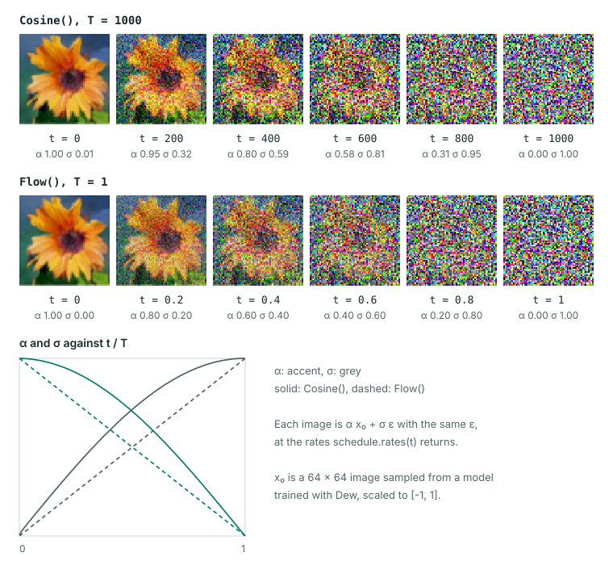
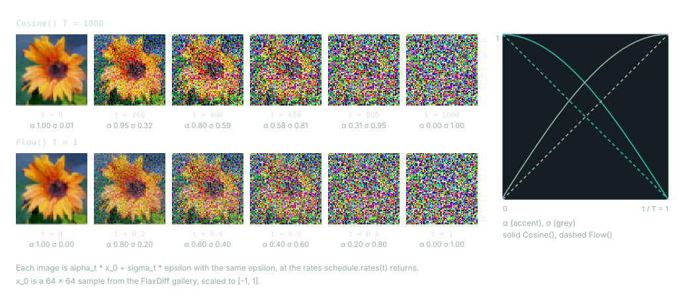

# Diffusion processes and solvers

A diffusion model learns to undo noise. Training takes a clean sample $x_0$, draws a time $t$ and a Gaussian $\epsilon \sim \mathcal{N}(0, I)$, and forms the noisy sample

$$x_t = \alpha_t x_0 + \sigma_t \epsilon.$$

The network sees $x_t$ and $t$ and predicts a quantity from which $x_0$ and $\epsilon$ can be recovered. Sampling starts from noise at the highest time and walks a grid of times down to zero with a solver. In Dew, a `Process` holds everything about this convention that training and sampling must agree on, a preset builds a published `Process`, and `dew.sampling.sample` runs a solver over it.




## Example

```python
import jax
import jax.numpy as jnp

from dew.diffusion.presets import Cosine, Flow

for preset in (Cosine(), Flow()):
    process = preset()
    schedule = process.schedule
    t = jnp.linspace(0, schedule.T, 5)
    alpha, sigma = schedule.rates(t)
    times = schedule.sample_t(jax.random.key(0), 4)
    print(type(preset).__name__, "T =", schedule.T)
    print("  alpha", " ".join(f"{float(v):.3f}" for v in alpha))
    print("  sigma", " ".join(f"{float(v):.3f}" for v in sigma))
    print("  training times", " ".join(f"{float(v):g}" for v in times))
```

```text
Cosine T = 1000
  alpha 1.000 0.920 0.702 0.378 0.000
  sigma 0.006 0.393 0.713 0.926 1.000
  training times 789 0 712 373
Flow T = 1.0
  alpha 1.000 0.750 0.500 0.250 0.000
  sigma 0.000 0.250 0.500 0.750 1.000
  training times 0.835159 0.883424 0.393268 0.480356
```

`Cosine` is a table over 1000 discrete steps and draws integer training times uniformly. `Flow` is continuous on `[0, 1]`, with $\alpha_t = 1 - t$ and $\sigma_t = t$, and draws training times from a logit-normal distribution.

## Process

A `Process` is a frozen dataclass of four parts:

| Part | What it decides |
|---|---|
| Schedule | $\alpha_t$ and $\sigma_t$ at each time, and how training draws times |
| Prediction transform | What the network outputs: the noise, the clean sample, a velocity, a flow, or the Karras-preconditioned form, and how that converts to $x_0$ and $\epsilon$ |
| Weighting | How the loss weighs each time: the schedule's own weight, a P2-style weight, or Min-SNR |
| Sampling schedule | The time grid inference walks, when it differs from training |

Four methods serve sampling. `process.noise(key, shape)` draws the starting noise at the highest level. `process.times(steps)` is the descending grid a solver walks, and `process.rates(t, like=x)` is that grid's `(alpha, sigma)` at `t`, shaped to broadcast against `x`. `process.denoiser(model, params, conditions)` wraps a model and its weights into the function a solver calls, which maps a noisy sample and its time to the model's estimates of the clean sample and of the noise.

## Presets

A preset is a frozen dataclass of the numbers that define a published convention. Pass `EDM(regime="pixel")` or `Flow()` directly to `DiffusionObjective` or `DiffusionRunConfig(preset=...)`; they build the process, and the objective's image task keeps that same process. Calling a preset yourself builds a `Process` for direct schedule inspection or low-level sampling. EDM's regime chooses the training noise levels: Karras et al. 2022's for pixels or EDM2's for latents. Explicit `P_mean` and `P_std` values override the regime; supplying both also works without a regime, so old run records retain their training distribution. Otherwise a preset without a regime refuses to build, and a run config fills it from whether the run has an autoencoder. A run's `run.json` stores the preset's fields, so sampling rebuilds the convention the model was trained with.

| Preset | Convention |
|---|---|
| `EDM` | Log-normal training noise (Karras et al. 2022 for pixels, EDM2 for latents), the EDM preconditioning and weighting, sampled on the rho-spaced Karras grid |
| `Karras` | The EDM preconditioning, trained on noise levels drawn uniformly along the grid it samples on |
| `Cosine` | The cosine beta table with v-prediction; its default P2 weight makes the loss an unweighted $x_0$ loss |
| `Flow` | Rectified flow on the linear path with velocity prediction. Training times follow one of SD3's densities (Esser et al., 2024): logit-normal (the default), the heavy-tailed `mode` density, `cosmap` or uniform. The time is the noise level, as in the paper; Diffusers' SD3 and Flux training scripts index their timesteps in descending order, so their `--logit_mean` is the negative of `logit_mean` here. `shift` is SD3's static resolution shift; `resolution_shift` sets it from the image size instead, as Flux's exp(mu) of a token count. A run config fills that count from its data on a 16-pixel grid, Flux's own; a model that tokenizes the image otherwise sets `tokens` to its count |
| `JiT` | JiT (Li & He, 2025): rectified flow on the linear path where the model predicts the clean sample and the loss scores it in velocity space (`VelocityLoss`), with sigma floored at `t_eps`. Training times are the reference's logit-normal. `simple_dit`'s `patch_bottleneck` is JiT's bottleneck patch embedding for large pixel patches |
| `MeanFlow` | MeanFlow (Geng et al., 2025): rectified flow whose model predicts the average velocity over an interval, reading the interval's `duration` beside the time (`Process.interval`, `simple_dit(interval=True)`). It trains under `MeanFlowObjective` (`mean_flow` on the run config), and one Euler step over the whole grid samples it |
| `Sqrt` | Diffusion-LM (Li et al., 2022): the square-root schedule with the plain $x_0$ loss |
| `MDLM` | Masked diffusion over tokens (Sahoo et al., 2024) on the log-linear schedule, from `dew.diffusion.discrete`; it takes the vocabulary's `mask_id` |

The presets are classes in `dew.diffusion.presets`. Training and inference can use different schedules: EDM trains on log-normal noise levels and samples on the Karras grid. `MinSNR(gamma)` in `dew.diffusion` replaces a process's weighting with min-SNR-$\gamma$ (Hang et al., 2023): $\min(\mathrm{SNR}, \gamma)$ on the $x_0$ loss, divided by SNR for an $\epsilon$ prediction and by SNR + 1 for a $v$ prediction. The EDM preconditioning computes its loss on $x_0$, so it takes the cap as is.

EDM2 (Karras et al., 2024) trains under the `EDM` preset with its latent regime. Its network is the `edm2_unet` backbone, built from the magnitude-preserving layers in `dew.nn.mp`; it matches NVlabs' `UNet` (`tools/edm2_reference.py`), with a text condition in place of the class label. `--optim.forced-weight-normalization` renormalizes those layers' weights after every update, as the paper's forced weight normalization does, and `uncertainty=128` on the run config learns the paper's loss weighting, a head u(sigma) trained beside the model with the loss w / e^u ||D - y||^2 + u, which a published task drops.

## Training aids

A run adds representation alignment with `alignment=RepresentationAlignment(...)` on `DiffusionRunConfig`, which builds `DiffusionObjective(alignment=Alignment(...))`. REPA (Yu et al., 2025) projects the model's hidden tokens after one layer with an MLP. It scores them against a frozen DINOv2's patch features of the clean image by negative cosine similarity, weighted by `weight`, REPA's `proj_coeff`. Dew's L2 halves the denoising error, so the alignment is halved with it. iREPA (Singh et al., 2026) sets `projector="conv"`, one 3x3 convolution over the token grid, and `spatial_norm=gamma`, which z-scores the encoder's features over space after subtracting gamma times their mean (0.6 in its training script). Both losses match the official code (`tools/repa_reference.py`). The projector trains beside the model, the encoder's weights stay frozen, and a published task drops both. The aligned tokens must lie on the encoder's patch grid in raster order. For REPA's setup on a 256-pixel run, a latent DiT of patch 2 has 16x16 tokens, which the default `encoder="facebook/dinov2-base"` reads at `resolution=224` (16x16 patches of 14 pixels). `layer="dit_block_7"` aligns after the eighth block of `simple_dit`. In Python the same encoder comes from `dew.nn.autoencoders.rae.load_dinov2`, as `module.clone(input_size=224)` over its parameters.

`RepresentationAlignment(end_to_end=EndToEnd())` adds REPA-E (Leng et al., 2025), which tunes the run's KL autoencoder with the model. The autoencoder trains on its L1 reconstruction and KL, plus 1.5 times the alignment of its latent read through the frozen model. The model trains on the detached latent, normalized by an affine-free batch norm. That norm's running statistics replace the autoencoder's fixed latent scale, and a saved run's task decodes with the tuned autoencoder under them. REPA-E's LPIPS and PatchGAN terms are left out. The regularizer and batch norm match REPA-E's code (`tools/repae_reference.py`).

`simple_dit`'s `routes` is TREAD's token routing (Krause et al., 2025), which applies during training only. Each `(ratio, start, end)` sends a random `ratio` of the tokens around blocks `start` to `end`. They rejoin afterwards holding the values they had before `start`, so those blocks compute on fewer tokens. The gather and scatter match CompVis/tread's `Router` (`tools/tread_reference.py`), and sampling runs every token through every block.

## Few-step generators

`MeanFlowObjective` trains the average velocity u(z_t, r, t) through the MeanFlow identity u = v - (t - r) du/dt. The derivative is taken along the flow with one `jax.jvp` through the model. Its training-time guidance mixes the sample's velocity with the model's own unconditional and conditional ones (`omega`, `kappa`), and each row's squared error is adaptively weighted (`norm_p`, `norm_eps`). As in the reference, the condition is dropped on the first rows of a batch, as many as a draw at `unconditional_prob` counts, which are the instantaneous rows. The loss and its gradient match Gsunshine/meanflow's `forward` on the reference's own draws (`tools/meanflow_reference.py`). On an interval process, `sample` hands the model the interval to the next grid point at every step, so `steps=2` is one step from noise to data.

MeanFlow's and sCM's losses differentiate the model in time, so its time embedding must be smooth in time. `simple_dit`'s default Fourier scale of 16, applied to a flow's model time (sigma times 1000), is not. One 2-D two-class toy compared them, a ring of eight Gaussians trained with these objectives on a one-token `simple_dit` (RTX 4080). At scale 16, MeanFlow diverged after 8,000 steps, and the sCM student reached 11% class accuracy in one step. At `time_scale=0.002` MeanFlow reached 99% in one step and 100% in two. The rCM student reached 98.6% in one step from a teacher that needs about 32 Euler steps for 99.9%.

`ShortcutObjective` (Frans et al., 2025; `shortcut` on the run config, under the `Shortcut` preset) trains a velocity conditioned on its step size. Most rows are flow matching at the finest step, 1 / `sections`. One row in `bootstrap_every` trains self-consistency: one step of 2d equals two of d from the EMA weights, at dyadic levels. The levels and targets match kvfrans/shortcut-models' `get_targets` (`tools/shortcut_reference.py`).

`ConsistencyDistillationObjective` is rCM (Zheng et al., 2025), set as `distill=ConsistencyDistillation(teacher=<run directory>)` on the run config. It distills a saved flow run into a few-step student on TrigFlow. The sCM loss (Lu & Song, 2025) pulls the student toward the teacher ODE's tangent, which comes from one `jax.jvp` through the student. The DMD2 loss (Yin et al., 2024) moves the student's few-step samples along the difference of a fake score, trained on them, and the teacher. `consistency_weight=0` leaves DMD2 alone and `dmd_weight=0` leaves sCM alone. The losses match NVlabs/rcm's own methods on their draws (`tools/rcm_reference.py`). One difference from rCM is the step structure: rCM keeps two optimizers and steps one at a time, while here the idle network's gradient is zero on the other's steps, so an Adam-family optimizer still moves it by momentum. The student samples with `Consistency`. cuDNN's and the TPU's fused attention define only reverse-mode derivatives. Inside `dew.nn.attention.forward_mode_attention()`, where the JVP runs, each call keeps the fused kernel's value and takes its tangent from the reference path. On an RTX 4080 the cuDNN tangent matches the XLA kernel's to bf16 rounding.

`GuidanceDistillationObjective` (`guidance_distill=GuidanceDistillation(teacher=<run directory>)` on the run config) distills a saved run's classifier-free guidance into a model that reads the scale as its conditioning's guidance input, as FLUX.1 [dev] does. This is stage one of Meng et al. (2023). Each row draws a scale w, and the student regresses its raw output onto the teacher's u + w (c - u) on the same noised sample. No training code is published for FLUX.1 [dev]'s guidance embedding, so the tests hold the loss to the paper's equation. A saved student samples one branch at its conditioner's guidance value.

`AdversarialDistillationObjective` (`adversarial=AdversarialDistillation(teacher=<run directory>, feature_layers=...)`) trains a few-step student with LADD's projected discriminator (Sauer et al., 2024). Both clean predictions and reference samples are renoised; the frozen teacher's token grids feed StyleGAN-T heads with spectral normalization, local batch normalization and projection conditioning. The hinge losses train each side with the other stopped. ADD's R1 penalty regularizes the heads, and `distillation_weight` adds its alpha-weighted, summed squared distance toward the teacher's denoising (Sauer et al., 2023). LADD drops that term for synthetic data. ADD's DINOv2 discriminator is not implemented. Neither paper publishes training code; head parity uses StyleGAN-T's official code, and the losses are checked against their equations.

The CIFAR-10 runs below use 32-pixel images, a flow `simple_dit` teacher (width 256, six blocks, 3,000 training steps), and FID-5k. Teacher columns give one-/four-/25-step Euler FID with CFG 1.5. Student columns use `Consistency`, without sampling-time CFG.

| Setup | Student steps | Seeds | One-step FID | Four-step FID | Teacher FID (1 / 4 / 25 steps) |
|---|---:|---|---:|---:|---|
| RTX 4080, prototype MLP heads, real data, several learning rates and renoising levels | 1,500–3,000 | 0 | 319–365 | — | 316 / 103 / 90 |
| RTX 4080, StyleGAN-T heads + R1, real data, lr 1e-5, batch 64, no distillation | 4,000 | 0 | 268 | 237 | 316 / 103 / 90 |
| Same | 4,000 | 1 | 283 | 292 | 316 / 103 / 90 |
| Same | 4,000 | 2 | 319 | 283 | 316 / 103 / 90 |
| RTX 4080, StyleGAN-T heads + R1, ADD distillation weight 2.5 | 2,500–4,000 | 0 | 430–437 | — | 316 / 103 / 90 |
| A100, StyleGAN-T heads + R1, synthetic teacher samples, lr 1e-5, batch 128, no distillation | 20,000 | 0 | 243.01 | 168.87 | 310.34 / 102.85 / 85.54 |
| Same | 20,000 | 1 | 216.91 | 160.52 | 310.34 / 102.85 / 85.54 |
| Same | 20,000 | 2 | 254.73 | 143.26 | 310.34 / 102.85 / 85.54 |

Every A100 seed improved one-step FID by 18–30% over that run's teacher at one step. None reached the teacher's four-step FID. Those runs used the paper's high-noise renoising and resumed between 4,000-step segments. The ADD distance dominated the short real-data runs; dropping it follows LADD's synthetic-data recipe, not a change to ADD's equation.

A separate two-class 2-D toy exposed the renoising sensitivity in the prototype heads (RTX 4080, one seed, 3,000 steps):

| Setup | One-step class accuracy | Log-density | Mode coverage |
|---|---:|---:|---|
| Paper renoising mean 1, std 1 | 53% | — | Discriminator near chance |
| Renoising mean -2, std 1, distillation weight 2.5, 256-wide prototype heads | 99.6% | 0.49 | All modes |
| Same lower renoising, no distillation or 64-wide prototype heads | — | — | One mode per class |

These are measured training smokes, not reproductions of the papers' image-quality results.

## Solvers

`sample(denoise, x_T, steps, solver=..., key=...)` runs a solver from the highest time to zero. `denoise` is `process.denoiser(model, params, conditions)`, which calls the model and converts its output into estimates of $x_0$ and $\epsilon$. This samples from an untrained DiT with two solvers; only the shapes are meaningful:

```python
from dew.nn.backbones.dit import SimpleDiT
from dew.sampling import DDIM, Euler, sample

process = Flow()()
model = SimpleDiT(patch_size=4, emb_features=16, num_layers=1, num_heads=2,
                  mlp_ratio=2, dtype=jnp.float32, attention_impl="xla")
params = model.init(jax.random.key(0), jnp.zeros((1, 8, 8, 3)), jnp.zeros((1,)))
denoise = process.denoiser(model, params, conditions={})
x_T = process.noise(jax.random.key(1), (2, 8, 8, 3))
print(process.times(5))
for solver in (Euler(), DDIM()):
    x_0 = sample(denoise, x_T, 5, solver=solver, key=jax.random.key(2))
    print(type(solver).__name__, x_0.shape, x_0.dtype)
```

```text
[1.   0.75 0.5  0.25 0.  ]
Euler (2, 8, 8, 3) float32
DDIM (2, 8, 8, 3) float32
```

`sample` walks `steps` points, `process.times(steps)`, and returns the model's clean prediction at the last point. The whole walk is one `jax.lax.scan`, so it compiles once, and every step's noise comes from `key` folded with the step index. Changing the solver changes nothing about the trained weights.

The classic integrators are `DDPM`, `DDIM`, `Euler`, `EulerAncestral`, `Heun`, `RK4`, and `MultiStepDPM`, a third-order finite-difference integrator in sigma space that keeps the last three noise estimates. A second group follows the Diffusers schedulers and reproduces the Diffusers 0.34.0 trajectories recorded by `tools/diffusers_reference.py`:

- `DPMSolverMultistep` covers every algorithm, order and second-order form of `DPMSolverMultistepScheduler`, and the EDM scheduler's update over the EDM process.
- `DPMSolverSinglestep`, `DPMSolverSDE`, `DEIS`, `UniPC`, `PNDM`, `LMS`, `KDPM2` (plain and ancestral) and `TCD`.
- `Consistency`, used with the `ConsistencyBoundary` prediction transform, for latent consistency models.

`FlowSDE` is Flow-GRPO's Euler-Maruyama solver on a rectified-flow process.

`Heun` is Algorithm 2 of Karras et al. (2022), and its `s_churn`, `s_tmin`, `s_tmax` and `s_noise` are that algorithm's stochasticity: inside `[s_tmin, s_tmax]` each step first raises sigma by the factor 1 + min(s_churn / N, sqrt(2) - 1) with fresh noise, then takes the Heun step from there. It matches NVlabs' `edm_sampler` (`tools/edm_reference.py`). The churn walks sigma, so it needs a variance-exploding process, and a walk that would raise sigma past the schedule's top is refused.

`MultiStepDPM` and `DPMSolverMultistep` are different things despite the names. `DPMSolverSDE` is the solver of `DPMSolverSDEScheduler`, not one of the SDE algorithms of `DPMSolverMultistep`: each interval takes two ancestral steps, and both draw noise from one keyed Brownian bridge over the schedule's positive sigma range, so the two draws are nested increments of a single path.

`DDPM(variance="large")` uses the wider published posterior variance, the beta of the variance-preserving forward step. That beta is zero wherever alpha is one, so DDPM refuses a variance-exploding grid instead of sampling it without noise. Neither variance adds noise on the step whose own time is the schedule's zero.

DPM-Solver++ 2M without any lowering of order at the end is `DPMSolverMultistep(order=2, algorithm="dpmsolver++", solver_type="midpoint", lower_order_final=False, euler_at_final=False)`. By default `lower_order_final=True`, which follows Diffusers: in a walk of fewer than 15 steps, the last step is first order and the one before it at most second order. A solver's `init` takes `(x_T, times, process, key=key)` with a concrete time grid, so an invalid pair of endpoints fails before the compiled loop starts.

Source clipping and dynamic thresholding live in `SourceLimitedPrediction`. They belong to the process's prediction conversion, not to a solver, so a solver that reads the clean prediction twice sees the limited value both times.

## Guidance

`CFG(scale, interval=(0.0, 1.0), rescale=0.0)` is classifier-free guidance. At each step the model predicts once with the condition and once without it, and the guided prediction is `uncond + scale * (cond - uncond)`. Outside `interval` the scale drops to 1 (Kynkäänniemi et al., 2024). The interval is in fractions of the walk and closed at both ends: step `i` of `N` is guided when `start <= i / N <= stop`, and the closing denoise counts as step `N`. Each step decides once, and every evaluation within it, such as Heun's corrector or a midpoint, uses that step's decision. This matches the paper's own sampler, whose `guidance_interval=[a, b]` over `N` steps is `interval=(a / N, b / N)` here and which `tests/test_guidance.py` runs against. A Diffusers guider's `start` and `stop`, which guide its steps `[int(start * N), int(stop * N))`, are `interval=(int(start * N) / N, (int(stop * N) - 1) / N)`. Every guidance below takes `interval` the same way. `rescale` is Diffusers' `guidance_rescale` (Lin et al., 2023), which pulls the guided output toward the conditional output's standard deviation; `rescale=0` leaves it unchanged.

Guidance is applied to the model's raw outputs, and the process converts the guided output once, as published pipelines order it, so a nonlinear conversion never sees the two branches separately. For one model to answer both questions, train it with some conditions blanked: `DiffusionObjective(unconditional_prob=...)` replaces the condition with its empty value on that fraction of rows, 12% by default.

Three other rules take the same place as `CFG` in `sample` and `TextToImage`:

- `APG(scale, eta=1.0, norm_threshold=15.0, momentum=0.0)` is adaptive projected guidance (Sadat et al., 2025). The direction `cond - uncond` is averaged over the walk with `momentum`, its norm is clipped at `norm_threshold`, and its component parallel to the conditional output is scaled by `eta`. With `eta=1`, no clipping and no momentum it is `CFG`. It matches Diffusers' `AdaptiveProjectedGuidance` over a whole walk, interval included under the mapping above. Where guidance is off, the momentum average stays as it was, as in Diffusers.
- `CFGPlusPlus(scale)` is CFG++ (Chung et al., 2025), with `scale` in [0, 1]. The clean prediction is guided and the noise a step renoises with is the unconditional one. Only solvers that step from the `(x_0, epsilon)` pair, such as `DDIM`, take its trajectory.
- `Autoguidance(scale, model)` guides with a weaker model of the same task, read under the same condition (Karras et al., 2024): `guide + scale * (model - guide)`. The guide's variables sit under `guide` in the denoiser's variables. It matches NVlabs/edm2's `edm_sampler(gnet=...)`.

## Text to image

`TextToImage` in `dew.inference` combines the text encoder, the denoising loop and, for latent models, the decoder. `objective.pipeline(state)` builds one from a trained objective, and `TextToImage.from_run(directory)` rebuilds one from a saved run.

For Stable Diffusion and SDXL checkpoints, `dew.pipeline(source)` rebuilds the source's own scheduler instead of picking a solver by name. It supports the source's clipping, thresholding and timestep spacing, and the Karras, exponential and beta grids where the corresponding scheduler has them. DPM-Solver multistep and UniPC files with `use_flow_sigmas`, as flow pipelines such as SANA and Wan ship them, walk the shifted rectified-flow path and read velocity. An unsupported combination raises an error instead of falling back to different defaults. The scheduler checks compare tiny synthetic trajectories against Diffusers; they are not image-quality benchmarks. [Supported models](../models.md) lists the pipelines that load.
