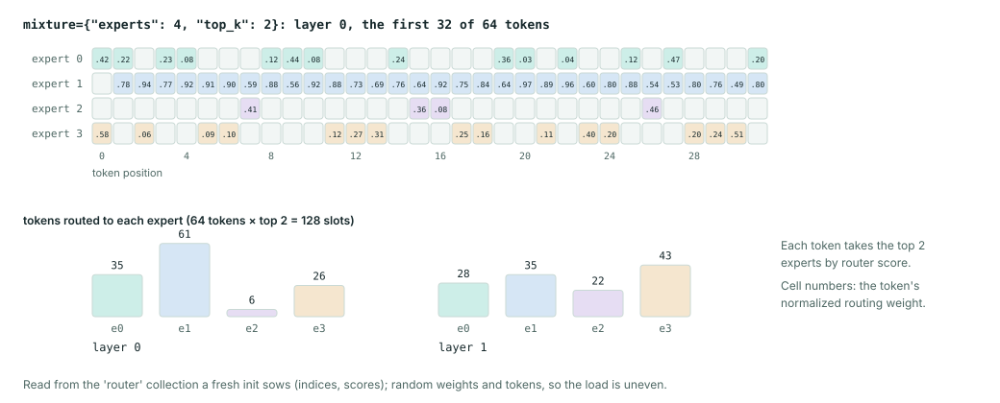
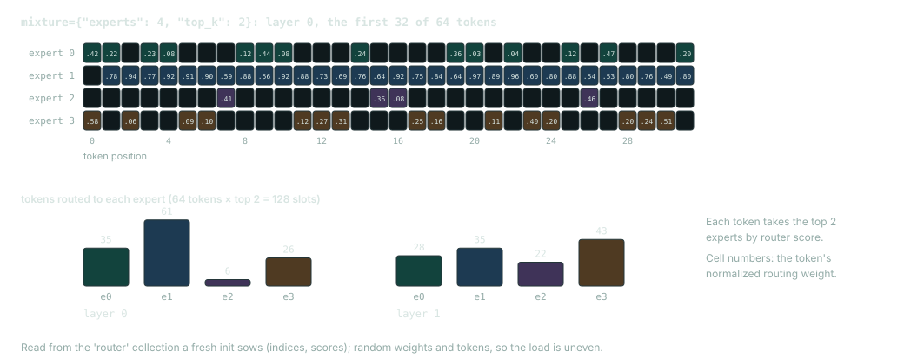

# Mixture of experts

A mixture-of-experts (MoE) layer holds several feed-forward networks, called experts, in place of one. For each token, a router scores the experts and selects the `top_k` with the highest scores, and the layer sums those experts' outputs weighted by the scores. To make a `CausalTransformer` sparse, set its `mixture` field to a `Mixture` from `dew.nn.backbones`.

## Example

```python
import jax
import jax.numpy as jnp

from dew.nn.backbones import CausalTransformer, Mixture

model = CausalTransformer(
    vocab_size=32, emb_features=16,
    num_layers=2, num_heads=2, mlp_features=32, max_seq_len=8,
    mixture=Mixture(experts=4, top_k=2),
    dtype=jnp.float32, attention_impl="xla",
)
tokens = jnp.array([[1, 2, 3, 4]], dtype=jnp.int32)
variables = model.init(jax.random.key(0), tokens)
logits, routed = model.apply(variables, tokens, mutable=["router"])
print("logits:", logits.shape)
chosen = routed["router"]["layers_0"]["mlp"]["gate"]["indices"][0]
print("experts per token, layer 0:", chosen[0].tolist())
```

```text
logits: (1, 4, 32)
experts per token, layer 0: [[1, 3], [3, 1], [1, 0], [3, 2]]
```

Every layer here routes to two of four experts, and the logits keep the usual `(batch, sequence, vocabulary)` shape. Passing `mutable=["router"]` makes each router record its choices (`indices`, `[batch, sequence, top_k]`), its scores and its log partition; without it nothing is recorded. Flax stores sown values in a tuple, which the first `[0]` unpacks. The figure reads the same collection from this model over 64 random tokens.




## Mixture

| Field | Default | Meaning |
|---|---|---|
| `experts` | required | Number of experts. |
| `top_k` | `2` | Experts per token. |
| `layers` | `None` | Sparse layers by index; `None` makes every layer sparse. A checkpoint's cadence (Qwen3-MoE's `decoder_sparse_step`, Llama 4's `interleave_moe_layer_step`) translates to these indices. |
| `score_function` | `'softmax'` | How router logits become scores. |
| `norm_topk_prob` | `True` | Divide a token's selected weights by their sum. |
| `scaling` | `1.0` | Routed output scale. |
| `groups`, `groups_per_token`, `group_score` | `1`, `1`, `'top2'` | DeepSeek's group-limited routing. |
| `bias` | `False` | Keep an aux-loss-free balancing bias (DeepSeek's `e_score_correction_bias`). |
| `expert_features` | `None` | Expert width; `None` uses `mlp_features`. |
| `shared_features`, `shared_gate` | `0`, `False` | Width of one dense shared expert every token takes, and a learned sigmoid gate on it. |
| `parallel` | `False` | Gemma 4's placement: experts beside the dense MLP. |
| `implementation` | `'auto'` | Grouped matmul kernel: `'auto'`, `'xla'`, `'pallas'` or `'tokamax'`. |
| `dispatch` | `'global'` | `'global'` or `'exchange'` (expert parallelism). |
| `capacity_factor` | `None` | Per-expert slot capacity; `None` keeps every selected slot. |
| `hash_layers`, `latent_features`, `latent_norm`, `media_bias` | | DeepSeek V4 hash routing, Kimi K3 latent experts, DeepSeek-V4.1's media bias. |

When you load a published checkpoint, its configuration sets these values. Changing them changes the architecture and can make the weights unusable.

## Routing

Model families route in different ways: softmax or sigmoid scores, normalized or raw selected weights, output scaling, group-limited routing, shared experts and a selection bias. So two routers whose tensors have the same shapes are not necessarily interchangeable. The router's gate projection runs in float32 whatever the activation dtype.

To balance the load without an auxiliary loss, set `bias=True`. Each expert then gets a bias that is added to its score when the router selects experts, but not when it weights them. The bias is non-parameter state, and every step `LMObjective(balance_rate=...)` moves it against each expert's load. An auxiliary balancing loss (`aux_loss_alpha`, `router_z_loss`) is a separate term of the objective ([Language models](language_models.md)). Check the algorithm and configuration of your model family before you turn on either.

Routing replay trains on the experts that a rollout engine used (R3, arXiv 2510.11370). Pass `routes=(routed_experts, routed)` to `LMObjective.token_scores`, or, for GRPO, pack sessions whose calls recorded `routed_experts` ([Post-training](post_training.md)). The record has shape `[batch, tokens, layers, top_k]` and is indexed by decoder layer, the way vLLM and SGLang return it. Each router uses the recorded experts in place of its own top-k but still computes their weights from the scores of the current forward pass, so the router still gets a gradient. Where the record does not cover a token (`routed` is false, as for the last sampled ID), the router makes its own choice. A balancing bias counts the replayed experts.

## Expert kernels

Dew sorts tokens into expert order and runs the experts as one grouped matrix multiplication. `implementation` picks the kernel:

| Value | Kernel |
|---|---|
| `'auto'` | The one measured fastest on the hardware generation (`dew.nn.kernels.device_generation`, keyed in `dew.nn.kernels.KERNELS['grouped_matmul']`): `'pallas'` on sm80 (A100), sm86 (RTX 3090) and sm89 (L4, RTX 4080), `'xla'` on TPU v5e and v6e. Every other generation runs `'xla'`: GPUs older than sm80 cannot compile the kernels, and sm90 and later are unmeasured. |
| `'xla'` | `jax.lax.ragged_dot`. On a GPU, XLA runs it as a product over every expert. |
| `'pallas'` | JAX's own Pallas/Triton grouped-matmul kernels, `gmm` and `tgmm`, vendored in `dew.nn.kernels.ragged_dot` from the jax 0.11.2 source tree because no wheel ships them. |
| `'tokamax'` | `tokamax.ragged_dot` with the kernel named per generation (`KERNELS['tokamax_grouped_matmul']`): Triton on sm80 and sm89, `mosaic_tpu_v2` on v5e and v6e, tokamax's XLA path elsewhere. Only the forward runs on tokamax; the backward differentiates on XLA. |

On an L4 the Pallas kernels cut the lm-moe training step from 601.6 ms to 213.1 ms ([Performance measurements](../performance.md)). jax 0.11.2 deprecates the Pallas Triton backend they run on. Dew still uses them on compute capability 8.0 to 8.9, because JAX's Mosaic GPU grouped matmul does not compile there (on sm89 it fails for lack of wgmma), and it leaves the deprecation warning to your warning filters.

The Pallas kernels support only first-order reverse mode, which is what an ordinary `Trainer` step uses. Forward mode and higher-order derivatives, as in meta-learning, need `'xla'`. Dew also falls back to `'xla'` in the cases where the Pallas kernels would compute a different product than you asked for: float64, fp32 operands at a precision above the default, and any x64 run.

The choice is the same on a mesh. The experts run inside the dispatch's `shard_map` on each device's rows, and the weights they need are gathered onto that device. On 2x RTX 3090, one fsdp-sharded expert layer took 26.2 ms with the Pallas kernels and 271.9 ms with `'xla'`. Every routed expert module the decoder builds follows `implementation`, including GPT OSS's.

Left to its default, tokamax picks its v1 TPU kernel, which is 13 times slower than XLA on a v6e, so Dew names the kernel it wants. If a model asks for `'tokamax'` and the package cannot be imported, initialization fails; Dew does not fall back to XLA under that name.

Install tokamax 0.0.15 or later ([Installation](../installation.md)). tokamax 0.0.13 and 0.0.14 pin `typeguard==2.13.3`, but tyro 1.0.16, which parses every recipe's command line, needs `typeguard>=4.0.0`. So installing either release downgrades typeguard, `uv pip check` reports the conflict, and every recipe then fails while parsing its arguments with `AttributeError: module 'typeguard' has no attribute 'TypeCheckError'`. The grouped-matmul numbers on this page were measured on 0.0.14, whose grouped-matmul kernels 0.0.15 keeps unchanged.

## Dispatch and expert parallelism

The `expert` mesh axis splits the expert dimension across devices. Dense parameter dimensions can use FSDP or tensor placement on their own; [Distributed training](distributed.md) covers the global batch and layout requirements.

`dispatch='global'`, the default, sorts and gathers tokens on the device that already holds them. On a mesh, each device routes its own tokens through every expert, so every layout computes each token once.

`dispatch='exchange'` is expert parallelism. Each device sends its selected tokens to the devices that hold their experts, using JAX `all_to_all` collectives, and receives the results back. It needs an `expert` mesh axis larger than one that divides the number of experts; the data, fsdp and sequence axes may split the tokens further. The exchange keeps every selected token, even when all of the traffic goes to one shard. In the first round each device sends every shard a bucket the size of an even split of its tokens, and whatever a skewed routing leaves over follows in later rounds of the same size. The backward pass recomputes those rounds rather than keeping their intermediates.

You can initialize the model outside a mesh, but applying the exchange needs the mesh. `TextGeneration` refuses `dispatch='exchange'` ([Inference](inference.md)), so generate with `dispatch='global'`, which computes the same layer. Gated experts and GPT OSS's interleaved biased experts are exchanged the same way, and each keeps its own activation and output-weight arithmetic.

To drop tokens over a fixed capacity, as GShard and MaxText do, set `capacity_factor`. Each sequence keeps `max(ceil(length * top_k / experts) * capacity_factor, capacity_factor)` slots per expert, filled in token order, and a dropped slot adds nothing to its token's output. Because the count runs over whole sequences, both dispatch modes drop the same slots on every placement. With a capacity set, the exchange runs one round.

## Precision

Both dispatch modes run their expert projections through `moe.expert_projection`. It gives a routed layer the same rounding in training whatever the activation dtype and placement:

- each contraction accumulates in at least fp32 and rounds once to the compute dtype;
- a kernel gradient sums the shares from every device and every exchange round in at least fp32 and rounds once to the master dtype; the summation order still depends on the mesh, so gradients on different meshes agree to fp32 rounding but not bit for bit;
- kernel gradients keep the master dtype, and input gradients their input's dtype;
- the exact GELU rounds once.

A model that names no `dtype` computes its experts in their stored dtype when that dtype is narrower than the residual stream (`moe.expert_compute_dtype`). For example, with an fp32 stream and bf16 expert kernels, each expert's input is rounded to bf16, the experts multiply bf16 by bf16 with fp32 accumulation, and they return bf16. The dense layers of such a model still promote to fp32. Promoting the experts to fp32 as well would copy each layer's kernels; serving gpt-oss-20b on four RTX 3090s, those copies took 14.35 GiB of live temporaries. So the forward pass reads the kernels as stored, and only a gradient widens them, because its cross-device sums need fp32.

JAX's x64 mode also widens default integer counts to int64. The TPU ragged-dot kernel cannot lower int64 indices, so the XLA grouped-matmul path narrows signed int64 group sizes to int32 when the number of rows fits. The expert values and their gradients keep the dtypes above.

Forward-mode and reverse-mode differentiation follow the same rules. `tests/test_moe_precision.py` checks them against float64 arithmetic on the rounded operands, and over three Adam steps of both dispatch modes in bf16. `tools/moe_exchange_probe.py` compares the exchange's working memory with the global path's on CPU; it does not measure throughput on several accelerators.

GPT OSS's per-expert biases go through `moe.gather_expert_bias`, which accumulates their gradients at master or compute precision and converts them back to the parameter dtype. Padding and idle experts add no bias gradient. The stored fused kernel and bias leaves, router choices, clipping limits and SwiGLU scaling are unchanged. `tests/test_moe_biased_exchange.py` checks the full router and experts against pinned transformers fixtures, and compares the forward pass, backward pass and optimizer updates of both dispatch modes.

## Cost and validation

More experts need more parameter storage, even with a fixed `top_k`. Routing, communication, shared experts and load imbalance all add to runtime. Estimate the optimizer and EMA storage along with the parameters, and time a representative forward and backward step on the topology you plan to use.

Against a reference model, compare the router's selections and weights, the sparse layer output, the loss and the parameter updates. For distributed training, check that the balancing statistics cover the global batch and that replicated state stays identical across shards. [Supported models](../models.md) lists which sparse checkpoints load and which have no export writer.
