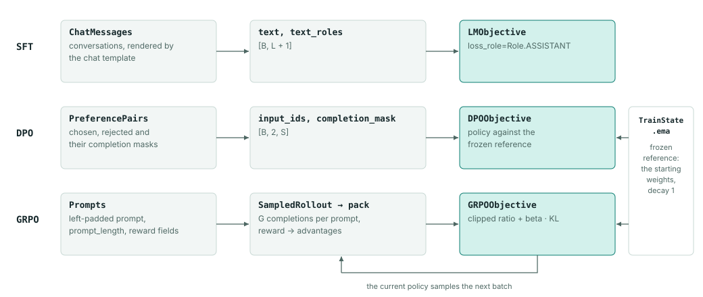
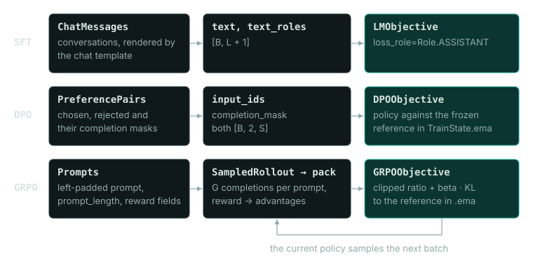

# Post-training

Post-training changes how a trained model behaves. Each method in Dew is an objective that runs on the ordinary `Trainer`, and the methods differ in the supervision their batches contain.

| Method | Supervision | Data | Objective |
|---|---|---|---|
| Supervised fine-tuning (SFT) | Example answers | `ChatMessages`, or rows with `text_roles` | `LMObjective(loss_role=Role.ASSISTANT)` |
| Direct preference optimization (DPO) | A preferred and a rejected answer to one prompt | `PreferencePairs` | `DPOObjective` |
| Group-relative policy optimization (GRPO) | A reward on answers the model samples | `Prompts` and `SampledRollout`, or a rollout scheduler | `GRPOObjective` |
| Proximal policy optimization (PPO) | A reward, plus a learned critic | `EpisodeRollout` and `PPORollout` | `PPOObjective` |
| Flow-GRPO | A reward on samples from a rectified-flow model | `FlowRollout` | `FlowGRPOObjective` |

DPO and GRPO (with `beta > 0`) keep the starting weights as a frozen reference. [Language models](language_models.md) covers next-token training, and [Objectives](objectives.md) how models, objectives and the trainer fit together.




## Example

The example builds a small byte-level decoder and runs a short SFT stage, then DPO, then GRPO, each starting from the previous stage's weights. It starts from a fresh initialization in place of a pretrained model, so it downloads nothing.

```python
import itertools
import json

import jax
import jax.numpy as jnp
import numpy as np

from dew import Dataset, Trainer
from dew.config import OptimConfig
from dew.data import ByteTokenizer, Loading, PreferencePairs
from dew.data.chat import Role
from dew.nn.backbones import CausalTransformer
from dew.objectives.lm import LMObjective
from dew.objectives.rl import DPOObjective, GRPOObjective, SampledRollout
from dew.sampling import Sampling

tokenizer = ByteTokenizer()
model = CausalTransformer(vocab_size=tokenizer.vocab_size,
                          emb_features=64, num_layers=2, num_heads=2, mlp_features=256,
                          max_seq_len=64)
base = model.init(jax.random.key(0), jnp.zeros((1, 8), jnp.int32))
```

`base` is a full Flax variables mapping, including its outer `params` collection, which is what every objective's `variables` argument takes.

### Supervised fine-tuning

Each token has a role. The prompt's tokens are `Role.USER` and the response's tokens are `Role.ASSISTANT`. With `loss_role=Role.ASSISTANT`, the loss counts only assistant targets, and the prompt tokens are still there as context.

```python
prompt = tokenizer.encode("Tom had a red ball.")
response = tokenizer.encode(" He kicked it.")
row = np.array(prompt + response, dtype=np.int32)
roles = np.array([Role.USER] * len(prompt) + [Role.ASSISTANT] * len(response), dtype=np.int8)
sft_batch = {"text": np.tile(row, (8, 1)), "text_roles": np.tile(roles, (8, 1))}
sft_data = Dataset(train=lambda partition: itertools.repeat(sft_batch), val=None,
                   records=8, batch=8)
sft_objective = LMObjective(model, seq_len=len(row) - 1, variables=base,
                            loss_role=Role.ASSISTANT)
sft_state = Trainer(sft_objective, OptimConfig(learning_rate=1e-3), key=jax.random.key(1)).fit(
    sft_data, steps=20, log_every=10)
```

```text
Training CausalTransformer from step 0 to 20: 147,904 parameters, on 1 × cpu, batch 8, float32
step 10/20  loss 1.136  ce 1.136  perplexity 3.115  token_accuracy 92.9%  step_time_ms 19.51  samples_per_sec 410.1  accepted 100.0%
step 20/20  loss 0.2127  ce 0.2127  perplexity 1.237  token_accuracy 100.0%  step_time_ms 13.53  samples_per_sec 591.3  accepted 100.0%
Trained 20 steps in 0:00:01: first step after 1.08 s, then 84.1 step/s
17.3% of the wall time in steps, final loss 0.2127
```

### Preference optimization

A pair is two sequences with the same prompt, one followed by the chosen response and the other by the rejected one. The masks mark response tokens with 1.

```python
rejected = tokenizer.encode(" He kicked kicked.")
pair = {"chosen": prompt + response, "rejected": prompt + rejected,
        "chosen_mask": [0] * len(prompt) + [1] * len(response),
        "rejected_mask": [0] * len(prompt) + [1] * len(rejected)}
width = max(len(pair["chosen"]), len(pair["rejected"]))
pairs = PreferencePairs(records=(json.dumps(pair),) * 8, seq_len=width,
                        loading=Loading(workers=0, threads=1, read_buffer=2)).load(batch=8)
dpo = DPOObjective(model, seq_len=width - 1, beta=0.1, variables=sft_state.variables)
dpo_state = Trainer(dpo, OptimConfig(optimizer="adam", learning_rate=1e-3), key=jax.random.key(2)).fit(
    pairs, steps=10, log_every=5)
```

```text
Training CausalTransformer from step 0 to 10: 147,904 parameters, on 1 × cpu, batch 8, float32
step  5/10  loss 0.03523  accuracy 1.000  rewards/chosen -1.711  rewards/rejected -5.039  step_time_ms 68.22  samples_per_sec 117.3  accepted 100.0%
step 10/10  loss 0.008948  accuracy 1.000  rewards/chosen -3.645  rewards/rejected -8.357  step_time_ms 36.17  samples_per_sec 221.2  accepted 100.0%
Trained 10 steps in 0:00:03: first step after 2.58 s, then 29.9 step/s
10.5% of the wall time in steps, final loss 0.008948
```

`PreferencePairs.seq_len` is the full row width; shorter rows are padded to it, and the objective scores one position fewer because of the next-token shift.

### Reinforcement learning with a reward function

GRPO samples a group of completions per prompt, scores each with a reward function and trains on their rewards relative to the rest of the group. The prompt batch uses the numeric layout `Prompts` produces, with the reward metadata as UTF-8 bytes. The reward here counts the alphabetic characters in the decoded completion and divides the count by 8, the response budget in bytes, so an 8-byte completion of letters scores 1.

```python
story = tokenizer.encode("Once upon a time")
prompt_batch = {
    "prompt": np.tile(np.array(story, dtype=np.int32), (8, 1)),
    "prompt_length": np.full(8, len(story), dtype=np.int32),
    "data_source": np.tile(np.frombuffer(b"stories", np.uint8).astype(np.int32), (8, 1)),
    "ground_truth": np.zeros((8, 0), dtype=np.int32),
    "extra_info": np.zeros((8, 0), dtype=np.int32),
}


def reward(data_source, completion, ground_truth, extra_info):
    return sum(character.isalpha() for character in completion) / 8


rl_data = Dataset(train=lambda partition: itertools.repeat(prompt_batch), val=None,
                  records=8, batch=8)
rl_objective = GRPOObjective(model, seq_len=len(story) + 7, beta=0.01,
                             variables=dpo_state.variables)
rollout = SampledRollout(rl_objective, reward=reward, groups=4, max_new_tokens=8,
                         sampling=Sampling(temperature=1.0, top_k=40),
                         decode=tokenizer.decode)
rl_state = Trainer(rl_objective, OptimConfig(learning_rate=1e-4), key=jax.random.key(3),
                   rollout=rollout).fit(rl_data, steps=4, log_every=2)
print(int(rl_state.updates), "GRPO updates")
```

```text
Training CausalTransformer from step 0 to 4: 147,904 parameters, on 1 × cpu, batch 8, float32
step 2/4  loss 2.506e-05  actor/pg_clipfrac 0  actor/pg_clipfrac_lower 0  actor/ppo_kl 1.770e-08  kl 0.002508  mismatch/ess 0.9903  mismatch/k3_kl 0.1754  mismatch/kl 0.6520  pg -2.049e-08  step_time_ms 107.2  samples_per_sec 298.5  rollout_seconds 2.009  accepted 100.0%  reward/mean 0.3438  length/mean 8.000  status/truncated 100.0%
step 4/4  loss 2.535e-04  actor/pg_clipfrac 0  actor/pg_clipfrac_lower 0  actor/ppo_kl 2.980e-08  kl 0.02535  mismatch/ess 0.9888  mismatch/k3_kl 0.1683  mismatch/kl 0.6362  pg -3.306e-08  step_time_ms 73.57  samples_per_sec 435.0  rollout_seconds 0.1273  accepted 100.0%  reward/mean 0.3789  length/mean 8.000  status/truncated 100.0%
Trained 4 steps in 0:00:04: first step after 3.76 s, then 13.0 step/s
5.8% of the wall time in steps, final loss 2.535e-04
4 GRPO updates
```

Each prompt produces four completions, and `SampledRollout.decode` turns each one into the text the reward reads. `seq_len` covers the prompt and the 8 response tokens, less one for the next-token shift. `beta` sets the coefficient of the KL term against the frozen reference. In one Colab run, 20 such steps trained a TinyStories decoder ([Language models](language_models.md)) with a reward of 1 for a completion that mentions a dog. Before training, 3 of 128 sampled completions mentioned a dog; after the 20 steps, all 128 did.

[`recipes/chain.py`](../../recipes/chain.py) connects SFT, DPO and GRPO stages ([Stage chains](#stage-chains)).

## Supervised fine-tuning

An SFT conversation is a list of messages, each with a role. `ChatMessages` reads conversations from a Parquet file, a `.jsonl` file or a Hub dataset ID. Each row holds one list of messages in the column named by `column` (default `messages`). If the data has no such column but has a `prompt` column, as verl's layout does, `ChatMessages` reads the messages from `prompt`. Tool schemas, where a row has any, go in a `tools` column. One row in the verl layout:

```text
prompt = [
    {"role": "user", "content": "What is two plus two?"},
    {"role": "assistant", "content": "Four."}
]
```

| Field | Default | Meaning |
|---|---|---|
| `tokenizer` | required | Hub name or local path of a tokenizer with a chat template. |
| `path` | `None` | Conversations: Parquet, `.jsonl` or a Hub dataset ID. |
| `column` | `messages` | Column holding each row's messages. |
| `split` | `train` | Split of a Hub dataset. |
| `val_path` | `None` | A separate source of held-out conversations, scored as one pass. |
| `val_split` | `None` | Split `val_path` is read at; `None` reads `split`. |
| `seq_len` | `256` | Prediction length `L`. |
| `options` | `HFOptions()` | What `datasets.load_dataset` takes beside the ID and the split. |

The chat template is the rule for turning message boundaries, role headers and content into tokens, and each model is trained on its own format. Joining message strings by hand can change both the input and which tokens count toward the loss. `ChatMessages` also preserves tool calls, tool responses and tool schemas.

Dew renders the conversation one prefix at a time to give each token a role. For an assistant turn, it leaves the generation header out of the assistant span. It checks that each tokenized prefix matches the start of the longer render, and raises if the template changes earlier tokens. This check does not guarantee correct assistant masks for every chat template or string delimiter, so look at the rendered tokens and roles for some typical conversations before a real run. Conversations must start with a system or user message; one that starts with an assistant message is rejected.

`ChatMessages.load(batch=B)` packs conversations into these arrays:

| Field | Shape | Meaning |
| --- | --- | --- |
| `text` | `[B, L + 1]` | Token IDs, including the extra next-token target. |
| `text_roles` | `[B, L + 1]` | `Role` value at each token. |
| `text_segment_ids` | `[B, L + 1]` | Document identity; separates packed conversations. |
| `text_positions` | `[B, L + 1]` | Position within each packed document. |

Train with `LMObjective(model, L, loss_role=Role.ASSISTANT)`. The objective shifts IDs and roles together: input position `i` predicts token `i + 1`, and the role of the target decides whether that prediction counts. It also skips padding and the transitions between packed documents. With `loss_role` set, a batch without `text_roles` raises. Keep evaluation conversations out of the training file; [Evaluation and tracking](../guides/evaluation.md) covers what token metrics measure.

## Direct preference optimization

DPO compares how much the policy prefers one answer over the other with how much a fixed reference policy does. The policy is the model being updated; the reference is a snapshot of its starting parameters. For each prompt, the chosen and rejected sequences hold the prompt followed by their own completion, and completion masks mark answer tokens with 1 and prompt tokens with 0.

`PreferencePairs` takes either a Parquet `path` or a tuple of JSON strings in `records`, not both. Each row has `chosen`, `rejected`, `chosen_mask` and `rejected_mask`, and each mask is as long as its ID list. Without a mask, every token counts as a completion token. Dew does not guess from the text where the prompt ends, so give masks for prompt-and-answer data.

A loaded batch holds `input_ids` and `completion_mask`, both `[B, 2, S]`. Index 0 of the middle axis is the chosen sequence and index 1 the rejected one. Shorter rows are right-padded to `S` (`pad_id`, default 0) with mask weight zero; rows that are too long raise. `PreferencePairs.seq_len` is the full row width `S`, so use `DPOObjective(model, seq_len=S - 1)`.

The objective sums the next-token log-probabilities over each completion and applies the log-sigmoid preference loss. `beta` (default 0.1) must be positive; it scales the comparison between policy and reference. Validation measures the perplexity of the chosen answers under the policy, which alone does not measure how often the preferred answer wins or how good the responses are.

### Offline DPO example

This block runs in a fresh process. The made-up vocabulary has eight tokens: IDs 1 and 2 (or 1 and 6) form the prompt, 3 is the preferred answer, 4 the rejected answer and 5 ends the answer, which counts toward the completion loss. Repeating the two pairs gives a batch of eight, which also divides across eight local devices.

```python
import json

import jax
import numpy as np

from dew import Trainer
from dew.config import OptimConfig
from dew.data import Loading, PreferencePairs
from dew.nn.backbones import CausalTransformer
from dew.objectives.rl import DPOObjective

rows = [
    {"chosen": [1, 2, 3, 5], "rejected": [1, 2, 4, 5],
     "chosen_mask": [0, 0, 1, 1], "rejected_mask": [0, 0, 1, 1]},
    {"chosen": [1, 6, 3, 5], "rejected": [1, 6, 4, 5],
     "chosen_mask": [0, 0, 1, 1], "rejected_mask": [0, 0, 1, 1]},
]
row_width = 4
spec = PreferencePairs(records=tuple(json.dumps(row) for row in rows * 4),
                       seq_len=row_width, pad_id=0,
                       loading=Loading(workers=0, threads=1, read_buffer=2))
data = spec.load(batch=8)
model = CausalTransformer(vocab_size=8, emb_features=16, num_layers=1,
                          num_heads=2, mlp_features=32, max_seq_len=row_width)
objective = DPOObjective(model, seq_len=row_width - 1, beta=0.1)
trainer = Trainer(objective, OptimConfig(optimizer="adam", learning_rate=1e-3).build(2), key=jax.random.key(0))
initial = trainer.initial_state()
# Copy the snapshot to host memory before training donates device buffers.
reference = jax.tree.map(lambda x: np.array(x, copy=True), initial.ema)
state = trainer.fit(data, steps=2, log_every=1)
for before, after in zip(jax.tree.leaves(reference), jax.tree.leaves(state.ema), strict=True):
    np.testing.assert_allclose(before, np.asarray(after), rtol=0, atol=1e-6)
print("Completed", int(state.updates), "DPO updates; reference stayed fixed.")
```

```text
Training CausalTransformer from step 0 to 2: 2,752 parameters, on 1 × cpu, batch 8, float32
step 1/2  loss 0.6931  accuracy 0  rewards/chosen -2.384e-08  rewards/rejected 0  step_time_ms 35.71  samples_per_sec 224.0  accepted 100.0%
step 2/2  loss 0.6703  accuracy 1.000  rewards/chosen 0.03338  rewards/rejected -0.01294  step_time_ms 1.349  samples_per_sec 5,928  accepted 100.0%
Trained 2 steps in 0:00:01: first step after 1.44 s, then 442.7 step/s
0.2% of the wall time in steps, final loss 0.6703
Completed 2 DPO updates; reference stayed fixed.
```

`fit` builds its state inside a compiled function, so its copy of the reference can differ from the eager `initial_state()` by float rounding (1.8e-7 at most on an L4). The tolerance of 1e-6 allows that rounding and still fails if an optimizer step moves the reference, because one Adam step at this learning rate moves weights by about 1e-3. For a real dataset, build both sequences with the same tokenizer and chat format, check that they share the prompt, and take the masks from known token boundaries rather than from a character offset found by searching the string.

### Reference memory

The DPO reference is kept in `TrainState.ema` with its decay fixed at 1, so it never changes, and `DPOObjective` refuses an `ema_decay` argument. `rewards/chosen` and `rewards/rejected` are beta times each side's sequence log-ratio of policy over reference, so a policy that has not moved yet reports zero rewards and no wins. The reference is not a second model object and the optimizer never updates it, but it is still a separate parameter tree with its own forward passes. Budget memory for the policy parameters, reference parameters, optimizer state, gradients, activations and batches.

SFT keeps no moving average unless `ema_decay` is set, as the language-model objective does. GRPO keeps a frozen reference only when `beta > 0`, and refuses `ema_decay` too. When a DPO or GRPO stage starts, its starting `variables` become the frozen reference.

## GRPO

GRPO needs a stream of prompts and a reward function before it can build a training batch. `Prompts(tokenizer, path=... or records=...)` accepts a Parquet file in the verl layout or JSON records with `prompt`, `data_source`, `ground_truth` and `extra_info`. A prompt can be token IDs, a string or a list of role and content messages. A string is encoded as it is, without added special tokens. With `tokenizer="byte"` it is encoded with Dew's local UTF-8 vocabulary, and with any other name by that Hugging Face tokenizer.

Messages go through the Hugging Face tokenizer's chat template, and `thinking` sets a reasoning template's `enable_thinking`. An optional `tools` column holds tool schemas, which are rendered into the prompt tokens. Missing reward fields become empty strings, and reward metadata that is not a string is passed on as JSON text.

```python
import json
from dew.data import Loading, Prompts

data = Prompts(tokenizer="byte", records=(json.dumps({"prompt": "dew"}),) * 8,
               max_prompt_len=8, loading=Loading(workers=0)).load(batch=8)
```

The prompt loader produces left-padded `prompt` IDs of shape `[B, P]` and `prompt_length` of shape `[B]`, where `P` is `max_prompt_len` (default 128). A prompt that is too long is cut from the front, so its end is kept. The metadata columns are stored as fixed-width UTF-8 byte arrays, and `SampledRollout` turns them back into strings for the reward:

```text
reward(data_source: str, completion: str,
       ground_truth: str, extra_info: str) -> float
```

Pick a reward whose score can be checked independently of training; for an exact-answer task, compare the decoded completion with the ground truth under a normalization rule you write down. `SampledRollout.decode` defaults to token IDs separated by spaces, not natural-language text, so a reward that reads text needs the tokenizer's decode function.

| `SampledRollout` field | Default | Meaning |
|---|---|---|
| `objective` | required | The `GRPOObjective` whose policy samples. |
| `reward` | required | The reward callable above. |
| `decode` | IDs joined by spaces | Turns sampled IDs into the reward's text. |
| `groups` | `4` | Completions per prompt, `G`; at least 2. |
| `max_new_tokens` | `32` | Response budget, `R`. |
| `estimator` | `"group"` | Advantage estimator: `"group"`, `"mean"` (only centres, Dr.GRPO) or `"rloo"` (each against the rest of its group). |
| `truncation` | `"score"` | What a completion that ran out of budget does: `"score"`, `"mask"` or `"zero"` ([Sessions and packed rows](#sessions-and-packed-rows)). |
| `sampling` | `Sampling()` | Temperature, top-k, top-p, min-p and EOS IDs. |

The trainer calls the rollout on the host before the compiled update. The rollout turns each completion into a one-call `Session` and builds the batch with `pack`, so the batch has the same layout as every other GRPO batch in Dew. With `N = B * G`, every column is `[N, P + R]` and aligned with `input_ids`. Each chain is a prompt without its padding followed by the sampled response, and several chains may share a row.

| Field | Meaning |
| --- | --- |
| `input_ids`, `text_segment_ids`, `text_positions` | The chains, which chain each ID belongs to, and its position in that chain. |
| `response_mask` | 1 on sampled IDs, EOS included. |
| `old_log_probs` | Raw model-policy likelihoods recorded at each sampled ID. |
| `behavior_log_probs` | Actual temperature/top-k sampling likelihoods. |
| `advantages` | The completion's advantage repeated across its chain. |
| `versions`, `session_index`, `call_index` | The policy version, the completion (`row * G + group`) and its call, on sampled IDs. |

Use `GRPOObjective(model, seq_len=P + R - 1)`, and give the decoder enough context for `P + R` tokens. With the default `truncation="score"`, every completion is scored, whether it stopped on EOS or on the budget.

| `GRPOObjective` argument | Default | Meaning |
|---|---|---|
| `beta` | `0.0` | k3 KL penalty against the frozen reference; `> 0` keeps the reference. |
| `epsilon_low`, `epsilon_high` | `0.2`, `0.2` | Clipping range of the policy ratio. |
| `dual_clip` | `3.0` | Dual-clip bound for negative advantages. |
| `policy_loss` | `"ppo"` | `"ppo"`, `"gspo"` or `"cispo"`. |
| `aggregation` | `"token-mean"` | `"token-mean"` or `"session-mean"`. |
| `behavior_importance` | `None` | Token TIS cap, or an IcePop `(lo, hi)` band. |
| `sequence_mask`, `geometric_mask` | `None` | Chain rejection by summed or mean k1. |
| `sampling_temperature` | `1.0` | Temperature the sampled IDs are scored at. |

Pass `sampling=Sampling(eos_id=..., temperature=..., top_k=...)`; `eos_id` takes one ID or a tuple. The response mask includes EOS; the text passed to the reward leaves out EOS and padding. The rollout turns `prompt_length` into the standard `ModelInputs` attention mask.

Generation prefills the padded batch once and packs the real tokens into each row's cache, so prompts of different valid lengths reuse the same compiled shape. After a row hits EOS, later steps leave its cache unchanged. Rescoring reads each chain on its own through its segment IDs and positions. GRPO validation scores prompt perplexity over real next-token transitions; it does not generate answers for a separate reward evaluation.

`old_log_probs` holds the raw policy likelihoods from the cached forward pass at sampling time, and `behavior_log_probs` the likelihoods after temperature and top-k. For greedy sampling, the chosen action has a behavior log-probability of zero. GRPO's PPO ratio compares the current raw policy with the old raw policy. A correction from behavior policy to proximal policy is a separate algorithm choice, applied only on request.

`GRPOObjective(..., behavior_importance=2.0)` applies detached, token-level truncated importance weights from the recorded raw old policy to the recorded behavior policy; the default `None` keeps the uncorrected loss. On supported actions the weight is `min(exp(clip(old_raw - behavior, -20, 20)), cap)`. It multiplies the policy-surrogate terms before the usual reduction over token count. PPO clipping still compares the current policy with the raw old policy, and the KL term does not change. Missing or misaligned behavior likelihoods are refused. This follows verl's token TIS implementation at revision `d040717b21af2e23e8e789a3e354cff2394ae2de`, and `tools/parity_behavior.py` checks it against the installed reference. Truncation, token-level weighting and filtered action support mean this is not an unbiased estimator of the raw policy over full trajectories.

## Tool episodes

`dew.objectives.rl.EpisodeRollout` collects multi-turn episodes from an environment you supply and an inference policy that can be bound to a set of weights. It works through the ordinary `Trainer(rollout=...)` hook and `GRPOObjective`. It does not pick an executor for you. Pass `dew.inference.TextGeneration(model, variables)` as its policy. Collection calls `policy.bind(snapshot)` once. Each call after that receives the exact context token IDs, a response budget, a key and `Sampling`, and returns a `Generation` with raw and behavior log-probabilities. Canvas generation is not an autoregressive policy and cannot supply these likelihoods.

The input dataset yields integer `task_id` rows. Your environment factory receives an `EpisodeId` with the task, the attempted step, the sample index and a random seed, and returns an `Environment` to use as a context manager. Its `reset()` returns an `Observation` with the first context. `step(action)` takes a finished model turn and returns either the exact next context or a terminal result. The environment is responsible for decoding, validating tool calls, chat formatting, execution, timeouts and cleaning up resources. Dew itself never executes generated code by default.

`SubprocessEnvironment(command, limits)`, in `dew.rl.sandbox`, is one environment factory you can use. It starts the argv `command` in its own session and temporary directory and exchanges JSON lines with it. A `reset` message holds the episode identity, and a `step` message holds the action's context, tokens, termination flag and policy step. Each reply has `context`, `status` and `detail`.

`SandboxLimits` sets RLIMIT_CPU and RLIMIT_AS in the worker, and a wall-clock deadline per session and a message size cap in the parent. On exit, Dew kills the worker's process group, and the worker gets SIGKILL if the parent dies. The worker runs with the caller's OS permissions and has no filesystem or network isolation, so untrusted code needs an outer sandbox. `tests/test_sandbox.py` runs a real worker through round trips, a hang, an exceeded memory limit, a crash, malformed output, parent death and a full `EpisodeRollout` cohort.

`Observation.status` tells apart running, completed, truncated, cancelled and error outcomes. Model EOS ends an action, and the environment decides when the episode ends. A response that hits its token limit without EOS is recorded as truncated and is not sent to a tool. A context longer than `max_prompt_tokens` also truncates the episode, without cutting off the input already recorded. `max_turns` limits the number of model calls.

The verifier takes an `Episode` and returns a finite scalar reward. It sees the termination status, the result detail and every `Transition(action, observation)`, so it can score finished and truncated outcomes differently. Group-relative advantages are computed over episodes of the same task and shared across all their action tokens. The objective rewards the final outcome only; it does not assign credit to individual tool calls. Exceptions, cancellation and verifier failures abort the group before any update. The optional `record` callback receives completed or failed host records. `EpisodeFailure` and `EpisodeCancelled` carry the partial episode.

Verification runs while the environment context is still open, so a verifier you write can inspect temporary files or a live sandbox. Resources are released after verification, whether it succeeded or failed. If release fails, the episode is thrown out instead of being scored.

Episodes go through the same packer as engine-sourced rollouts ([Sessions and packed rows](#sessions-and-packed-rows)). `session_of(episode, group=...)` turns each episode into a `Session` whose calls are its actions. When the environment's next context starts with the previous context plus the sampled actions, the two calls merge into one chain; any other context starts a new chain. Chains share rows `max_prompt_tokens + max_new_tokens` IDs wide, so set `GRPOObjective.seq_len` to that width minus one. The batch has B*G*K rows for B tasks, G samples and K turns, which always fits and keeps the shapes fixed.

Only sampled actions, EOS included, count toward the loss mass, and observations are never targets. Raw likelihoods go into `old_log_probs` and behavior likelihoods into `behavior_log_probs`, copied from the actual inference result, so no transcript is retokenized or rescored. Truncated episodes are masked out of the loss and left out of the group baseline.

Collection binds one snapshot of the variables until it returns. Every rank supplies the same number of task rows and agrees on budgets, sampling and clocks before it opens any environment. All local episode slots are sampled together in each round. Finished slots keep their global row positions with inert prompts whose outputs are thrown away, so episodes with different turn counts do not change the order of collectives or the random draws. Ranks agree on a tool, reset or verifier failure before the next generation, and every rank releases the environments it opened. The committed update clock stays in `policy_step`, and the attempted-work clock in the episode identities. Continuing from a checkpoint restores the Trainer and the input iterator.

Projection accepts records from one collection binding only. Each episode and action has an internal origin identity, so mixing records from policies bound separately fails even when their attempt and update clocks match. You do not set this identity, and it is not a hash of the weights. Project batches you collected separately on their own. The identity does not affect random draws or whether replayed public records compare equal.

Both asyncio and concurrent-futures cancellations raise `EpisodeCancelled` with `CANCELLED` status. The original cancellation object is kept as its `__cause__`, and the environment exits under that original exception before the wrapper is raised. Cancelled observations that the environment returns itself have no source exception.

`tests/test_tool_episodes.py` trains a small policy that samples a call to a square tool, receives the computed result and samples a final answer. It checks categorical gradients on actions only, raw and behavior probabilities, resource cleanup, failures and cancellation, and that Trainer updates match with and without a checkpoint restore. These tests run offline and check the lifecycle and the numbers. They do not show that a remote sandbox works.

`tests/test_episode_pool.py` runs two real CPU processes with different episode turn counts. Their actions, likelihoods, projected arrays and updated parameters exactly match a single-process run on the same two global devices. It also runs a tool failure on one rank and a mismatched cohort configuration. Both end on all ranks together, without leaking any open environments.

The lifecycle matches the responsibilities in [verl BaseTool](https://github.com/volcengine/verl/blob/main/verl/tools/base_tool.py): create, execute, calculate reward and release. verl's [multi-turn guide](https://verl.readthedocs.io/en/latest/sglang_multiturn/multiturn.html) describes assistant-only masks and warns about differences caused by retokenization. Dew keeps each actual model call instead of rebuilding sampled tokens from message deltas. A remote sandbox adapter would also have to handle creation, timeout policy and termination, as the [E2B Python SDK](https://github.com/e2b-dev/E2B/blob/main/packages/python-sdk/e2b/sandbox_sync/main.py) does. Dew bundles neither an E2B client nor a verl runtime adapter. `SubprocessEnvironment` covers only the local case with resource limits. For single-shot verification, `SandboxFleet` with `ContainerRunner` runs each program in a network-less container; see [asynchronous RLVR](#asynchronous-rlvr).

### verl rows

`dew.objectives.rl.verl.to_verl(sessions)` writes native verl `AgentLoopOutput` rows, one per strict chain of each session. A row holds the first call's prompt followed by every sampled and in-between ID, with `response_mask` 1 on the sampled IDs. It also holds the engine's behavior log probabilities (0.0 elsewhere), `routed_experts` when every call recorded routing, and `min_global_steps` and `max_global_steps` taken from the call versions.

`from_verl(rows)` reads verl's own rows back. Each run of mask-1 IDs becomes one call, whose prompt is every ID before it and whose policy version is the row's `min_global_steps`. Pass verl's `rollout.n` as `samples=` to group rows the way verl repeats prompts. `extra_fields.dew` is optional; when Dew wrote it, it restores the session's identity, status, finish reasons, versions and sampling supports exactly. A call that sampled nothing, such as one aborted before its first token, keeps its place.

A native row keeps its own `min_global_steps` and `max_global_steps`, and Dew writes its own only when a row had none. verl's own `extra_fields` come back in `VerlTrajectory.extras` and are written out unchanged. Rows with media (`multi_modal_data`, `mm_processor_kwargs`, `mm_processor_output`) are refused, because Dew's text trainer would score their placeholder IDs without the images or video. `from_verl(rows, media=True)` imports them for a round trip only. Import also refuses rows without behavior log probabilities, a version or a reward.

Live, imported and journal-restored actions all go through the same validation: a nonempty context, nonnegative integer token ids (booleans excluded), aligned finite likelihoods, and a termination flag that agrees with the configured EOS. Tokens after EOS are refused. Checking the upper bound against the vocabulary is left to the caller, which knows the model.

`tools/verl_interop_reference.py` writes the fixtures `tests/test_verl_interop.py` reads from verl revision `12ebe0cb4d300c58449fb6c675379e8700015c51`, run in an isolated environment: four rows of verl's `gsm8k_tool_agent_loop.py` parquet and two `AgentLoopOutput` dumps with their `as_dict()` tensors. One is a tool loop with routed experts. The other is a video turn whose `mm_processor_output` comes from `build_sglang_video_payload`. The test imports and re-exports verl's rows unchanged, and checks that packing matches verl's tensor mapping. `Prompts` reads the verl parquet's `reward_model.ground_truth`, keeps `tools_kwargs` inside `extra_info`, and reads and drops `ability` and `agent_name`. Dew does not import torch or verl at runtime.

### Episode journal

Set `EpisodeRollout(..., journal=EpisodeJournal("run/episodes"))` to save sampled pending actions and completed turns in a SQLite WAL, one per rank. The environment must implement `get_state() -> bytes` and `set_state(state: bytes) -> None`. Those snapshots must hold the tool state and any workspace state that later calls or the verifier need. The subprocess adapter exposes these operations as JSON requests, with base64 state strings and a `{"restored": true}` acknowledgment. Environments without snapshots still work when you do not use a journal.

Recovery restores completed turns with their exact contexts, raw and behavior likelihoods, rewards and environment snapshots. Pending draws are saved before the tool runs and reused after a crash. A completed turn is committed before the next tool call or training update. An external effect that happens between a pending record and its completed commit can run twice, so the environment must use the episode identity and action to make such effects idempotent. The journal does not promise that arbitrary external effects happen exactly once, and it cannot resume in the middle of a tool call.

Use one journal directory per run. Recovery checks task identities, sampling controls, topology, training clocks, the key and a digest of the local policy shards. Computing that digest reads the local weights once per collection. The journal refuses concurrent writers, and refuses a different policy at the same clocks. SQLite commits in FULL synchronous mode keep turn boundaries intact. `tests/test_episode_recovery.py` kills a real two-device training process while a subprocess tool call is pending, restores it, and gets identical sampled actions and updated parameters. Its audit log confirms that each completed square call ran once.

## Asynchronous RLVR

Reinforcement learning with verifiable rewards (RLVR) scores each completion by checking it: running the program it wrote against test cases, or comparing its final answer with a reference. `RolloutScheduler` runs GRPO rollouts from a `SessionSource` while the trainer updates, and `SandboxFleet` runs the checks. `examples/train_rlvr.py` puts them together.

### Rollout servers

`dew.inference.RolloutServer` is the interface for a server that samples continuations of token prompts under a versioned policy. `submit(prompt_ids, max_new_tokens, key=...)` returns a future `Draw` with the sampled IDs, their behavior log-probabilities, the raw-policy log-probabilities when the backend has them, whether EOS ended the draw, and the policy `version` the request was submitted under. `load(variables, version)` pushes new weights. Generation continues across a push, so a draw's version is that of the oldest weights that may have produced any of its tokens.

- `NativeRolloutServer(Server.from_task(task, slots=..., capacity=...))` drives Dew's continuous-batching `Server` on a background thread. `load` copies the trainer's tree onto the served device in place (`Server.reload`) between two steps, casting floating leaves to the served precision, so you can train in float32 and serve in bfloat16. Draws carry both raw and behavior likelihoods.
- `OpenAIRolloutServer(OpenAICompletion(name, client, provider="vllm" or "sglang"), sampling, weights)` posts token-ID prompts to a vLLM or SGLang completions endpoint. Each request has the `Sampling` controls, a seed, `logprobs=0` and the field that makes the engine return the sampled IDs: `return_tokens_as_token_ids` for vLLM, which puts them in the logprob tokens, and `return_token_ids` for SGLang, which lists them on the choice. So the draw holds the IDs the engine sampled, and no text has to be retokenized.

  The two engines report different distributions. vLLM reports raw model log-probabilities unless it runs with `--logprobs-mode processed_logprobs`, so for vLLM the server refuses a transforming `Sampling` (temperature other than one, top-k, top-p or min-p) unless you pass `processed_logprobs=True`. A filtering `Sampling` (top-k, top-p or min-p) also needs each draw's kept IDs, which only vLLM's token route returns, so `OpenAIRolloutServer` refuses one for vLLM.

  SGLang's `/v1/completions` reports `log_softmax(logits / temperature)` before its top-k, top-p and min-p filters and has no field for the filtered likelihood. So for SGLang the server accepts any temperature and refuses every filter. SGLang's native `/generate` does report the filtered likelihood under `return_sampling_mask` for a finite top-k, and a filtered policy would need that route. Leave `SGLANG_RETURN_ORIGINAL_LOGPROB` unset, because it switches SGLang to raw log-probabilities. SGLang honors the seed only under `--enable-deterministic-inference`.

  `routing=True` reads vLLM's per-choice `routed_experts` into each draw for routing replay; start vLLM with `--enable-return-routed-experts`. Remote draws have no raw likelihood.
- `VLLMGenerateServer(base_url, sampling, weights, routing=False)` posts to vLLM's token route, `/inference/v1/generate`, which returns the ids the sampler kept for every drawn token (`sampling_mask`) beside the filtered likelihoods, so a top-k or top-p policy trains on its recorded support. Start vLLM with `--enable-scale-out` (or `--tokens-only`), `--return-sampling-mask`, `--logprobs-mode processed_logprobs`, and `--enable-return-routed-experts` for `routing=True`. vLLM builds the mask only under a finite top-k, so the server refuses a `Sampling` without one.
- `SafetensorsReload(pretrained, directory, engines, engine)` publishes a policy version to every replica in `engines`, given as their root URLs. It writes the policy once with `Pretrained.save` in bfloat16, stages the files beside `directory` and moves each one in with `os.replace`, then runs the reload sequence on all replicas at once. Launch every replica on the same directory, written the first time by `SafetensorsReload.write`.

  For `engine="vllm"` (checked against v0.30.0) it calls `POST /pause?mode=wait`, which lets in-flight requests finish and schedules no new ones. Then it calls `POST /collective_rpc {"method": "reload_weights"}`, `POST /reset_prefix_cache`, `POST /update_weight_version {"new_version": "v"}` and `POST /resume`. These are vLLM development endpoints, enabled by `VLLM_SERVER_DEV_MODE=1`, so expose them only on a trusted network. vLLM reports a reset that did not happen as HTTP 200 with `{"success": false}`, so the push fails unless the reset answers `{"success": true}`. A push that fails after the pause leaves vLLM paused, so that no draw comes from weights the push may have half loaded; the next successful push resumes it.

  For `engine="sglang"` it makes one call, `POST /update_weights_from_disk {"model_path": directory, "flush_cache": true, "abort_all_requests": false, "weight_version": "v"}`. SGLang starts the load once every in-flight request has finished, holds new requests until the load returns, and flushes the radix cache before answering. So in-flight draws finish on the old weights, and the push takes as long as the longest of them. A failed SGLang load answers 400 with `{"success": false}`. The push fails on a status other than 200 or a `success` that is not true, and SGLang then re-reads the same directory as its rollback. On either engine, a failed push leaves the server's `version` where it was.

  `Publication(push, version=v0, stamp=gateway.stamp)` turns a push into a versioned publisher. Its `load(variables, v)` runs the push and then the stamp, and moves `version` to `v` only when both succeed. The stamp goes to a recording gateway (`Gateway.stamp` posts rllm-model-gateway's `/admin/weight_version`) only after every replica serves `v`. The gateway stamps each call with its version when the request arrives, so a stamp ahead of any replica would claim weights the call was not sampled from, while a stamp behind them only overstates the call's lag. Construction stamps `v0`, the launch version, so a stamp an earlier run left behind never labels this run's calls.

  On a multi-process trainer every process calls the push. The pool gathers the tree to host memory (`collective_host`), process 0 writes and publishes, and all processes agree on the outcome, so a failed push raises on every process.
- `NCCLPush(pretrained, engines, library)` publishes to vLLM replicas without going through the disk. It sends the tensors `Pretrained.save` would write (`Pretrained.export`) from one trainer GPU to each replica's GPUs by NCCL broadcast. The broadcast runs over a group the trainer opens with each replica on the first push. To open it, the trainer creates the NCCL unique ID, posts it to `/init_weight_transfer_engine` and joins the group through ctypes, so the trainer does not need torch. `library` is the engine's own `libnccl.so.2` (for a pip-installed vLLM, `<venv>/lib/python3.12/site-packages/nvidia/nccl/lib/libnccl.so.2`), because NCCL refuses a peer of another version.

  Launch vLLM with `--weight-transfer-config '{"backend": "nccl"}'` and `VLLM_SERVER_DEV_MODE=1` (checked against v0.30.0). A push pauses each replica with `mode=wait`, then runs `/start_weight_update`, `/update_weights` while it broadcasts, `/finish_weight_update`, a reset of the prefix cache that must answer success, and `/resume`. Every process of a multi-process trainer calls it. The pool gathers the policy to host memory leaf by leaf, as `SafetensorsReload` does. The process holding the mesh's first device then exports the policy and sends it from that device, with at most two `chunk`s (or two copies of its largest tensor) on the device at a time beside the trainer's state. `close` aborts the groups, because NCCL's destroy would wait for the engine's side, which the engine keeps open until it exits.

  On 4x RTX 3090 (PCIe 3.0, one host), with a three-process trainer on GPUs 0 to 2 and vLLM on GPU 3, a push of Qwen3-0.6B in bfloat16 (1.1 GiB) took 6.8 to 7.3 s (the gather 4.6 to 5.1 s, the export 1.2 s, the broadcast 0.9 s), and a `SafetensorsReload` took 8.7 to 9.8 s. After either one, the engine's prompt log-probabilities for the same weights were identical. Pushing the launch weights back reproduced the engine's first answers exactly, and a policy with its `down_proj` halved moved them by up to 8.5 nats.
- `HarborSource(Gateway(url, sandbox_url=...), harbor=..., model=..., trials=...)` in `dew.interop.harbor` runs each sample as one Harbor trial, and `examples/train_harbor.py` trains with it. The trial's harness reaches the model through rllm-model-gateway at `/sessions/{session}/v1`, and `HarborSource` reads the session's calls back from the gateway's traces. The gateway has no authentication, and the port that proxies model calls also serves every session's traces and its admin routes (`/admin/workers`, `/admin/weight_version`).

  Sandboxes run the policy's commands, so they must never reach that port. Keep `url` on an interface only the trainer can reach, and give the sandboxes a `sandbox_url` that is a reverse proxy forwarding only `POST /sessions/<session>/v1/chat/completions`. Then restrict the task's agent phase to that proxy with Harbor's `network_mode = "allowlist"` (`allowed_hosts`, or `--allow-agent-host`). Harbor's allowlist filters hosts and not paths, so the proxy is what keeps the admin and trace routes out of reach.
- Dew does not start the gateway or its engines; it connects to the ones you run. Two steps keep the gateway from turning a busy engine into failed trials. First, warm each engine before the gateway takes traffic, by sending one short chat request of each shape you will serve (with and without tools) straight to the engine. SGLang 0.5.20 spent 108 s compiling on its first chat request on an L4, and during that time its `/health` did not answer.

  Second, rllm-model-gateway (3b40c37) marks a worker dead after 3 failed health probes of 5 s each, and while no worker is healthy it answers every call with a plain-text 500 and records nothing. Only the probe interval can be configured, so set `health_check_interval` to make 3 × interval longer than the longest stall you expect. Sixty seconds covers the 108 s compile. `HarborSource` checks the gateway before its first submission (`Gateway.ready`). It waits up to `ready_timeout` seconds for `/health/workers` to report a healthy worker and for `GET /v1/models` to answer through the gateway. A worker that goes dead later in the run shows up as `INFRA_ERROR` sessions, which the scheduler retries. A gateway config for one engine on the trainer host:

  ```yaml
  host: 127.0.0.1            # only Dew reaches it; sandboxes go through a path-restricted proxy
  port: 9090
  store_worker: memory
  sync_traces: true          # traces are stored before the reply, so a finished harness has all of them
  health_check_interval: 60  # 3 failed probes = 3 minutes: longer than a first-request compile
  workers:
    - url: http://127.0.0.1:8011/v1
      model_name: Qwen/Qwen3-0.6B
  ```

`OpenAICompletion` accepts token-id rows as prompts, and its `Completion` records per-choice `tokens` and `log_probs` when the engine reports them.

### Rollout scheduler

`RolloutScheduler(objective, source, weights, width=W, rows=N, tasks=..., groups=G, max_lag=1, ahead=1, sync_every=1)` is a trainer `Rollout` for any `SessionSource`. Train on `scheduler.tasks(dataset)` with `Trainer(..., rollout=scheduler)`. `tasks` turns a batch into `Task`s; `task_ids` reads integer `task_id` rows, and `prompt_tasks` reads prompt rows.

The wrapped stream registers each batch as the trainer's prefetch reads it. When the trainer gives the scheduler batch `i`, the scheduler submits batches `i + 1` through `i + ahead` under the version `weights` serves at that moment. Batch `i` itself was submitted `ahead` calls earlier and has been running since. The scheduler reads nothing beyond the trainer's prefetch, so the checkpointed data position is still the trainer's. A resumed run re-reads and resubmits whatever was in flight, and reopening the stream cancels the rollouts the old stream left running.

Each task becomes one group of `G` rollouts. The scheduler relabels every admitted rollout with its own group ID, sample index and attempt, so a resubmitted sample rejoins its group. The scheduler admits rollouts as follows:

- `COMPLETED` and `AGENT_ERROR` rollouts are admitted with their verifier reward.
- `TRUNCATED` rollouts complete their group and train as `truncation` says (`"mask"` by default: no loss, no baseline; see [Sessions and packed rows](#sessions-and-packed-rows)). Under `"score"`, a truncation that arrives without a reward is submitted again as a failed attempt: its verifier never ran, which is an infrastructure failure, not an outcome of the policy.
- `INFRA_ERROR` and `CANCELLED` rollouts are never scored. The sample is submitted again under the served weights, up to `max_attempts` failures per sample, after which its group is abandoned.
- A rollout whose oldest call is more than `max_lag` updates behind is discarded and submitted again. A rollout still running whose submission is already past that bound is cancelled without waiting for it.
- With `timeout=S`, a rollout still running `S` seconds after its submission is cancelled and submitted again as a failed attempt. Cancelling asks the source to stop; a thread stuck inside an environment step cannot be reclaimed, so environments must bound their own step time.

If a source raises instead of returning a status, Dew cancels the batch's work and the exception propagates. Two settings cut the long tail without changing the batch shape. `oversample=K` runs `G + K` samples per group and admits the first `G` to finish, and `admit=M` admits the first `M` groups of a batch to complete and cancels the rest. Both select by completion time, which favors short rollouts. A rollout that is running when a push arrives keeps running. Its later calls have the new version, and its staleness is that of its oldest call.

The scheduler pushes weights through `weights.load(params, updates)` whenever the served version falls `sync_every` updates behind, so a first submission is at most `ahead + sync_every - 1` updates stale. Construction refuses a `max_lag` below that. A push that does not move the served version is tried once more, and then the scheduler raises.

`pack(sessions, W, rows=N)` packs the admitted groups into fixed `[N, W]` rows with per-rollout advantages. A session whose calls do not extend each other packs as one chain per call, so a complete group is admitted only if its chains fit in `N` rows beside the groups admitted before it. Otherwise the group is cut, counted in the record, and the batch trains without it. Size `N` for the chains a group can split into, because a group that cannot fit its chains in `N` rows on its own raises, whatever order the groups finish in.

`old_log_probs` is always rescored under the trainer's current weights, which serve as the proximal policy ([AReaL](https://arxiv.org/abs/2505.24298)). `behavior_log_probs` keeps what the engine reported, and `GRPOObjective(behavior_importance=...)`, a TIS cap or an IcePop band, weights each token by proximal over behavior. Any schedule that allows lag needs this correction.

`log` receives a `SchedulerRecord` per call. It has the oldest admitted version and lag, admitted groups, resubmissions by cause, cancellations, abandoned and cut groups, seconds waited, and `session_metrics` over the admitted rollouts and their packed batch, with each rollout's latency from submission to finish.

A multi-process trainer runs one scheduler per process. Each scheduler has its own source over the task rows its process's data stream reads, and each packs its own `N` rows. The step's batch is every process's rows together, sharded as the trainer shards any batch, so no rollout crosses a process. The processes synchronize at the weight push, which every process calls and one process sends, and at the proximal rescoring, which runs once over the pool's batch. An admission that fails on one process raises on every process at that point, so the others are not left waiting in the rescoring.

On 4x RTX 3090 (PCIe 3.0, one host), three trainer processes on GPUs 0 to 2 trained Qwen3-0.6B with GRPO from rollouts that vLLM drew on GPU 3, one task batch ahead (`max_lag=1`). After the first update no process waited more than 0.03 s for its rollouts, and eight updates took 161 s with `NCCLPush` and 229 s with `SafetensorsReload`.

Two sources run on a `RolloutServer`. `PromptSource(server, reward, decode=..., max_new_tokens=R)` draws one completion per sample and scores its decoded text on a thread pool as the draw finishes. A draw that ends on its budget is `TRUNCATED`, and a failed draw or reward is `INFRA_ERROR`.

`EnvironmentSource(server, environment, verifier, max_prompt_tokens=P, max_new_tokens=R, max_turns=T, workers=N)` runs the in-process `Environment` protocol of [tool episodes](#tool-episodes), one session per sample on a worker thread. Each turn submits the observation's context to the server, so turns from different sessions share the engine's batch and do not wait for each other in a lock-step cohort. Each call keeps the version it was submitted under. An environment that raises or reports `ERROR`, a failed draw and a verifier crash are infrastructure failures, while context, token and turn limits truncate the session. `environment(task, identity)` enters each session's environment and `verifier(task, episode)` returns its reward, and both read the `Task`'s own payload. `cancel` stops a session at its next turn, including in the middle of a draw, and releases its environment.

### Sandbox fleet and verifiable rewards

`dew.rl.sandbox` has the program runners. A `Program` is a set of files written into a fresh temporary directory, an argv run there without a shell, and its stdin. `SandboxFleet(runner, limits=SandboxLimits(...), workers=N)` runs programs on `N` threads, each program in its own process, and returns an `Outcome` per program with its `Verdict` (`COMPLETED`, `FAILED`, `TIMEOUT`, `CRASHED` or `OUTPUT_LIMIT`), exit code, captured output and seconds. A failed program returns an `Outcome` like any other.

- `ProcessRunner` starts the program through the `SubprocessEnvironment` launcher: RLIMIT_CPU, RLIMIT_AS, no core dumps, its own session, SIGKILL on parent death and a minimal environment. The process group is killed at the wall deadline, on excess output, and after exit. It keeps your user, filesystem and network, so a program can read and reach whatever you can.
- `ContainerRunner(image, runtime="docker")` runs each program in a fresh container with no network, a read-only root, the job directory mounted read-only at `/work`, all capabilities dropped, `no-new-privileges`, an unprivileged user, and memory, CPU-share, process-count and CPU-time limits. The container is killed by name at the deadline. Use this runner for untrusted code.

A reward is a `Reward` callable, `(data_source, completion, ground_truth, extra_info) -> float`, that the recipe supplies, and it works with both `SampledRollout` and `PromptSource`. `examples/train_rlvr.py` defines `CodeReward(fleet)`, which extracts the last fenced `python` block from a completion and runs it once per test case. Its ground truth is a JSON list of `{"stdin", "stdout"}` cases, and the reward is the fraction of cases whose stdout matches line by line (`outputs_match`), or all-or-nothing with `all_or_nothing=True`.

`MathReward()` in `dew.rl.sandbox` reads the last `\boxed{}` answer and compares it with the reference as an exact rational, so `0.5`, `1/2` and `\frac{1}{2}` agree. `PromptSource` scores each completion on a thread pool as its draw finishes, so verification overlaps generation and the update.

`tests/test_fleet.py` runs real programs through each verdict, including a forked child that must die at the timeout and, when Docker and `python:3.12-slim` are present, a container that must have no network and a read-only mount. `tests/test_rollout_scheduler.py` checks admission, retries, truncation masks, stragglers, the staleness bound, resume and a `Trainer` run through multi-turn environments on the native server. `tests/test_rollout_sources.py` checks both sources' statuses and cancellation. `tests/test_rollout_servers.py` checks the vLLM and SGLang requests and responses against each engine's wire format, the version of a draw in flight across a push, a safetensors reload read back by `Pretrained.load`, and reloads refused on both engines, by status or by a 200 that says `success: false`.

## Sessions and packed rows

`dew.objectives.rl.sessions` defines the records any recording gateway can supply. A `Call` has the `prompt_ids` the engine read, the `sampled_ids` it drew (EOS included on a natural stop), one engine-reported `behavior_log_probs` entry per sampled ID, a `finish_reason` and the policy `version` served when the request was submitted. A `Session` is one harness session, with `task`, `group`, `sample`, `attempt`, its calls in submission order, a `Status` (`COMPLETED`, `TRUNCATED`, `AGENT_ERROR`, `INFRA_ERROR`, `CANCELLED`), the verifier's `reward`, its `components` and a `detail` string. A `SessionSource` turns a `Task(id, data)` into futures of sessions.

`pack(sessions, width, rows=None, estimator="group", truncation="mask")` builds one training batch. It merges call k + 1 into call k's chain only when call k + 1's prompt IDs start with every ID of the chain so far, sampled IDs included. It never merges on a prompt-only prefix, because that would splice sampled IDs into a context the model did not see. Chains are packed first-fit into `[rows, width]` with `text_segment_ids` and `text_positions`, so attention and rotary positions stay inside each chain. Every column is aligned with `input_ids`: `response_mask`, `behavior_log_probs`, `versions`, `session_index`, `call_index`, `advantages` and `session_weights`.

Calls that recorded `routed_experts` add a `routed_experts` column, `[rows, width, layers, top_k]` in the engine's dtype, and `routed`, which is true where a record covers the ID. Calls that recorded a `support` add `support_ids` and `support_columns`, both `[rows, support_capacity]`. They hold each row's kept IDs back to back, each tagged with the column of the sampled ID it belongs to, and padded with -1. `support_capacity` is then required (the scheduler takes it too), so that every batch has one shape; size it at top-k times the number of sampled IDs a row holds.

`COMPLETED` and `AGENT_ERROR` sessions always train on their reward. `INFRA_ERROR` and `CANCELLED` sessions never do, and they take no rows and no part in the baseline. `truncation` decides what happens to `TRUNCATED` sessions:

- `"mask"`, the default, drops them like an infrastructure failure. Use it for agentic runs, where a context, turn or wall-clock limit says little about the task (DeepSWE's compact filtering; SkyRL-Agent masks 32K-context and 50-turn truncations).
- `"score"` trains them on their verifier reward, like a completed session. Use it for single-turn RLVR, where a completion cut off after a closed answer can still be graded, and where masking every budget-hit draw of a short budget would leave nothing to train on. `examples/train_rlvr.py` uses it, the behaviour of the rollout it replaced.
- `"zero"` trains them on reward 0 whatever the verifier said, which penalizes running long (SkyRL's `zero_reward_on_non_stop`).

`rows_needed(chain_lengths(sessions, width, truncation=...), width)` counts the rows `pack` would fill. `advantages` are group-relative over `(task, group)`. `sessions.session_metrics(sessions, batch, latencies=..., version=..., truncation=...)` reports calls per chain, the masked share of sampled ids by status, mean reward and reward by component, the latency tail and version lag; the mismatch between trainer and engine is the loss's own metric.

`GRPOObjective` trains a packed batch directly. `packed_log_probs(params, batch)` scores each ID against its own chain's prefix. A scheduler that rescores the proximal policy stores the result as `old_log_probs`; otherwise the behavior likelihoods are used in its place.

Without `old_log_probs`, the corrections follow verl's bypass mode. The band and the sequence masks compare the detached current policy with behavior. The band only masks, because the ratio is already current over behavior (verl's `token_k1` rejection with threshold `1/high_1/low`, which `tools/parity_agentic.py` checks). Out-of-band tokens also leave the token-mean denominator, and a TIS cap is refused because it would count that correction twice. The table lists the objective's options; `tests/test_agentic_losses.py` checks each one against verl `12ebe0c`, with a fixture from `tools/parity_agentic.py`:

| Option | Effect | Reference |
|---|---|---|
| `policy_loss="ppo"` | Dual-clipped token surrogate | `compute_policy_loss_vanilla` |
| `policy_loss="gspo"` | Clipped sequence ratio, pooled per chain, no dual clip | `compute_policy_loss_gspo` |
| `policy_loss="cispo"` | `-sg(clip(r)) * A * log pi` | `compute_policy_loss_cispo` |
| `aggregation="session-mean"` | Ratio over sessions of each session's token mean | `seq-mean-token-mean`; Agent Lightning `per_rollout_mean` |
| `behavior_importance=c` | Token TIS weight `min(pi_old / mu, c)` | `compute_rollout_correction_weights` |
| `behavior_importance=(lo, hi)` | IcePop: token weight zero outside the band | same, `"lo_hi"` threshold |
| `sequence_mask=(lo, hi)` | Reject a chain whose summed k1 leaves `[log lo, log hi]` | `compute_rollout_rejection_mask`, `seq_sum_k1` |
| `geometric_mask=(lo, hi)` | Same with the mean k1 | `seq_mean_k1` |
| `sampling_temperature=T` | Scores sampled ids at temperature `T`, after any softcap, and over their `support_ids` when present | slime `_build_topp_keep_mask` |

Whenever behavior likelihoods are present the loss reports `mismatch/kl`, `mismatch/k3_kl` and `mismatch/ess`, and each mask reports the share of trainable tokens it removed. `tests/test_packed_grpo.py` checks that packed GRPO equals GRPO over the unmerged chains, one call per row, gradients included.

Before training a new model family or harness setting, run `tools/audit_template.py template --tokenizer <name>` to see whether its chat template keeps histories append-only, and `tools/audit_template.py sessions traces.jsonl` to measure calls per chain on recorded sessions. The audit takes the sampled turn to be what the template writes for a final assistant turn, so it checks each family's own tool-call and reasoning syntax.

With Qwen3 (`Qwen/Qwen3-0.6B`), only a reasoning turn followed by a tool-role observation merges. A user-role observation drops the reasoning from history, and a turn without reasoning is written with an empty `<think></think>` block that history then drops. In the reasoning setting that otherwise merges, arguments sent as a JSON string still merge, but compact tool-call JSON is re-serialized with spaces and the chain splits.

## PPO

`PPOObjective(model, seq_len, critic=..., value_coefficient=.5, value_clip=.2, beta=...)` trains the policy and critic as two subtrees of one variables tree, with the ordinary optimizer. `ValueHead(backbone)` adds a scalar Dense head on a decoder's hidden states. A custom critic can instead return one scalar per token position from packed token ids with their `segment_ids` and `positions`. The critic is initialized separately from the policy. The unit-decay reference covers only the policy subtree.

`PPORollout(objective, episodes, gamma=1., lam=.95)` wraps an `EpisodeRollout` and adds critic evaluation and GAE. The collector's policy is `objective.policy(variables)`, which selects the policy subtree when it is bound to the Trainer snapshot. GAE runs over the sampled actions of a whole episode in draw order, across tool turns, chains and rows, and the verifier's reward goes on the last action. Advantages are whitened over the global set of actions before training. A cohort with exactly one trainable action token is refused, because its whitening is undefined. A cohort with none, such as one where every episode truncated, returns zero targets and makes no update. Completed episodes have zero tail bootstrap, following the pinned verl convention, and truncated ones are masked.

The prepared batch keeps `old_log_probs`, `behavior_log_probs` and `response_mask`, and adds `old_values`, `advantages` and `returns`, each shaped like the packed `input_ids`. Both losses reduce over the same action-token mass, so PPO keeps token-mean aggregation and refuses sequence masks. `value_coefficient` scales the half-squared critic loss, and `value_clip` clips predictions around the recorded values. Policy clipping, KL strength and the optional behavior-importance cap are the same controls as in GRPO. You can also keep these targets in a dataset and run several PPO updates on them without sampling again.

The next example samples square-tool calls, runs the in-memory square environment and learns from the final-answer reward. Its policy, environment and critic backbone come from Dew's test suite, so it needs a Dew repository checkout. The policy is a small bigram model and the critic backbone is a set of trainable token features, so it needs no pretrained language model, checkpoint or network service.

```python
import itertools
import sys
from pathlib import Path

import dew
import jax
import numpy as np
import optax
from dew import Trainer
from dew.data import Dataset
from dew.objectives.rl import EpisodeRollout, PPOObjective, PPORollout, ValueHead

sys.path.insert(0, str(Path(dew.__file__).parents[2] / "tests"))
from test_ppo import TokenFeatures
from test_tool_episodes import SAMPLING, Harness, ToolPolicy, verify

key = jax.random.key(19)
objective = PPOObjective(ToolPolicy(), seq_len=10,
                         critic=ValueHead(TokenFeatures()), beta=.03)
episodes = EpisodeRollout(objective.policy(objective.init(key)), Harness(), verify,
                          max_prompt_tokens=8, max_new_tokens=3, max_turns=3,
                          groups=4, sampling=SAMPLING)
trainer = Trainer(objective, optax.sgd(.05), key=key,
                  rollout=PPORollout(objective, episodes, gamma=.97, lam=.9))
data = Dataset(train=lambda partition: itertools.repeat({
    "task_id": np.arange(jax.device_count(), dtype=np.int32)}),
    val=None, records=None, batch=jax.device_count())
state = trainer.fit(data, steps=2, log_every=1)
print("PPO updates:", int(state.updates))
```

```text
Training PPOObjective from step 0 to 2: 169 parameters, on 1 × cpu, batch 1, float32
step 1/2  loss 0.1247  actor/pg_clipfrac 0  actor/pg_clipfrac_lower 0  actor/ppo_kl 0  critic/loss 0.2493  kl 0  mismatch/ess 0.9990  mismatch/k3_kl 5.171e-04  mismatch/kl 0.008742  pg -4.470e-08  step_time_ms 2.660  samples_per_sec 4,511  rollout_seconds 0.9878  accepted 100.0%
step 2/2  loss 0.1797  actor/pg_clipfrac 0  actor/pg_clipfrac_lower 0  actor/ppo_kl 0  critic/loss 0.3594  kl 3.248e-06  mismatch/ess 0.9990  mismatch/k3_kl 5.201e-04  mismatch/kl 0.01021  pg 8.941e-08  step_time_ms 44.26  samples_per_sec 271.1  rollout_seconds 0.04330  accepted 100.0%
Trained 2 steps in 0:00:02: first step after 1.52 s, then 22.4 step/s
2.9% of the wall time in steps, final loss 0.1797
PPO updates: 2
```

`tools/parity_ppo.py` records installed verl's GAE, clipped policy and value losses and autograd gradients at revision `d040717b21af2e23e8e789a3e354cff2394ae2de`. `tests/test_ppo.py` checks those tensors, the complete Objective loss and parameter gradients, and a two-update run that changes the policy and critic weights, lowers the critic error and keeps the policy reference fixed. Removing the critic, KL or policy-clipping term makes the composite reference comparison fail.

## Flow-GRPO

Flow-GRPO trains a generative model on its own samples using a reward function. It needs a rectified-flow Process with velocity prediction. The objective reuses DiffusionObjective's InputSpec, conditioning encoders and optional autoencoder. The reward receives decoded samples in [-1, 1] and the repeated source batch, and returns one finite scalar per sample.

This offline example trains a small DiT. Brightness is only a demonstration reward. The image field sets the batch size; the rollout does not train on those zero-valued pixels.

```python
import itertools
import jax
import numpy as np
from dew import Field, InputSpec, Trainer
from dew.config import OptimConfig
from dew.data import Dataset
from dew.diffusion.presets import Flow
from dew.nn.backbones import SimpleDiT
from dew.objectives.rl import FlowGRPOObjective, FlowRollout

inputs = InputSpec(Field("image", (4, 4, 1)))
model = SimpleDiT(output_channels=1, patch_size=2, emb_features=8,
                  num_layers=1, num_heads=2, mlp_ratio=2)
objective = FlowGRPOObjective(model, Flow(), inputs,
                              guidance=None, beta=0.01, steps=5)

def brightness(images, batch):
    return images.mean(axis=(1, 2, 3))

rollout = FlowRollout(objective, brightness, groups=4, steps=5, train_steps=2)
batch = {"image": np.zeros((2, 4, 4, 1), dtype=np.uint8)}
data = Dataset(train=lambda partition: itertools.repeat(batch), val=None, records=2, batch=2)
trainer = Trainer(objective, OptimConfig(optimizer="adam", learning_rate=1e-3), key=jax.random.key(0), rollout=rollout)
state = trainer.fit(data, steps=2, log_every=1)
print(int(state.updates))
```

This prints two committed updates. A conditioned run can supply the fields from `inputs.tokenize(prompts)`, with no image field, for rollout, evaluation and preview. To turn on validation, set `eval_every` and add the metric consumers you need. Metrics such as FID still need real comparison images in the batch, which prompt-only generation does not provide. Each source row forms one contiguous group. The rollout uses the population standard deviation of the group with epsilon 1e-4. Rows with zero advantage stay in the fixed-shape batch with their transition mask cleared.

Callback scores stay float64 through collection, JSON and byte transfer between ranks, and the group statistics. The normalized training advantages are then cast to float32. The host rollout's `rewards` column keeps float64 values. The objective's `reward` metric is a float32 diagnostic, and with JAX x64 off, moving the reward column to the device also narrows it. Those diagnostics can round away differences that still affect learning. This differs on purpose from the [released SD3 trainer's float32 score conversion](https://github.com/yifan123/flow_grpo/blob/879042cf5707f8b90daa98d147d7deac2317c5da/scripts/train_sd3.py#L695-L698). A callback that returns values already rounded to float32 cannot get the lost precision back.

`steps` counts time points, including both endpoints. Here five points give four stochastic transitions, and `train_steps=2` picks the first two for the update. `train_steps=None` uses all transitions. The objective's own `steps` and `solver` set up evaluation. `FlowSDE.trajectory(denoise, x_T, steps, guidance=, key=)` returns a FlowTrajectory with states, times, joint log densities and marks for stochastic support. Deterministic intervals have no defined Gaussian density and never enter the policy loss.

`FlowGRPOObjective` uses per-coordinate log-density ratios and averages the loss over the selected stochastic transitions. A positive `beta` freezes the starting policy in the EMA slot. A `beta` of zero keeps no reference. Evaluation and previews use the live policy. The KL metric is `transition_kl`, the per-coordinate conditional Gaussian KL from [section 4 of the paper](https://arxiv.org/html/2505.05470v5#S4), with the elapsed time included in the transition variance. The [released SD3 training script](https://github.com/yifan123/flow_grpo/blob/879042cf5707f8b90daa98d147d7deac2317c5da/scripts/train_sd3.py#L897-L899) uses a time-reweighted regularizer, so its `beta` values do not carry over directly to this conditional KL.

On several hosts, every rank takes part in generation. Rewards run on rank zero. The rollout returns rows owned by each process, and the trainer reassembles them. Its host conversion gathers the full trajectory on every rank before picking the owned rows, so host memory grows with the global rollout size. The two-process CPU check shows correct row ownership and a matching single update. It does not measure throughput on a cluster.

## Stage chains

`recipes.chain.Recipe(model, optimizer, key, stages, directory, batch=8, layout=Layout())` trains one decoder through a tuple of `Stage` values, in Python only. The type of a stage's dataset decides its objective: `ChatMessages` trains SFT, `PreferencePairs` trains DPO and `Prompts` trains GRPO. The stage name only labels its directory, so a name such as `"sft"` does not infer masks or convert data.

In new stage directories, each stage starts a fresh optimizer and step counter from the previous stage's final policy variables. DPO and GRPO freeze that starting policy as their reference. If a stage directory already exists, the stage can restore its checkpoint instead, so a fresh chain needs distinct stage names and a new run directory. `Recipe.run` returns every stage's final state, oldest first, so a long chain can hold a lot of memory.

A `Stage` sets `steps` (default 100); `beta` (`None` picks 0.1 for DPO and 0.0 for GRPO, and an SFT stage refuses a `beta`); `reward` (required for GRPO); and `groups`, `max_new_tokens` and `estimator`. It does not expose the rollout's `decode` or `sampling`, so its reward reads token-ID text. For rewards on decoded text or for stop tokens, build `SampledRollout` and `Trainer` directly. The [LM recipe](../recipes.md) trains the `lm`, `masked_diffusion` and `block_diffusion` objectives over token files, and it does not run an SFT, DPO and GRPO chain from the command line.

## Scope and numerical checks

Multi-turn text episodes run through `EpisodeRollout` and environments you supply, including on coordinated JAX process pools and with the local `SubprocessEnvironment`. `EpisodeJournal` restores completed turn boundaries for environments that can snapshot their state. Dew does not bundle remote sandbox adapters for episodes; `SandboxFleet` runs verification programs in local processes or containers.

The episode tests cover continuing from a checkpoint both after an optimizer update and in the middle of a two-microbatch accumulation window. They also check that an environment error or a cancellation leaves the previous checkpoint intact. Recovering a turn also needs a journal and complete environment snapshots. Read [checkpoints](../guides/checkpoints.md) and [evaluation](../guides/evaluation.md) before you rely on these paths in a long run.

These are the recorded comparisons on fixed tensors:

| Check | Reference | Largest recorded difference |
| --- | --- | --- |
| Chat IDs and assistant mask | TRL 1.12 | 0, both exact |
| DPO loss | TRL 1.12 | 5.96e-08 |
| DPO gradients | TRL 1.12 autograd | Exact |
| GRPO loss | verl 0.9 | 7.45e-08 |
| GRPO gradients | PyTorch autograd | Exact |
| PPO composite loss | verl d040717 | 3.26e-08 |
| PPO parameter gradients | verl/PyTorch autograd | 1.50e-08 |
| PPO episode GAE advantages | verl d040717 | 2.39e-07 |
| PPO episode returns | verl d040717 | 5.97e-08 |

Each of these compares one computation with its reference, so none of them measures learned behavior or shows that multi-host post-training works. They also do not cover every tokenizer or model family, and they do not show parity with a full TRL or verl training run. See [references](../references.md) for the methods and upstream projects.
