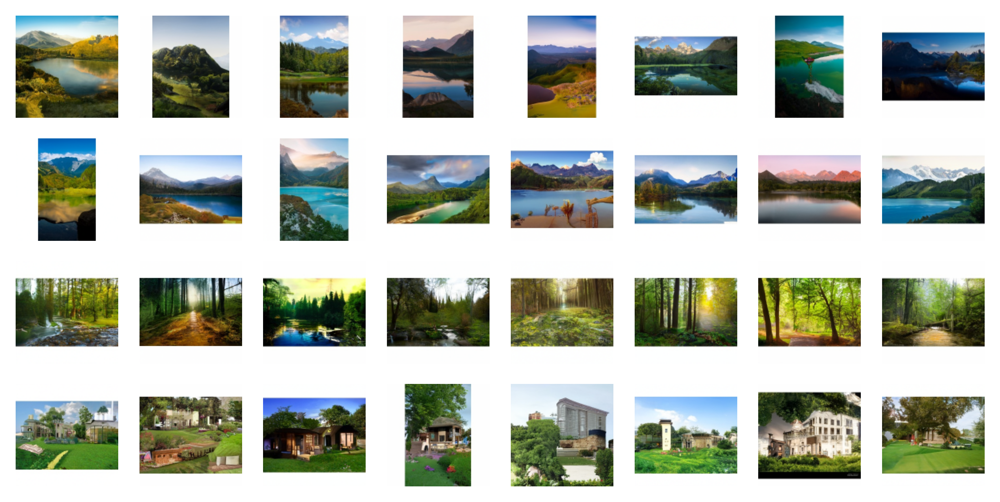
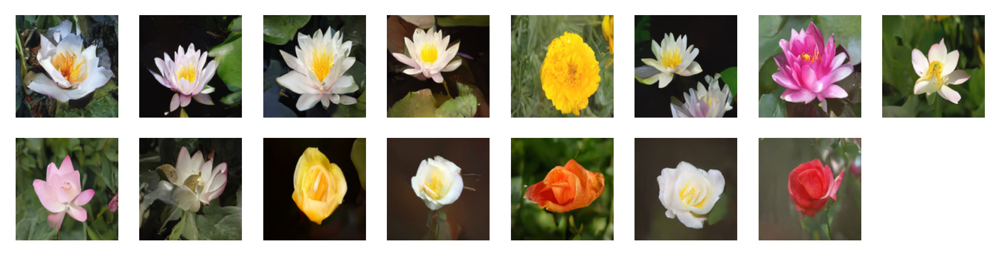
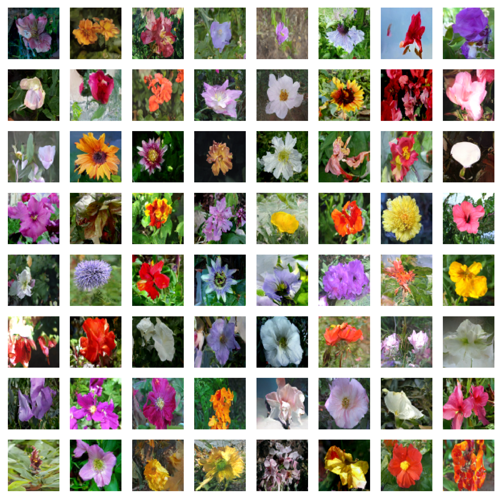

# Gallery: historical FlaxDiff experiments

These images come from the project's earlier FlaxDiff experiments. The settings below preserve the recorded run descriptions, including their old scheduler and model names. They are historical results, not runnable configurations for today's Dew API or evidence that a current checkout reproduces the images.

The gallery records training data, image sizes, sampling settings, and some model fields. It does not provide a complete environment, checkpoint, seed record, or quality evaluation for each run. For a current workflow, start with [recipes](recipes.md) and the [diffusion guide](guides/diffusion.md). For timed measurements with revision and hardware context, see [benchmarks](benchmarks.md).

## Text-to-image on a mixed captioned dataset

The recorded model trained on LAION-Aesthetics 12M, CC12M, MS COCO, and a one-million-image aesthetic-6+ subset of COYO-700M on a TPU-v4-32 slice. Sampling used Euler ancestral sampling for 200 steps with classifier-free guidance (CFG). CFG combines conditional and unconditional predictions to control how strongly sampling follows the text condition.

The displayed batch used repetitions of the prompt “a beautiful landscape with a river with mountains.” The historical record does not give the guidance scale for this grid.

| Setting | Recorded value |
| --- | --- |
| Batch size | 256 |
| Image size | 128 × 128 |
| Training epochs | 5 |
| Steps per epoch | 74,573 |
| Feature depths | `[128, 256, 512, 1024]` |
| Training noise schedule | `EDMNoiseScheduler` |
| Inference noise schedule | `KarrasVENoiseScheduler` |

## Text-to-image on Oxford Flowers

This run used Oxford Flowers 102, Euler ancestral sampling for 200 steps, and CFG scale 2. The recorded prompt sequence was:

> water tulip; a water lily; a water lily; a water lily; a photo of a marigold; a water lily; a water lily; a photo of a lotus; a photo of a lotus; a photo of a lotus; a photo of a rose; a photo of a rose; a photo of a rose; a photo of a rose; a photo of a rose

| Setting | Recorded value |
| --- | --- |
| Batch size | 16 |
| Image size | 128 × 128 |
| Training epochs | 1,000 |
| Steps per epoch | 511 |
| Training noise schedule | `EDMNoiseScheduler` |
| Inference noise schedule | `KarrasVENoiseScheduler` |

## Unconditional Oxford Flowers with DDPM

An unconditional model generates without a text prompt. This grid used DDPM sampling for 1,000 steps, with `CosineNoiseScheduler` for both training and inference.

| Setting | Recorded value |
| --- | --- |
| Dataset | Oxford Flowers 102 |
| Batch size | 16 |
| Image size | 64 × 64 |
| Training epochs | 1,000 |
| Steps per epoch | 511 |
| Embedding features | 256 |
| Feature depths | `[64, 128, 256, 512]` |
| Attention configuration | Five entries, each `{"heads": 4}` |
| Residual blocks | 2 |
| Middle residual blocks | 1 |

The attention list and feature-depth list above reproduce the old record, not a constructor call for the current UNet.

## Unconditional Oxford Flowers with Heun

This grid used a recorded 10-step Heun sampler. Heun uses a predictor and a correction evaluation on a sampling interval; exact network-evaluation counts depend on the solver's endpoint handling. The older caption reported 20 model evaluations, but the gallery does not retain a trace that verifies that count.

| Setting | Recorded value |
| --- | --- |
| Dataset | Oxford Flowers 102 |
| Batch size | 16 |
| Image size | 64 × 64 |
| Training epochs | 1,000 |
| Steps per epoch | 511 |
| Training noise schedule | `EDMNoiseScheduler` |
| Inference noise schedule | `KarrasVENoiseScheduler` |

These grids do not form a controlled sampler comparison: the descriptions do not establish identical checkpoints, seeds, or training settings. Keep the dataset licenses and any access conditions in mind if you prepare a new run with the named data; the gallery does not redistribute those datasets. [References and attribution](references.md) identifies the research and upstream implementations behind these methods.
