# Gallery

These samples come from models trained with Dew. [Diffusion training](guides/diffusion.md) and [Recipes](recipes.md) explain how to train a model. [Diffusion processes and solvers](concepts/diffusion.md) describes the samplers used below.

## Text-to-image, 176M hybrid DiT

This 176M-parameter model generates 256×256 images from text. It was trained with Dew. Weights: [`dewml/hybrid-dit-176m`](https://huggingface.co/dewml/hybrid-dit-176m).

Each caption is the prompt used for that image. To reproduce a sample, use the seed, solver, guidance and batch context in the [manifest](../site/public/examples/curated/manifest.json). Settings differ between images.

<figure>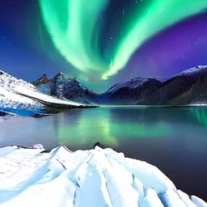<figcaption>green and purple northern lights reflected in a frozen lake, snowy mountains at night, vivid colors, dramatic lighting, highly detailed</figcaption></figure>

<figure>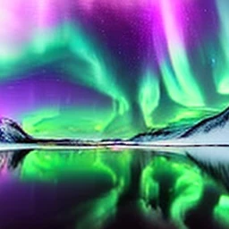<figcaption>green and purple northern lights reflected in a frozen lake, snowy mountains at night, vivid colors, dramatic lighting, highly detailed</figcaption></figure>

<figure>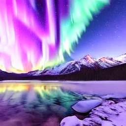<figcaption>green and purple northern lights reflected in a frozen lake, snowy mountains at night, vivid colors, dramatic lighting, highly detailed</figcaption></figure>

<figure>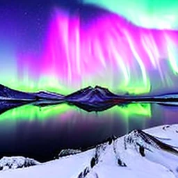<figcaption>green and purple northern lights reflected in a frozen lake, snowy mountains at night, vivid colors, dramatic lighting, highly detailed</figcaption></figure>

<figure>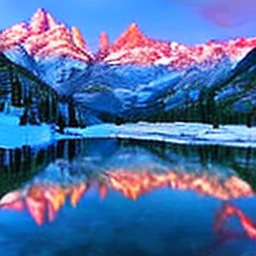<figcaption>a mountain lake reflecting snowy peaks, vivid colors, dramatic lighting, highly detailed</figcaption></figure>

<figure>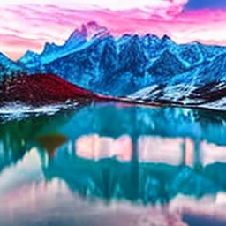<figcaption>a mountain lake reflecting snowy peaks, vivid colors, dramatic lighting, highly detailed</figcaption></figure>

<figure>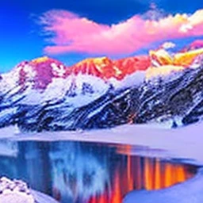<figcaption>a mountain lake reflecting snowy peaks, vivid colors, dramatic lighting, highly detailed</figcaption></figure>

<figure>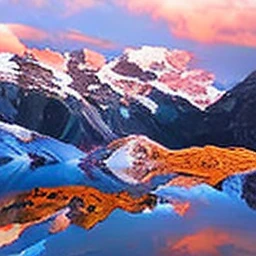<figcaption>a mountain lake reflecting snowy peaks, vivid colors, dramatic lighting, highly detailed</figcaption></figure>

<figure>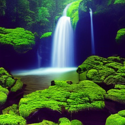<figcaption>a waterfall in a lush green forest, vivid colors, dramatic lighting, highly detailed</figcaption></figure>

<figure>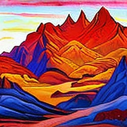<figcaption>a waterfall in a lush green forest, vivid colors, dramatic lighting, highly detailed</figcaption></figure>

<figure>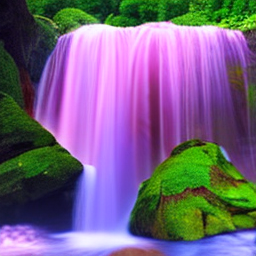<figcaption>a waterfall in a lush green forest, vivid colors, dramatic lighting, highly detailed</figcaption></figure>

<figure>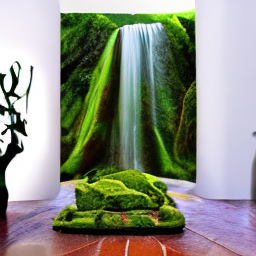<figcaption>a waterfall in a lush green forest, vivid colors, dramatic lighting, highly detailed</figcaption></figure>

<figure>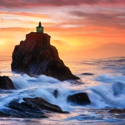<figcaption>a lighthouse on a rocky coast at sunset, dramatic waves and golden light, vivid colors, dramatic lighting, highly detailed</figcaption></figure>

<figure>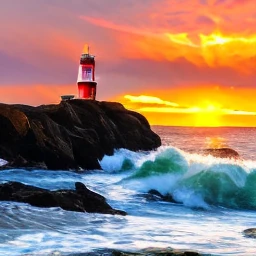<figcaption>a lighthouse on a rocky coast at sunset, dramatic waves and golden light, vivid colors, dramatic lighting, highly detailed</figcaption></figure>

<figure>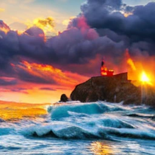<figcaption>a lighthouse on a rocky coast at sunset, dramatic waves and golden light, vivid colors, dramatic lighting, highly detailed</figcaption></figure>

<figure>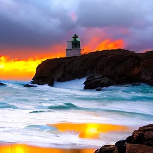<figcaption>a lighthouse on a rocky coast at sunset, dramatic waves and golden light, vivid colors, dramatic lighting, highly detailed</figcaption></figure>

<figure>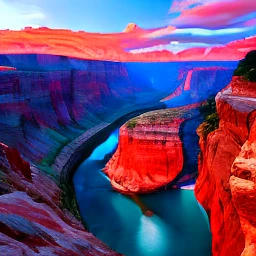<figcaption>a canyon with towering red rock cliffs and a winding river at sunset, vivid colors, dramatic lighting, highly detailed</figcaption></figure>

<figure>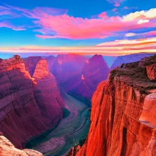<figcaption>a canyon with towering red rock cliffs and a winding river at sunset, vivid colors, dramatic lighting, highly detailed</figcaption></figure>

<figure>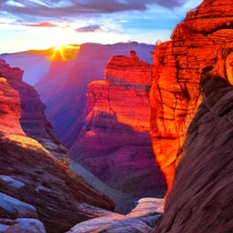<figcaption>a canyon with towering red rock cliffs and a winding river at sunset, vivid colors, dramatic lighting, highly detailed</figcaption></figure>

<figure>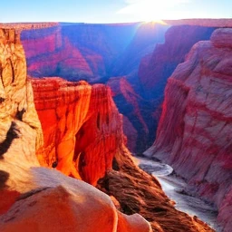<figcaption>a canyon with towering red rock cliffs and a winding river at sunset, vivid colors, dramatic lighting, highly detailed</figcaption></figure>

<figure>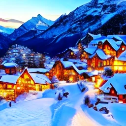<figcaption>a snowy mountain village at dusk, warm glowing windows and blue snow, vivid colors, dramatic lighting, highly detailed</figcaption></figure>

<figure>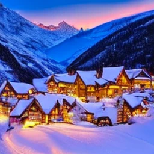<figcaption>a snowy mountain village at dusk, warm glowing windows and blue snow, vivid colors, dramatic lighting, highly detailed</figcaption></figure>

<figure>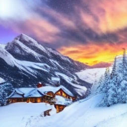<figcaption>a snowy mountain village at dusk, warm glowing windows and blue snow, vivid colors, dramatic lighting, highly detailed</figcaption></figure>

<figure>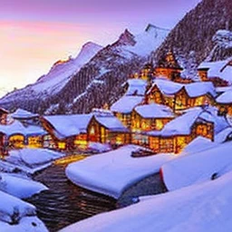<figcaption>a snowy mountain village at dusk, warm glowing windows and blue snow, vivid colors, dramatic lighting, highly detailed</figcaption></figure>

## Unconditional models

The two grids below come from unconditional models trained with Dew on Oxford Flowers 102. Their records include image sizes, sampling settings and model fields. They lack complete environment details, checkpoints, seeds and quality evaluations. Scheduler and model names refer to the Dew version used for each run.

### DDPM sampling

This grid used DDPM sampling for 1,000 steps, with `CosineNoiseScheduler` for both training and inference.

| Setting | Recorded value |
| --- | --- |
| Dataset | Oxford Flowers 102 |
| Batch size | 16 |
| Image size | 64 × 64 |
| Training epochs | 1,000 |
| Steps per epoch | 511 |
| Embedding features | 256 |
| Feature depths | `[64, 128, 256, 512]` |
| Attention configuration | Five entries, each `{"heads": 4}` |
| Residual blocks | 2 |
| Middle residual blocks | 1 |

The attention and feature-depth lists describe the recorded run. They are not arguments of the current UNet.

### Heun sampling

This grid used a 10-step Heun sampler. Heun predicts and corrects on each sampling interval. The exact number of network evaluations depends on how the solver handles the last step. The recorded caption says 20 model evaluations, but no trace confirms that count.

| Setting | Recorded value |
| --- | --- |
| Dataset | Oxford Flowers 102 |
| Batch size | 16 |
| Image size | 64 × 64 |
| Training epochs | 1,000 |
| Steps per epoch | 511 |
| Training noise schedule | `EDMNoiseScheduler` |
| Inference noise schedule | `KarrasVENoiseScheduler` |

The records do not establish a controlled sampler comparison between these two grids. They do not show matching checkpoints, seeds or training settings. This gallery does not redistribute datasets; each has its own license and access conditions. [Papers and attribution](references.md) lists the research and upstream implementations for these methods.
