# Gallery

Samples from models trained with Dew. [Diffusion training](guides/diffusion.md) and [Recipes](recipes.md) describe how to train one, and [Diffusion processes and solvers](concepts/diffusion.md) the samplers named below.

## Text-to-image, 176M hybrid DiT

A 176M-parameter text-to-image model at 256×256, trained with Dew. Weights: [`dewml/hybrid-dit-176m`](https://huggingface.co/dewml/hybrid-dit-176m).

Each image is captioned with its prompt. The [manifest](../site/public/examples/curated/manifest.json) records the actual seed, solver, guidance and batch context for reproducing each draw; settings differ between images.

<figure>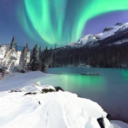<figcaption>green and purple northern lights reflected in a frozen lake, snowy mountains at night</figcaption></figure>

<figure>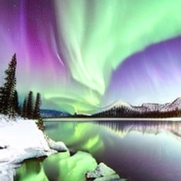<figcaption>green and purple northern lights reflected in a frozen lake, snowy mountains at night</figcaption></figure>

<figure>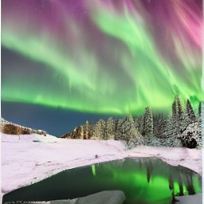<figcaption>green and purple northern lights reflected in a frozen lake, snowy mountains at night</figcaption></figure>

<figure>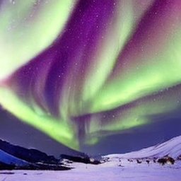<figcaption>green and purple northern lights reflected in a frozen lake, snowy mountains at night</figcaption></figure>

<figure>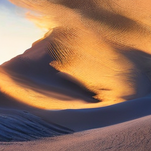<figcaption>rolling sand dunes in the desert at sunset, deep orange sand and purple sky</figcaption></figure>

<figure>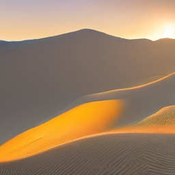<figcaption>rolling sand dunes in the desert at sunset, deep orange sand and purple sky</figcaption></figure>

<figure>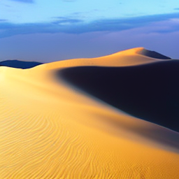<figcaption>rolling sand dunes in the desert at sunset, deep orange sand and purple sky</figcaption></figure>

<figure><figcaption>rolling sand dunes in the desert at sunset, deep orange sand and purple sky</figcaption></figure>

<figure>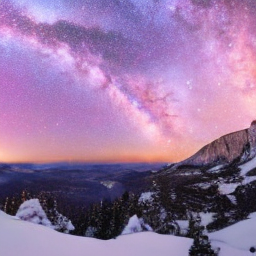<figcaption>the milky way above snowy mountains, a clear starry night sky</figcaption></figure>

<figure>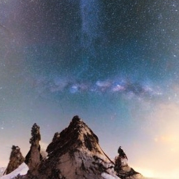<figcaption>the milky way above snowy mountains, a clear starry night sky</figcaption></figure>

<figure>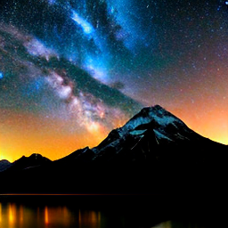<figcaption>the milky way above snowy mountains, a clear starry night sky</figcaption></figure>

<figure>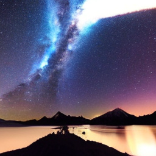<figcaption>the milky way above snowy mountains, a clear starry night sky</figcaption></figure>

<figure><figcaption>a Gothic cathedral interior with glowing stained glass windows and stone arches</figcaption></figure>

<figure><figcaption>a Gothic cathedral interior with glowing stained glass windows and stone arches</figcaption></figure>

<figure>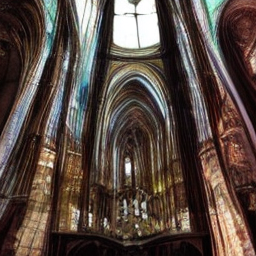<figcaption>a Gothic cathedral interior with glowing stained glass windows and stone arches</figcaption></figure>

<figure>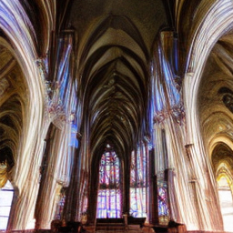<figcaption>a Gothic cathedral interior with glowing stained glass windows and stone arches</figcaption></figure>

<figure>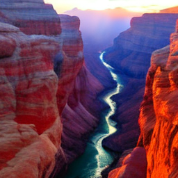<figcaption>a canyon with towering red rock cliffs and a winding river at sunset</figcaption></figure>

<figure><figcaption>a canyon with towering red rock cliffs and a winding river at sunset</figcaption></figure>

<figure>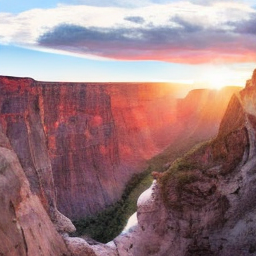<figcaption>a canyon with towering red rock cliffs and a winding river at sunset</figcaption></figure>

<figure>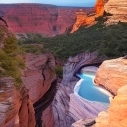<figcaption>a canyon with towering red rock cliffs and a winding river at sunset</figcaption></figure>

<figure>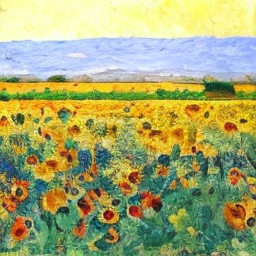<figcaption>a field of sunflowers in southern France, an oil painting by Vincent van Gogh</figcaption></figure>

<figure>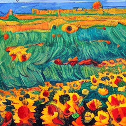<figcaption>a field of sunflowers in southern France, an oil painting by Vincent van Gogh</figcaption></figure>

<figure>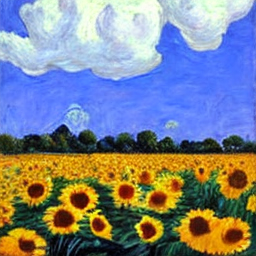<figcaption>a field of sunflowers in southern France, an oil painting by Vincent van Gogh</figcaption></figure>

<figure>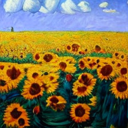<figcaption>a field of sunflowers in southern France, an oil painting by Vincent van Gogh</figcaption></figure>

## Unconditional models

The two grids below come from unconditional models trained with Dew on Oxford Flowers 102. Their records give the image size, sampling settings and model fields, but no complete environment, checkpoint, seed or quality evaluation, and their scheduler and model names are those of the Dew version the runs used.

### DDPM sampling

This grid used DDPM sampling for 1,000 steps, with `CosineNoiseScheduler` for both training and inference.

| Setting | Recorded value |
| --- | --- |
| Dataset | Oxford Flowers 102 |
| Batch size | 16 |
| Image size | 64 × 64 |
| Training epochs | 1,000 |
| Steps per epoch | 511 |
| Embedding features | 256 |
| Feature depths | `[64, 128, 256, 512]` |
| Attention configuration | Five entries, each `{"heads": 4}` |
| Residual blocks | 2 |
| Middle residual blocks | 1 |

The attention list and the feature-depth list are the recorded settings, not arguments of the current UNet.

### Heun sampling

This grid used a 10-step Heun sampler. Heun takes a prediction step and then a correction on each sampling interval, so the exact number of network evaluations depends on how the solver handles the last step. The recorded caption said 20 model evaluations; no trace confirms that count.

| Setting | Recorded value |
| --- | --- |
| Dataset | Oxford Flowers 102 |
| Batch size | 16 |
| Image size | 64 × 64 |
| Training epochs | 1,000 |
| Steps per epoch | 511 |
| Training noise schedule | `EDMNoiseScheduler` |
| Inference noise schedule | `KarrasVENoiseScheduler` |

The two unconditional grids are not a controlled comparison of samplers: the records do not show that they used the same checkpoints, seeds or training settings. The gallery does not redistribute the datasets; each has its own license and access conditions. [Papers and attribution](references.md) lists the research and the upstream implementations behind these methods.
