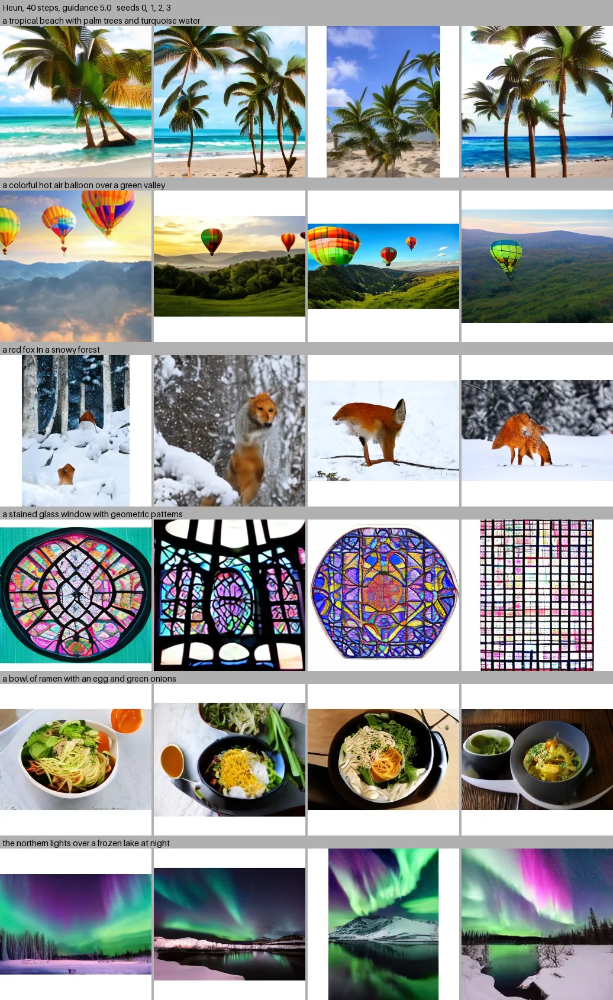
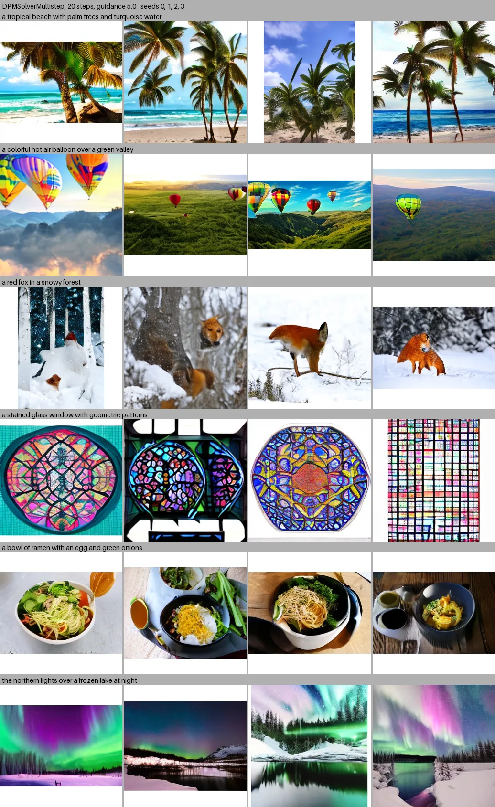
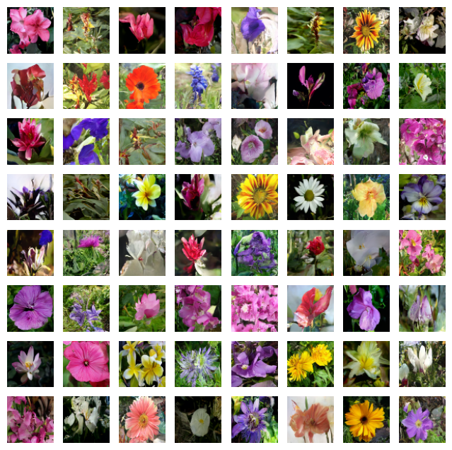
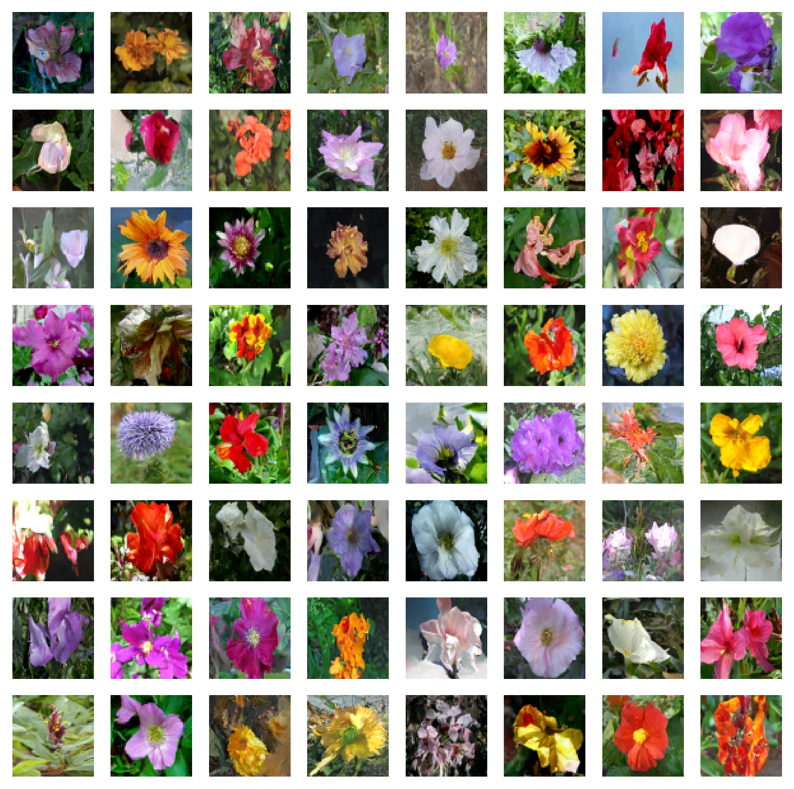

# Gallery

Samples from models trained with Dew. [Diffusion training](guides/diffusion.md) and [Recipes](recipes.md) describe how to train one, and [Diffusion processes and solvers](concepts/diffusion.md) the samplers named below.

## Text-to-image, 176M hybrid DiT

A latent text-to-image model with a hybrid DiT denoiser (state-space and attention blocks), trained with Dew, sampled at step 1,350,000 from its EMA weights. It generates 256×256 images through the Stable Diffusion VAE, conditioned on a CLIP text encoder.

| Component | Parameters |
|---|---|
| Denoiser (hybrid DiT) | 175,640,848 |
| CLIP text encoder | 123,060,480 |
| Stable Diffusion VAE | 83,653,863 |

Each grid has one row per prompt and one column per seed (0, 1, 2, 3), with classifier-free guidance 5.0 against the empty prompt. `examples/sample_text_to_image.py` drew them in float32 on an RTX 4080; a batch of six images took 1.9 s with Heun over 40 steps and 0.6 s with `DPMSolverMultistep` over 20 steps. Some images carry flat white bands at their edges, which the model draws.

The prompts, in row order:

1. a tropical beach with palm trees and turquoise water
2. a colorful hot air balloon over a green valley
3. a red fox in a snowy forest
4. a stained glass window with geometric patterns
5. a bowl of ramen with an egg and green onions
6. the northern lights over a frozen lake at night

## Unconditional models

The two grids below come from unconditional models trained with Dew on Oxford Flowers 102. Their records give the image size, sampling settings and model fields, but no complete environment, checkpoint, seed or quality evaluation, and their scheduler and model names are those of the Dew version the runs used.

### DDPM sampling

This grid used DDPM sampling for 1,000 steps, with `CosineNoiseScheduler` for both training and inference.

| Setting | Recorded value |
| --- | --- |
| Dataset | Oxford Flowers 102 |
| Batch size | 16 |
| Image size | 64 × 64 |
| Training epochs | 1,000 |
| Steps per epoch | 511 |
| Embedding features | 256 |
| Feature depths | `[64, 128, 256, 512]` |
| Attention configuration | Five entries, each `{"heads": 4}` |
| Residual blocks | 2 |
| Middle residual blocks | 1 |

The attention list and the feature-depth list are the recorded settings, not arguments of the current UNet.

### Heun sampling

This grid used a 10-step Heun sampler. Heun takes a prediction step and then a correction on each sampling interval, so the exact number of network evaluations depends on how the solver handles the last step. The recorded caption said 20 model evaluations; no trace confirms that count.

| Setting | Recorded value |
| --- | --- |
| Dataset | Oxford Flowers 102 |
| Batch size | 16 |
| Image size | 64 × 64 |
| Training epochs | 1,000 |
| Steps per epoch | 511 |
| Training noise schedule | `EDMNoiseScheduler` |
| Inference noise schedule | `KarrasVENoiseScheduler` |

The two unconditional grids are not a controlled comparison of samplers: the records do not show that they used the same checkpoints, seeds or training settings. The gallery does not redistribute the datasets; each has its own license and access conditions. [Papers and attribution](references.md) lists the research and the upstream implementations behind these methods.
