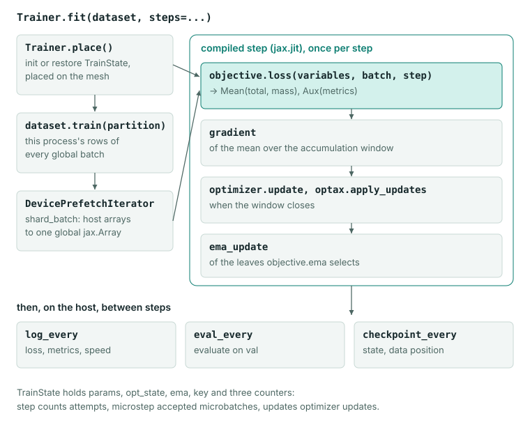
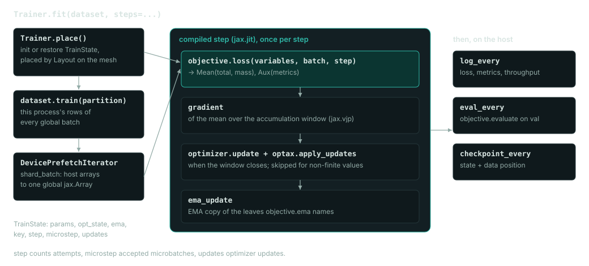

# Key concepts

A Dew training run is built from four objects, each responsible for one part of the work:

| Object | Responsible for | Written by you when |
|---|---|---|
| Model, a `flax.linen.Module` | The forward computation and the shapes of its variables | You need a new architecture. The built-in ones are classes in `dew.nn.backbones`. |
| `Objective` | Initializing the variables, the loss, evaluation outputs, and which weights keep a moving average | You need a loss Dew does not have. |
| `Dataset` | The iterators that yield training and validation batches | Your data does not fit a built-in reader. |
| `Trainer` | The device mesh, the compiled step, the optimizer update, the moving average, checkpoints and logging | Never; it is configured, not subclassed. |

`Trainer.fit` returns a `TrainState`, the numerical state of the run: the variables, the optimizer state, the root random key, the step counters and the moving-average copy. Continuing a run also needs the data position, which checkpoints store beside the state, and the configuration that built the objective and trainer (a recipe writes it to `run.json`).

## Example

This trains a small decoder on one repeated sentence and generates from it. It downloads nothing and runs on a CPU.

```python
import jax
import numpy as np

from dew import Dataset, Trainer
from dew.config import OptimConfig
from dew.data import ByteTokenizer
from dew.nn.backbones import CausalTransformer
from dew.objectives.lm import LMObjective
from dew.sampling import Sampling, generate

tokenizer = ByteTokenizer()
text = tokenizer.encode("dew trains jax models. " * 3)
rows = np.tile(np.asarray(text[:65], np.int32), (8, 1))
data = Dataset.from_records({"text": rows}, batch=8)

model = CausalTransformer(
    vocab_size=tokenizer.vocab_size,
    emb_features=64, num_layers=2, num_heads=4,
    mlp_features=256, max_seq_len=128)
objective = LMObjective(model, seq_len=64)
trainer = Trainer(objective, OptimConfig(learning_rate=3e-3),
                  key=jax.random.key(0))
state = trainer.fit(data, steps=100, log_every=25)

prompt = [tokenizer.encode("dew")]
out = generate(model, state.variables, prompt, max_new_tokens=40,
               key=jax.random.key(1),
               sampling=Sampling(temperature=0))
print(tokenizer.decode(out.tokens[0]))
```

Output on two cores of a shared workstation CPU:

```text
Training CausalTransformer from step 0 to 100: 147,840 parameters, on 1 × cpu, batch 8, float32
step  25/100  loss 0.03061  ce 0.03061  perplexity 1.031  token_accuracy 100.0%  step_time_ms 23.68  samples_per_sec 337.9  accepted 100.0%  0:00:01 left
step  50/100  loss 0.01018  ce 0.01018  perplexity 1.010  token_accuracy 100.0%  step_time_ms 24.52  samples_per_sec 326.2  accepted 100.0%  0:00:01 left
step  75/100  loss 0.006710  ce 0.006710  perplexity 1.007  token_accuracy 100.0%  step_time_ms 24.68  samples_per_sec 324.1  accepted 100.0%  0:00:01 left
step 100/100  loss 0.005113  ce 0.005113  perplexity 1.005  token_accuracy 100.0%  step_time_ms 22.84  samples_per_sec 350.2  accepted 100.0%
Trained 100 steps in 0:00:04: first step after 2.06 s, then 42.6 step/s
53.0% of the wall time in steps, final loss 0.005113
dew trains jax models. dew trains jax model
```

This is the output with stdout piped to a file; on a terminal, `fit` draws the same numbers as one live panel with a progress bar and a sparkline per metric. Each `step` line shows the loss and the objective's metrics of that step (for `LMObjective`: cross entropy, perplexity and token accuracy), and the step time and throughput over the interval since the previous line. Each row holds 65 byte ids. `LMObjective(seq_len=64)` feeds the first 64 to the model and scores its predictions of the 64 that follow, shifted by one position. `generate` returns the prompt followed by the new tokens; `temperature=0` picks the most likely token at every step.

## Model

A model is a `flax.linen.Module` with `init` and `apply`. Its variables are a nested dictionary of arrays, and it has no knowledge of training. Build one from its class, `from dew.nn.backbones import CausalTransformer`. Each class is also registered under a name (`causal_transformer`), which is how recipes and saved runs rebuild a model from a configuration file.

Your own model registers with one line, and its constructor fields are then its record:

```python
import flax.linen as nn

from dew.registry import models


@models("residual_mlp")
class ResidualMLP(nn.Module):
    """A denoiser `DiffusionObjective` can train: it maps a noisy sample, the
    noise level's embedding and optional text context to its prediction."""

    features: int = 64

    @nn.compact
    def __call__(self, x, temb, textcontext=None, train=False):
        return x + nn.Dense(x.shape[-1])(nn.gelu(nn.Dense(self.features)(x)))
```

Every checkpoint a run of this model writes records `"architecture": "residual_mlp"` and `"config": {"features": 64}`, and `TextToImage.from_run` and `dew.pipeline` rebuild the model from that record. A decoder's run loads the same way through `TextGeneration.from_run` and `Pretrained.from_run`. A composite model records each registered part inside its own record, and an adapted model records its base model with the adapter's rank, alpha and modules.

A package outside Dew registers its members the same way and names the module that registers them under the `dew.plugins` entry-point group in its `pyproject.toml` (`[project.entry-points."dew.plugins"]`, `mypackage = "mypackage"`). When Dew meets a name it has not registered, it imports every such entry once and looks again, so a run recorded with the package's model loads in a process that has not imported the package. A kind of the package's own is a `Registry("activation").share()`, made in the module that defines its base class, whose members a record names as `{"name": ..., "fields": {...}}`. A member can be a class or a function. A field typed with a class takes the record of a member that derives from it or of a function declared to return it, and a function member's record fields are its parameters, converted to their annotations as a dataclass's fields are. An objective of its own uses `saved_task` to name the task its runs load as through `dew.pipeline`, as Dew's objectives do.

Registration is only needed to load a run by its record. An unregistered model trains, checkpoints and resumes the same way, and its run records it under its class name in lower case. The first checkpoint's warning and any attempt to load the run both name the line that registers it, and once that line is in place, the same run loads.

Dew's modules name the logical axes of their parameters, such as `embed`, `heads` and `mlp`. The trainer maps those names onto the device mesh, so the model code does not change when the mesh does. [Distributed training](concepts/distributed.md) describes the mapping.

## Objective

An objective implements two methods:

- `init(key, variables=None)` returns the model's variables.
- `loss(variables, batch, step)` returns the loss as a `Ratio(total, mass)` and an `Aux` with metrics to log.

It can also implement `evaluate` for validation and `preview` for samples, and it names the weights that keep an exponential moving average (EMA) in its `ema` attribute. Its `shown` attribute maps metric names to `Shown` values that tell the training display how to show them: `Shown(better="higher", percent=True)`, for an accuracy, colours a rise as progress and prints the value as a percentage.

Dew ships objectives for autoregressive language modeling (`LMObjective`), image and video diffusion (`DiffusionObjective`), masked and block diffusion over tokens (`MaskedDiffusionObjective`, `BlockDiffusionObjective`), JEPA (`JepaObjective`), preference and reinforcement learning (`DPOObjective`, `GRPOObjective`, `PPOObjective`, `FlowGRPOObjective`) and distillation (`DistillationObjective`). A new kind of model is a new module; a new kind of training is a new objective. [Custom objectives](concepts/objectives.md) writes one.

## Dataset

`Dataset(train, val, records, batch)` holds two functions. `train(partition)` opens an endless stream of training batches; `val(partition)` opens one pass over the validation records. `partition` is a `DataPartition` that says which share of each global batch this process reads, which matters when several processes train together. `Dataset.from_records` builds one from records held in memory, as the example does: it reshuffles them every epoch, gives each process its share, and saves its position in checkpoints.

The built-in readers, such as `TokenWindows` for tokenized text and `HFImages` for image datasets on the Hugging Face Hub, are specifications whose `.load(batch=...)` returns a `Dataset`. Images arrive as `uint8` arrays in `[0, 255]` and token windows as `int32` ids under the key `"text"`. Readers built on Grain record their position, so a checkpoint resumes the data stream where it stopped. [Training data](concepts/data.md) covers the details.


## Trainer

`Trainer(objective, optimizer, key=...)` takes an `OptimConfig` or an Optax optimizer, and a JAX random key or integer seed. `fit(dataset, steps=...)` builds a configured optimizer over the run's length, places the variables on the devices, compiles one training step and runs it until the step counter reaches `steps`. Between steps it logs every `log_every` steps, evaluates every `eval_every` steps, and writes a checkpoint every `checkpoint_every` steps when the trainer was given `checkpoints=Checkpoints(directory)`.




The same call runs on one device or many. `Trainer(..., mesh=MeshSpec(fsdp=4))` shards the parameters and optimizer state over four devices; the objective, the model and the data do not change.

The trainer logs the loss, the objective's metrics and an injected learning rate, but not the gradient norm, which would be one more reduction over every gradient each step. To track it, chain a transformation that keeps the norm in the optimizer state and read `state.opt_state[0]` after `fit`. Next to `clip_by_global_norm`, XLA computes the norm once for both, so it costs nothing:

```python
import jax.numpy as jnp
import optax

record_norm = optax.GradientTransformation(
    lambda params: jnp.zeros(()), lambda updates, state, params=None: (updates, optax.tree.norm(updates)))
optimizer = optax.chain(record_norm, optax.clip_by_global_norm(1.0), optax.adamw(1e-3))
```

## Training state

`TrainState` keeps three counters. `step` counts attempts, and together with the root key it determines the next random draw. `microstep` counts accepted microbatches. `updates` counts optimizer updates, which differs from `microstep` when gradients are accumulated. `state.variables` holds the live variables, and `state.averaged` holds the same tree with the EMA weights in place.

After training, `objective.pipeline(state)` wraps the weights in an inference task, such as text generation or text-to-image, and `Pretrained.save` writes a checkpoint in its source's own format. [Checkpoints](guides/checkpoints.md) lists which artifact continues what.
